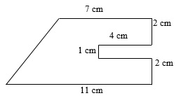
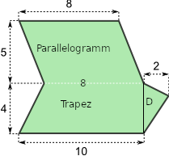
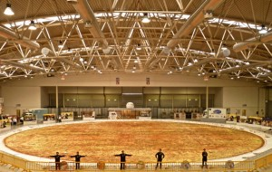

```{r include=FALSE, cache=FALSE}
## ---- speed-13
ttcode <- function(x, type = "tt") {
  outputFormat <- knitr:::pandoc_to()
  if (outputFormat %in% c('latex', 'beamer'))
    paste0("\\texttt{", escape_latex(x), "}")
  else if (outputFormat == 'html')
    paste0("<", type, ">", x, "</", type, ">")
  else
    x
}
# psyTeachR styles and functions
# do not edit!!!!!

library(tidyverse)

# default knitr options
knitr::opts_chunk$set(
  echo       = TRUE,
  results    = "hold",
  out.width = '100%',
  fig.width  = 8, 
  fig.height = 5, 
  fig.align = 'center'
)

# make docs directory and include .nojekyll file for github
if (!dir.exists('docs')) dir.create('docs')
file.create('docs/.nojekyll')

## set global theme options for figures
theme_set(theme_bw())

## set class for a chunk using class="className"
knitr::knit_hooks$set(class = function(before, options, envir) {
  if (before) {
    sprintf("<div class = '%s'>", options$class)
  } else {
    "</div>"
  }
})

## verbatim code chunks
knitr::knit_hooks$set(verbatim = function(before, options, envir) {
  if (before) {
    sprintf("<div class='verbatim'><code>&#96;&#96;&#96;{%s}</code>", options$verbatim)
  } else {
    "<code>&#96;&#96;&#96;</code></div>"
  }
})

## verbatim inline R in backticks
backtick <- function(code) {
  paste0("<code>&#096;", code, "&#096;</code>")
}


myglossary <- list()

## link to glossary with shortdef on hover
glossary <- function(term, display = NULL, shortdef = "", link = TRUE) {
  lcterm <- gsub(" ", "-", tolower(term), fixed = TRUE)
  if (is.null(display)) display <- term
  first_letter <- substr(lcterm, 1, 1)
  url <- paste0("https://psyteachr.github.io/glossary/", first_letter)
  if (shortdef == "") {
    hash <- paste0("#", lcterm, " dfn")
    shortdef <- xml2::read_html(url) %>% 
      rvest::html_node(hash) %>%
      rvest::html_text() %>%
      gsub("\'", "&#39;", .)
  }
  
  ## add to global glossary for this book
  myglossary[lcterm] <<- shortdef
  
  if (link) {
    paste0("<a class='glossary' target='_blank' title='", shortdef, 
           "' href='", url, "#", lcterm, "'>", display, "</a>")
  } else {
    paste0("<a class='glossary' title='", shortdef, "'>", display, "</a>")
  }
}

glossary_table <- function() {
  as.data.frame(myglossary) %>% 
    t() %>% 
    as.data.frame() %>%
    rownames_to_column(var="term") %>%
    rename("definition" = V1) %>%
    mutate(term = paste0("<a class='glossary' target='_blank' ",
                         "href='https://psyteachr.github.io/glossary/",
                         substr(term, 1, 1), "#", term, "'>",
                         gsub(".", " ", term, fixed = 1), "</a>")) %>%
    arrange(term) %>%
    knitr::kable(escape = FALSE)
}

## palette with psyTeachR logo colour
psyteachr_colours <- function(vals = 1:6) {
  ptrc <- c(
    "pink" = "#983E82",
    "orange" = "#E2A458",
    "yellow" = "#F5DC70",
    "green" = "#59935B",
    "blue" = "#467AAC",
    "purple" = "#61589C"
  )
  
  unname(ptrc[vals])
}
psyteachr_colors <- psyteachr_colours

```

# Was ist das? {-}

```{r, child="_setup.Rmd"}
```

```{r, eval=TRUE, echo=FALSE}
# install.packages("kableExtra")
options(knitr.duplicate.label = "allow")
library("kableExtra")
library("tidyverse")
library("webex")
```


Ein Distanzlernpfad zum Thema *Formeln und Flächen* 


Hier geht's zur bisherigen [Seite](https://gdischinger.github.io/Mathe_8d/03FormelnErstellen/FlächenberechnungErinnerung.html). Dort ist alles unverändert...

```{r, eval=knitr::opts_knit$get("rmarkdown.pandoc.to") == "html", results='asis', echo=FALSE}
cat('<hr style="background-color:#3C6690;height:2px">')
```

### Aktuelles {-}

+ Stichtag für das Abschlussquiz ist der **28. Februar**


```{r, eval=knitr::opts_knit$get("rmarkdown.pandoc.to") == "html", results='asis', echo=FALSE}
cat('<hr style="background-color:#3C6690;height:2px">')
```

### Allgemeines{-}

Dieser Lernpfad soll dir helfen, das große Thema "Formeln und Flächen" nicht zu vergessen. Natürlich darfst du auch das Buch zum Nachlesen und zusätzlichen Üben nutzen. Einige Aufgaben, die hier vorkommen, werden mehr oder weniger aus dem Buch übernommen sein.

Da jede*r von euch über individuelles Vorwissen verfügt, wirst du dich mehr oder weniger lang mit diesen Lernpfad beschäftigen müssen wie andere aus deiner Klasse. Es kann sein, dass du feststellst, dass es gut wäre, alte Inhalte noch einmal aufzufrischen oder zu erarbeiten. Arbeite daran, wenn du gerade ein bisschen Zeit hast. In Mathe macht die Übung den Meister - auch die Meisterin.

```{r, eval=my_output == "html", results='asis', echo=FALSE}
cat('<hr style="background-color:#3C6690;height:2px">')
```


```{r, eval=knitr::opts_knit$get("rmarkdown.pandoc.to") == "html", results='asis', echo=FALSE}
cat('<br>


Dieses Skript ist lizenziert unter der Creative Commons Lizenz [Creative Commons Attribution-NonCommercial-ShareAlike 4.0 International License](http://creativecommons.org/licenses/by-nc-sa/4.0/).')
```


<!--chapter:end:index.Rmd-->

```{r include=FALSE, cache=FALSE}
## ---- speed-13
ttcode <- function(x, type = "tt") {
  outputFormat <- knitr:::pandoc_to()
  if (outputFormat %in% c('latex', 'beamer'))
    paste0("\\texttt{", escape_latex(x), "}")
  else if (outputFormat == 'html')
    paste0("<", type, ">", x, "</", type, ">")
  else
    x
}
# psyTeachR styles and functions
# do not edit!!!!!

library(tidyverse)

# default knitr options
knitr::opts_chunk$set(
  echo       = TRUE,
  results    = "hold",
  out.width = '100%',
  fig.width  = 8, 
  fig.height = 5, 
  fig.align = 'center'
)

# make docs directory and include .nojekyll file for github
if (!dir.exists('docs')) dir.create('docs')
file.create('docs/.nojekyll')

## set global theme options for figures
theme_set(theme_bw())

## set class for a chunk using class="className"
knitr::knit_hooks$set(class = function(before, options, envir) {
  if (before) {
    sprintf("<div class = '%s'>", options$class)
  } else {
    "</div>"
  }
})

## verbatim code chunks
knitr::knit_hooks$set(verbatim = function(before, options, envir) {
  if (before) {
    sprintf("<div class='verbatim'><code>&#96;&#96;&#96;{%s}</code>", options$verbatim)
  } else {
    "<code>&#96;&#96;&#96;</code></div>"
  }
})

## verbatim inline R in backticks
backtick <- function(code) {
  paste0("<code>&#096;", code, "&#096;</code>")
}


myglossary <- list()

## link to glossary with shortdef on hover
glossary <- function(term, display = NULL, shortdef = "", link = TRUE) {
  lcterm <- gsub(" ", "-", tolower(term), fixed = TRUE)
  if (is.null(display)) display <- term
  first_letter <- substr(lcterm, 1, 1)
  url <- paste0("https://psyteachr.github.io/glossary/", first_letter)
  if (shortdef == "") {
    hash <- paste0("#", lcterm, " dfn")
    shortdef <- xml2::read_html(url) %>% 
      rvest::html_node(hash) %>%
      rvest::html_text() %>%
      gsub("\'", "&#39;", .)
  }
  
  ## add to global glossary for this book
  myglossary[lcterm] <<- shortdef
  
  if (link) {
    paste0("<a class='glossary' target='_blank' title='", shortdef, 
           "' href='", url, "#", lcterm, "'>", display, "</a>")
  } else {
    paste0("<a class='glossary' title='", shortdef, "'>", display, "</a>")
  }
}

glossary_table <- function() {
  as.data.frame(myglossary) %>% 
    t() %>% 
    as.data.frame() %>%
    rownames_to_column(var="term") %>%
    rename("definition" = V1) %>%
    mutate(term = paste0("<a class='glossary' target='_blank' ",
                         "href='https://psyteachr.github.io/glossary/",
                         substr(term, 1, 1), "#", term, "'>",
                         gsub(".", " ", term, fixed = 1), "</a>")) %>%
    arrange(term) %>%
    knitr::kable(escape = FALSE)
}

## palette with psyTeachR logo colour
psyteachr_colours <- function(vals = 1:6) {
  ptrc <- c(
    "pink" = "#983E82",
    "orange" = "#E2A458",
    "yellow" = "#F5DC70",
    "green" = "#59935B",
    "blue" = "#467AAC",
    "purple" = "#61589C"
  )
  
  unname(ptrc[vals])
}
psyteachr_colors <- psyteachr_colours

```
# Vorwissen

Wie immer im Matheunterricht baut auch dieses Thema auf bereits gelernten Unterrichtsinhalten auf. Insbesondere das Aufstellen und Zusammenfassen von Termen solltest Du bereits ganz gut beherrschen. Wenn du hierin noch unsicher bist, dann arbeite die folgenden Abschnitte bitte gründlich durch.


## Terme aufstellen {-}

```{css, echo=FALSE}
.box {
        display: flex;
      }

      .box > * {
        flex: 1 1 0;
      }
```

Einen Term oder eine Gleichung aufstellen bedeutet, dass man einen in einem Text (z.B. einer Textaufgabe) oder durch eine Situation gegebenen mathematischen Zusammenhang in der Sprache der Mathematik notiert.

Du hast schon viele derartige Aufgaben gesehen und gelöst. Hier ein paar alte und neue Beispiele:

<br>
**Zahlenrätsel (5. Klasse)**

Ich denke mir <font color="blue">eine Zahl</font>. Wird sie <font color="red">verdoppelt</font>, ergibt das <font color="green">64</font>:
$\quad \color{blue}{x} \cdot \color{red}{2} = \color{green}{64}$

Ich denke mir <font color="magenta">eine Zahl</font>. <font color="purple">Addiert</font> man <font color="blue">5</font> und <font color="red">multipliziert</font> die <font color="orange">Summe</font> mit <font color="green">4</font> ergibt das <font color="960018">36</font>:
$\quad \color{orange}{(}\color{magenta}{x}\color{purple}{+}\color{blue}{5}\color{orange}{)}\color{red}{\cdot}\color{green}{4}=\color{#960018}{36}$

<br>
**Altersrätsel (7. Klasse)**

<font color="red">Lea</font> ist <font color="blue">zwei</font> Jahre jünger als <font color="green">Tim</font>:
$\quad \color{red}{l}=\color{green}{t}-\color{blue}{2}$ 

<font color="red">Anna</font> ist <font color="blue">dreimal</font> so alt wie <font color="green">Max</font>:
$\quad \color{red}{a}=\color{blue}{3} \cdot \color{green}{m}$

<br>
**Geometrieaufgaben (8. Klasse)**

Die <font color="blue">Höhe</font> eines Parallelogramms ist <font color="red">fünfmal</font> so lang wie seine <font color="green">Grundseite</font>:
$\quad \color{blue}{h}=\color{red}{5} \cdot \color{green}{g}$

Die <font color="magenta">längere Seite</font> eines Rechtecks ist um <font color="blue">25 Meter</font> <font color="red">länger</font> als die <font color="purple">kürzere Seite</font> des Rechtecks:
$\quad \color{magenta}{l}=\color{purple}{b} \color{red}{+} \color{blue}{25\;m}$

#### {-}

```{r, eval=knitr::opts_knit$get("rmarkdown.pandoc.to") == "html", results='asis', echo=FALSE}
cat('<hr style="background-color:#3C6690;height:2px">')
```

#### {-}

```{r, eval=knitr::opts_knit$get("rmarkdown.pandoc.to") == "html", results='asis', echo=FALSE}
cat('<hr style="background-color:#3C6690;height:2px">')
```


### Was tun, wenn ein Term nicht genug ist?{-}
Zur Lösung der Zahlenrätsel genügt die eine Gleichung, die oben aufgstellt wurde. Die beiden Zahlenrätsel kann man nun eindeutig lösen.

Leider gilt das für die Altersrätsel und die Geometrieaufgaben nicht. Bisher weiß man beispielsweise nur, dass Lea zwei Jahre jünger ist als Tim. Tim könnte also 5 Jahre alt sein und Lea wäre dann 3. Oder Tim ist 6 Jahre alt und Lea 4. Oder, oder, oder. Auf die Frage, wie alt Lea ist, kann man also nur eine **vorläufige Antwort** geben.

In all diesen Fällen braucht man noch eine weitere Angabe zur **Bestimmung** einer eindeutigen Lösung.

<br>
**Altersrätsel**

<font color="red">Lea</font> ist <font color="blue">zwei</font> Jahre jünger als <font color="green">Tim</font>. <span style="color:darkorange">Zusammen sind sie 10 Jahre alt.</span>

1. Vorläufige Antwort:
$\quad \color{red}{l}=\color{green}{t}-\color{blue}{2}$ 

2. <span style="color:darkorange">Bestimmungsgleichung:</span>
$\quad \color{red}{l} + \color{green}{t} = 10$

3. Die vorläufige Antwort in die Bestimmungsgleichung einsetzten:
$\quad \underbrace{\color{green}{t}-\color{blue}{2}}_{=\color{red}l} + \color{green}{t} = 10$


<font color="red">Anna</font> ist <font color="blue">dreimal</font> so alt wie <font color="green">Max</font>. <span style="color:darkorange">In drei Jahren wird Anna doppelt so alt sein wie Max dann ist.</span>

1. Vorläufige Antwort:
$\quad \color{red}{a}=\color{blue}{3} \cdot \color{green}{m}$

2. <span style="color:darkorange">Bestimmungsgleichung:</span>
$\quad \color{red}{a+3}= 2 \cdot \color{green}{(m+3)}$


3. Die vorläufige Antwort in die Bestimmungsgleichung einsetzten:
$\quad \underbrace{\color{blue}{3} \cdot \color{green}{m}}_{=\color{red}a} \color{red}{+3}= 2 \cdot \color{green}{(m+3)}$

<br>
**Geometrieaufgaben**

Die <font color="blue">Höhe</font> eines Parallelogramms ist <font color="red">fünfmal</font> so lang wie seine <font color="green">Grundseite</font>. <span style="color:darkorange">Der Flächeninhalt des Parallelogramms beträgt $80\;cm^2$.</span>

1. Vorläufige Antwort:
$\quad \color{blue}{h}=\color{red}{5} \cdot \color{green}{g}$

2. <span style="color:darkorange">Bestimmungsgleichung:</span>
$\quad 80\;cm^2 = g \cdot h$

3. Die vorläufige Antwort in die Bestimmungsgleichung einsetzten:
$\quad 80\;cm^2 = g \cdot \underbrace{\color{red}{5} \cdot \color{green}{g}}_{=\color{blue}h}$

Die <font color="magenta">längere Seite</font> eines Rechtecks ist um <font color="blue">25 Meter</font> <font color="red">länger</font> als die <font color="purple">kürzere Seite</font> des Rechtecks. <span style="color:darkorange">Das Rechteck hat einen Umfang von 330 Metern.</span>

1. Vorläufige Antwort:
$\quad \color{magenta}{l}=\color{purple}{b} \color{red}{+} \color{blue}{25\;m}$

2. <span style="color:darkorange">Bestimmungsgleichung:</span>
$\quad 330\;m = 2 \cdot (l+b)$

3. Die vorläufige Antwort in die Bestimmungsgleichung einsetzten:
$\quad 330\;m = 2 \cdot (\underbrace{\color{purple}{b} \color{red}{+} \color{blue}{25\;m}}_{=\color{magenta}l}+b)$


#### {-}

```{r, eval=knitr::opts_knit$get("rmarkdown.pandoc.to") == "html", results='asis', echo=FALSE}
cat('<hr style="background-color:#3C6690;height:2px">')
```

#### {-}

```{r, eval=knitr::opts_knit$get("rmarkdown.pandoc.to") == "html", results='asis', echo=FALSE}
cat('<hr style="background-color:#3C6690;height:2px">')
```


### Gesetzmäßigkeiten, die bei Geometrieaufgaben oft genutzt werden {-}

  * Rechteck: $\quad A=l\cdot b$, $\quad U=2\cdot (l+b)$
  
  * Dreieck: $\quad A= {1 \over 2} \cdot g \cdot h$
  
  * Parallelogramm: $\quad A=g \cdot h$
  
  * Trapez: $\quad A= {a+c \over 2} \cdot h$
  
  * Kreis: $\quad A=\pi \cdot r^2$, $\quad U=2 \cdot \pi \cdot r$

#### {-}

```{r, eval=knitr::opts_knit$get("rmarkdown.pandoc.to") == "html", results='asis', echo=FALSE}
cat('<hr style="background-color:#3C6690;height:2px">')
```

#### {-}

```{r, eval=knitr::opts_knit$get("rmarkdown.pandoc.to") == "html", results='asis', echo=FALSE}
cat('<hr style="background-color:#3C6690;height:2px">')
```

#### {-}

### Aufgaben {-}

#### Aufgabe 1 {-}
Herr Professor Hirnschnell, aus Hirnschnell neben Vilshofen, besitzt h Bücher. Herr Professor Kien, der berühmte Sinologe, hat k Bücher angesammelt, die er hin und wieder spazieren tragen muss.

Welche Aussagen werden durch die folgenden Gleichungen gemacht? 

a) $\quad k=h+2021$

b) $\quad 3 \cdot h = k$

c) $\quad h = {2 \over 5} k +47$


#### {-}

```{r, eval=knitr::opts_knit$get("rmarkdown.pandoc.to") == "html", results='asis', echo=FALSE}
cat('<hr style="background-color:#3C6690;height:2px">')
```


#### Aufgabe 2 {-}
Vervollständige die Tabelle.

```{r, 'kable'}
```
Situation               | Term           | Bedeutung von x       | Bedeutung des Terms     
------------------------|----------------|-----------------------|---------------------
Karl hat für die Hausaufgaben 45 Minuten länger gebraucht als Otto. | $x+45$      |          |              
Annas Haare sind dreimal so lang wie Meikes Haare.                  |             | Annas Haarlänge   |    
Maria hat im Test halb so viele Punkte wie Josef. Sie entdeckt einen Fehler in der Korrektur und bekommt noch zwei Punkte|     |      | Anzahl der Punkte von Maria 
Franz war vor 3 Jahren doppelt so alt wie Gabi heute ist. | $2x+3$ |  | 


#### {-}

```{r, eval=knitr::opts_knit$get("rmarkdown.pandoc.to") == "html", results='asis', echo=FALSE}
cat('<hr style="background-color:#3C6690;height:2px">')
```


#### Aufgabe 3 {-}
Welcher Term beschreibt welche Situation? Ordne zu!

```{r, 'kable'}
```
 Situation                    | Term       
------------------------------|------------
A) Sven freut sich. Er hat Gummibärchen. Otto, der Mops,  hat doppelt so viele Gummibärchen wie Max und Sven zusammen. Max hat drei Gummibärchen mehr als Sven. |A) $\quad 3x$ 
B) Maria und Anna rechnen zusammen Aufgaben. Maria rechnet doppelt soviele Aufgaben wie Anna. |B) $\quad 2x-8$ 
C) Franz bekommt nur halb soviel Taschengeld wie Joschi. Er jammert. Deshalb bekommt er ab jetzt 4 Euro mehr. |C) $\quad 4x+6$


#### {-}

```{r, eval=knitr::opts_knit$get("rmarkdown.pandoc.to") == "html", results='asis', echo=FALSE}
cat('<hr style="background-color:#3C6690;height:2px">')
```


#### Aufgabe 4 {-}
Die Schüler*innen der Klasse 8a sind während ihrer fünftägigen Klassenfahrt ein bisschen gewandert. 

Insgesamt haben sie in 5 Tagen 48 Kilometer zurückgelegt. Am zweiten Tag sind sie 2 Kilometer mehr gewandert als am ersten Tag. Am dritten Tag sind sie sogar doppelt so weit gewandert wie am ersten Tag. Am vierten Tag haben sie allerdings einen Kilometer weniger geschafft als am ersten Tag. Am fünften Tag haben sie dann aber wieder 5 Kilometer mehr zurückgelegt.

Wie viele Kilometer sind die Schüler*innen am ersten Tag gewandert?


`r hide("Tipp 1")`

Verschaffe dir einen Überblick, welche Angaben in der Aufgabe enthalten sind und welche Größe gesucht ist.

Folgende Fragen können dir dabei helfen:

  * Wie viele Tage sind die Schüler*innen insgesamt gewandert?
  * Welche Angabe ist gesucht?
  * Zu welchen Tagen wird etwas über die gelaufenen km gesagt?
  * Wie viele Kilometer sind die Schüler*innen insgesamt gelaufen?

#### {-}

`r hide("Tipp 2")`

Folgende Informationen solltest du in der Aufgabe gefunden haben:

  * Die Schüler*innen wandern 5 Tage.
  * Gesucht sind die gelaufenen Kilometer am ersten Tag, diese könntest du also mit $x$ bezeichnen.
  * Zu Tag 2 bis 5 wird etwas über die jeweils gewanderten Kilometer gesagt. Stelle hierzu Terme in Abhängigkeit von x auf.
  * Die Schüler*innen sind insgesamt 48 Kilometer gewandert. Diese Angabe brauchst du für die Bestimmungsgleichung.

#### {-}


```{r, eval=knitr::opts_knit$get("rmarkdown.pandoc.to") == "html", results='asis', echo=FALSE}
cat('<hr style="background-color:#3C6690;height:2px">')
```


#### Aufgabe 5 {-}
Der Umfang eines gleichschenkligen Dreiecks beträgt $21cm$. Die Basislänge ist um $3cm$ größer als die Schenkellänge. Wie lang ist die Basis, wie lang sind die Schenkel?

#### {-}

```{r, eval=knitr::opts_knit$get("rmarkdown.pandoc.to") == "html", results='asis', echo=FALSE}
cat('<hr style="background-color:#3C6690;height:2px">')
```


#### Aufgabe 6 {-}
Ein Rechteck ist $2,5$-mal so lang wie breit. Sein Umfang beträgt $33,6cm$. Berechne seinen Flächeninhalt.

#### {-}

```{r, eval=knitr::opts_knit$get("rmarkdown.pandoc.to") == "html", results='asis', echo=FALSE}
cat('<hr style="background-color:#3C6690;height:2px">')
```


#### Aufgabe 7 {-}
Ein Rechteck ist dreimal so lang wie breit. Verkürzt man die längere Seite um $5cm$ und verlängert gleichzeitig die kürzere Seite um $5cm$, dann nimmt der Flächeninhalt um $35cm²$ zu. Wie lang sind die Seiten des ursprünglichen Rechtecks?

#### {-}

```{r, eval=knitr::opts_knit$get("rmarkdown.pandoc.to") == "html", results='asis', echo=FALSE}
cat('<hr style="background-color:#3C6690;height:2px">')
```


#### Aufgabe 8 {-}
Der Flächeninhalt eines Rechtecks beträgt $120m²$. Die beiden Seiten unterscheiden sich um $7m$. Wie lang sind sie?

#### {-}


## Terme zusammenfassen {-}

```{css, echo=FALSE}
.box {
        display: flex;
      }

      .box > * {
        flex: 1 1 0;
      }
```


<script language="javascript">
function toggle(num) {
var ele = document.getElementById("toggleText" + num);
var text = document.getElementById("displayText" + num);
if(ele.style.display == "block") {
ele.style.display = "none";
text.innerHTML = "show";
}
else {
ele.style.display = "block";
text.innerHTML = "hide";
}
}
</script>

### Gleichartige Terme zusammenfassen - 3 Äpfel und 4 Äpfel sind 7 Äpfel {-}
Stimmen zwei Terme in allen Variablen (Buchstaben) überein, bezeichnet man sie als **gleichartig**. **Gleichartige Terme** unterscheiden sich also nur in ihrem Zahlenfaktor, dem sogenannten Koeffizienten. Sie werden addiert, indem man ihre Koeffizienten addiert. Ebenso werden sie subtrahiert, indem man ihre Koeffizienten subtrahiert. 

```{r, 'kable'}
```
Gleichartig sind:            | addieren             |subtrahieren  
-----------------|----------------------|-------------
 $4\color{red}{pq}$ und $2\color{red}{pq}$ | $4\color{red}{pq}+2\color{red}{pq} = 6\color{red}{pq}$      | $4\color{red}{pq}-2\color{red}{pq} = 2\color{red}{pq}$    
 $3,5\color{blue}{xyz}$ und $\color{blue}{x}5\color{blue}{yz}$ | $3,5\color{blue}{xyz} + \color{blue}{x}5\color{blue}{yz} = 3,5\color{blue}{xyz} + 5\color{blue}{xyz} = 8,5\color{blue}{xyz}$ | $3,5\color{blue}{xyz}-5\color{blue}{xyz}= -1,5\color{blue}{xyz}$         
 $6\color{red}{a^2b}$ und ${1\over 2}\color{red}{a^2b}$ | $6\color{red}{a^2b} + {1\over 2}\color{red}{a^2b} = 6{1 \over 2}\color{red}{a^2b}$ | $6\color{red}{a^2b}- {1\over 2}\color{red}{a^2b} = 5{1 \over 2}\color{red}{a^2b}$

#### {-}

```{r, eval=knitr::opts_knit$get("rmarkdown.pandoc.to") == "html", results='asis', echo=FALSE}
cat('<hr style="background-color:#3C6690;height:2px">')
```

#### Aufgabe 1 {-}
Vereinfache, indem du zusammenfasst.

:::: {class="box"}
::: {}

<button id="displayText" onclick="javascript:toggle(1);">5 Äpfel, 7 Birnen, 3 Äpfel, 4 Birnen</button>
<div id="toggleText1" style="display: none">

8 Äpfel, 11 Birnen

</div>

<br>

<button id="displayText" onclick="javascript:toggle(2);">3 Messer, 4 Gabeln, 1 Messer, 2 Gabeln</button>
<div id="toggleText2" style="display: none">

4 Messer, 6 Gabeln

</div>

<br>

<button id="displayText" onclick="javascript:toggle(3);">7m und 40kg und 1,5m und 2,8kg</button>
<div id="toggleText3" style="display: none">

8,5m und 42,8kg

</div>

<br>

<button id="displayText" onclick="javascript:toggle(4);">$a+20a+200a+2000a$</button>
<div id="toggleText4" style="display: none">

$2221a$

</div>

<br>

<button id="displayText" onclick="javascript:toggle(5);">$1000b+4b+200b$</button>
<div id="toggleText5" style="display: none">

$1204b$

</div>

:::

::: {}

<button id="displayText" onclick="javascript:toggle(6);">$10c-11c+12c-13c+14c$</button>
<div id="toggleText6" style="display: none">

$12c$

</div>

<br>

<button id="displayText" onclick="javascript:toggle(7);">$125d-80d+56d-21d$</button>
<div id="toggleText7" style="display: none">

$80d$

</div>

<br>

<button id="displayText" onclick="javascript:toggle(8);">$7f+3e+5f+5e+3f+7e$</button>
<div id="toggleText8" style="display: none">

$15e+15f$

</div>

<br>

<button id="displayText" onclick="javascript:toggle(9);">$125g^2-80g+56g-21g^2$</button>
<div id="toggleText9" style="display: none">

$104g^2-24g$

</div>

<br>

<button id="displayText" onclick="javascript:toggle(10);">$z^3-2z+3z^2-4z^3-5z+6z^2$</button>
<div id="toggleText10" style="display: none">

$-3z^3+9z^2-7z$

</div>

<br>

<button id="displayText" onclick="javascript:toggle(11);">$k^2-3k+4k^4+12k^3$</button>
<div id="toggleText11" style="display: none">

$4k^4+12k^3+k^2-3k$

</div>

:::

::::


#### {-}

```{r, eval=knitr::opts_knit$get("rmarkdown.pandoc.to") == "html", results='asis', echo=FALSE}
cat('<hr style="background-color:#3C6690;height:2px">')
```


#### Aufgabe 2 {-}
Vereinfache, indem du gleichartige Terme zusammenfasst.

:::: {class="box"}
::: {}

<button id="displayText" onclick="javascript:toggle(12);">$7ab+3bc-3ab-bc$</button>
<div id="toggleText12" style="display: none">

$4ab+2bc$

</div>

<br>

<button id="displayText" onclick="javascript:toggle(13);">$3de+2d^2e+4d^2e-2de$</button>
<div id="toggleText13" style="display: none">

$de+6d^2e$

</div>

<br>

<button id="displayText" onclick="javascript:toggle(14);">$-6f+3g-9f+f-g$</button>
<div id="toggleText14" style="display: none">

$-14f+2g$

</div>

<br>

<button id="displayText" onclick="javascript:toggle(15);">$3h+4i+7j+3i+4h$</button>
<div id="toggleText15" style="display: none">

$7h+7i+7j$

</div>

<br>

<button id="displayText" onclick="javascript:toggle(20);">$99xy+2xy-3z+7z-xy$</button>
<div id="toggleText20" style="display: none">

$100xy+4z$

</div>

<br>

<button id="displayText" onclick="javascript:toggle(17);">$pq+2p^2q^2-2pq+3p^2q^2+3pq$</button>
<div id="toggleText17" style="display: none">

$2pq+5p^2q^2$

</div>

:::

::: {}

<button id="displayText" onclick="javascript:toggle(18);">$3st-3t-5st+2st$</button>
<div id="toggleText18" style="display: none">

$-3t$

</div>

<br>

<button id="displayText" onclick="javascript:toggle(19);">$15uv+21uv+3vw-7vw-6uv$</button>
<div id="toggleText19" style="display: none">

$30uv-4vw$

</div>

<br>

<button id="displayText" onclick="javascript:toggle(16);">$3nop-2op+3np+2nop+2op-3np$</button>
<div id="toggleText16" style="display: none">

$5nop$

</div>

<br>

<button id="displayText" onclick="javascript:toggle(21);">$xy+2yz+3xz+4xz+5xz+6xy+7xy$</button>
<div id="toggleText21" style="display: none">

$14xy+12xz+2yz$

</div>

<br>

<button id="displayText" onclick="javascript:toggle(22);">$6x^3+6x^2-2x^2-2x-4x^4+2x^3-4x^3+2x^2$</button>
<div id="toggleText22" style="display: none">

$-4x^4+4x^3+6x^2-2x$

</div>

<br>

<button id="displayText" onclick="javascript:toggle(23);">$4z^2+3z+1-2z+5-z^2-9$</button>
<div id="toggleText23" style="display: none">

$3z^2+z-3$

</div>

:::

::::


#### {-}

```{r, eval=knitr::opts_knit$get("rmarkdown.pandoc.to") == "html", results='asis', echo=FALSE}
cat('<hr style="background-color:#3C6690;height:2px">')
```

#### {-}

```{r, eval=knitr::opts_knit$get("rmarkdown.pandoc.to") == "html", results='asis', echo=FALSE}
cat('<hr style="background-color:#3C6690;height:2px">')
```


### Produktterme vereinfachen - hier wird nur multipliziert {-}
Wie du weißt, ist in allen Zahlbereichen, die du kennst, die Reihenfolge der Faktoren in einer Multiplikationsaufgabe beliebig. Beispielsweise haben die Rechnungen $3 \cdot 5$ und $5 \cdot 3$ dasselbe Ergebnis -- nämlich $15$. Um gleichartige Terme schneller erkennen zu können, lohnt es sich, sie zu **vereinfachen**, indem man sie **sortiert**. Dabei geht man am besten wie folgt vor:

  1. Den Zahlenfaktor notiert man ganz vorne, 
  2. zudem sortiert man die Variablen nach Alphabet und
  3. fasst gleiche Variablen zu einer Potenz zusammen.
  
**Beispiele:**

$r \cdot a \cdot b \cdot e  = a \cdot b \cdot e \cdot r = aber$

$a \cdot n \cdot n \cdot a = a^2 \cdot n^2 = a^2n^2$

$2 \cdot i \cdot 3 \cdot s \cdot 4 \cdot e = 2 \cdot 3 \cdot 4 \cdot e \cdot i \cdot s = 24\; eis$

$2 \cdot b \cdot (-1) \cdot a \cdot r \cdot 2 \cdot b \cdot 3 \cdot a \cdot r \cdot a= 2 \cdot (-1) \cdot 2 \cdot 3 \cdot a^3 \cdot b^2 \cdot r^2 = -12 \; a^3b^2r^2$

#### {-}

```{r, eval=knitr::opts_knit$get("rmarkdown.pandoc.to") == "html", results='asis', echo=FALSE}
cat('<hr style="background-color:#3C6690;height:2px">')
```

#### Aufgabe 1 {-}
Vereinfache die folgenden Terme.

:::: {class="box"}
::: {}

<button id="displayText" onclick="javascript:toggle(24);">$4 \cdot u \cdot u \cdot v \cdot v \cdot 4 \cdot u \cdot 4$</button>
<div id="toggleText24" style="display: none">

$64u^3v^2$

</div>

<br>

<button id="displayText" onclick="javascript:toggle(25);">$9 \cdot x \cdot y \cdot 9 \cdot y \cdot x \cdot y \cdot z$</button>
<div id="toggleText25" style="display: none">

$81x^2y^3z$

</div>

<br>

<button id="displayText" onclick="javascript:toggle(26);">$z \cdot 5 \cdot 5 \cdot z \cdot z \cdot 5$</button>
<div id="toggleText26" style="display: none">

$125z^3$

</div>

<br>

<button id="displayText" onclick="javascript:toggle(27);">$11 \cdot x^2 \cdot y^2 \cdot z^3 \cdot 2 \cdot x^3$</button>
<div id="toggleText27" style="display: none">

$22x^5y^2z^3$

</div>

<br>

<button id="displayText" onclick="javascript:toggle(28);">$c^3 \cdot b^2 \cdot 2 \cdot a \cdot 5 \cdot b^2 \cdot a^2$</button>
<div id="toggleText28" style="display: none">

$10a^3b^4c^3$

</div>

<br>

<button id="displayText" onclick="javascript:toggle(29);">$s \cdot t \cdot s \cdot s \cdot t^2 \cdot s^2 \cdot t^2 \cdot 4$</button>
<div id="toggleText29" style="display: none">

$4s^5t^5$

</div>

:::

::: {}

<button id="displayText" onclick="javascript:toggle(30);">$3 \cdot p \cdot a \cdot p \cdot a \cdot 6 \cdot m \cdot a \cdot m \cdot a$</button>
<div id="toggleText30" style="display: none">

$18a^4m^2p^2$

</div>

<br>

<button id="displayText" onclick="javascript:toggle(31);">$m \cdot a \cdot t \cdot h \cdot e \cdot m \cdot a \cdot t \cdot i \cdot k$</button>
<div id="toggleText31" style="display: none">

$a^2ehikm^2t^2$

</div>

<br>

<button id="displayText" onclick="javascript:toggle(32);">$r \cdot a \cdot t^2 \cdot e$</button>
<div id="toggleText32" style="display: none">

$aert^2$

</div>

<br>

<button id="displayText" onclick="javascript:toggle(33);">$p \cdot i \cdot l^2 \cdot e \cdot p \cdot a \cdot l^2 \cdot e$</button>
<div id="toggleText33" style="display: none">

$ae^2il^4p^2$

</div>

<br>

<button id="displayText" onclick="javascript:toggle(34);">$o \cdot t^2 \cdot o \cdot s \cdot m \cdot o \cdot p \cdot s$</button>
<div id="toggleText34" style="display: none">

$mo^3ps^2t^2$

</div>

<br>

<button id="displayText" onclick="javascript:toggle(35);">$k \cdot k^9 \cdot i^8 \cdot i^2 \cdot b^3 \cdot c^4 \cdot c^6 \cdot b^7$</button>
<div id="toggleText35" style="display: none">

$b^{10}c^{10}i^{10}k^{10}$

</div>

:::

::::


#### {-}

```{r, eval=knitr::opts_knit$get("rmarkdown.pandoc.to") == "html", results='asis', echo=FALSE}
cat('<hr style="background-color:#3C6690;height:2px">')
```


#### Aufgabe 2 {-}
Vereinfache die folgenden Terme.

:::: {class="box"}
::: {}

<button id="displayText" onclick="javascript:toggle(36);">$5x^4 \cdot 3x^2 \cdot 7x^4$</button>
<div id="toggleText36" style="display: none">

$105x^{10}$

</div>

<br>

<button id="displayText" onclick="javascript:toggle(37);">$8x^3 \cdot (-2x^2)$</button>
<div id="toggleText37" style="display: none">

$-16x^5$

</div>

<br>

<button id="displayText" onclick="javascript:toggle(38);">$(-8x^2) \cdot (-4x^3) \cdot (-2x^8)$</button>
<div id="toggleText38" style="display: none">

$-64x^{13}$

</div>

<br>

<button id="displayText" onclick="javascript:toggle(39);">$3b^2 \cdot7a^4$</button>
<div id="toggleText39" style="display: none">

$21a^4b^2$

</div>

<br>

<button id="displayText" onclick="javascript:toggle(40);">$-2x^2 \cdot (-4y^2) \cdot 8y^3 \cdot3x^2$</button>
<div id="toggleText40" style="display: none">

$192x^4y^5$

</div>

<br>

<button id="displayText" onclick="javascript:toggle(41);">$3i^3 \cdot 2i \cdot (-2j^7) \cdot 4j^2$</button>
<div id="toggleText41" style="display: none">

$-48i^4 j^7$

</div>

:::

::: {}

<button id="displayText" onclick="javascript:toggle(42);">$5ij \cdot 3ji \cdot2ji^2 \cdot (-3j^2i)$</button>
<div id="toggleText42" style="display: none">

$-90i^5 j^5$

</div>

<br>

<button id="displayText" onclick="javascript:toggle(43);">$cd^2 \cdot de^2 \cdot ec^2 \cdot cde$</button>
<div id="toggleText43" style="display: none">

$c^4d^4e^4$

</div>

<br>

<button id="displayText" onclick="javascript:toggle(44);">$-3x \cdot 8y \cdot 7 \cdot xy \cdot (-5z)$</button>
<div id="toggleText44" style="display: none">

$840 x^2 y^2 z$

</div>

<br>

<button id="displayText" onclick="javascript:toggle(45);">$abba \cdot baba \cdot aba \cdot bab$</button>
<div id="toggleText45" style="display: none">

$a^7 b^7$

</div>

<br>

<button id="displayText" onclick="javascript:toggle(46);">$8st \cdot 7ts \cdot 9 \cdot t^2 s^2$</button>
<div id="toggleText46" style="display: none">

$504 s^4 t^4$

</div>

<br>

<button id="displayText" onclick="javascript:toggle(47);">$a^2 b^3 \cdot c^2 a ^3 \cdot 4a \cdot 5b \cdot 3c$</button>
<div id="toggleText47" style="display: none">

$60 a^6 b^4 c^3$

</div>

:::

::::


#### {-}

```{r, eval=knitr::opts_knit$get("rmarkdown.pandoc.to") == "html", results='asis', echo=FALSE}
cat('<hr style="background-color:#3C6690;height:2px">')
```

#### {-}

```{r, eval=knitr::opts_knit$get("rmarkdown.pandoc.to") == "html", results='asis', echo=FALSE}
cat('<hr style="background-color:#3C6690;height:2px">')
```


### Vereinfachen von Termen - jetzt wird auch addiert, subtrahiert und dividiert {-}
Die Variablen sind Platzhalter für Zahlen. Deshalb müssen die für die Zahlen bekannten **Rechengesetze** und **Vorrangregeln** auch für den Umgang mit Termen gelten.

Beachtet werden müssen also:

#### {-}

`r hide("Die Rechengesetze")`

  * Das Kommutativgesetz der Addition: $a+b=b+a$
  
  * Das Kommutativgesetz der Multiplikaiton: $a \cdot b = b \cdot a$
  
  * Das Assoziativgesetz der Addition: $(a+b) + c = a+ (b+c)$
  
  * Das Assoziativgesetz der Multiplikaiton: $(a \cdot b) \cdot c = a \cdot (b \cdot c)$
  
  * Das Distributivgesetz: $(a+b) \cdot c = a \cdot c + b \cdot c$

#### {-}

`r hide("Die Vorrangregeln")`

**Klammer > Potenz > Punkt- > Strichrechnung**

  1. Zuerst werden Ausdrücke in **Klammern** berechnet bzw. zusammengefasst. $$ 3 \cdot (2a+5a) = 3 \cdot 7a = 21 a $$
  
  2. **Potenzrechnung** muss vor Punkt- und Strichrechnung beachtet werden. 
  $$\begin{align} & 8b^2 + 2\cdot (4b)^2 = \\
                = & 8b^2 + 2 \cdot 16b^2 = \\
                = & 8b^2 + 32b^2= 40b^2 \end{align}$$
                
  3. **Punktrechnung** geht vor Strichrechnung. $$2c^3 + 4c^2 \cdot 3c = 2c^3 + 12c^3=14c^3$$
  
  4. Sonst rechnet man **von links nach rechts**. $$10x^5- 2x^5 +4x^5 = 8x^5 + 4x^5 = 12x^5 $$

#### {-}

`r hide("Plus- und Minusklammern")`

Steht vor einer Klammer ein **Pluszeichen**, kann die Klammer einfach weggelassen werden.
$$3x + (2 - 4y) = 3x + 2 - 4y$$

Steht vor einer Klammer ein **Minuszeichen**, werden Klammer und Minuszeichen weggelassen und alle Rechenzeichen in der Klammer umgekehrt.

(Beachte: Pluszeichen werden nicht als Vorzeichen notiert, sind also direkt hinter der öffnenden Klammer "unsichtbar")

$$A) \quad \begin{align} &3x - (2 - 4y) = \\
              = & 3x - (+2 - 4y) =\\
              = & 3x \quad -2 + 4y \end{align}$$
              
$$B) \quad \begin{align} &3x - (- 2 + 4y) = \\
              = & 3x \quad +2 - 4y \end{align}$$

#### {-}

```{r, eval=knitr::opts_knit$get("rmarkdown.pandoc.to") == "html", results='asis', echo=FALSE}
cat('<hr style="background-color:#3C6690;height:2px">')
```

#### Aufgabe 1 {-}
Vereinfache die folgenden Terme. Eventuell musst du zunächst Produktterme vereinfachen, um gleichartige Terme zu finden.


:::: {class="box"}
::: {}

<button id="displayText" onclick="javascript:toggle(48);">$2a+3c+4b+3c+2b+a$</button>
<div id="toggleText48" style="display: none">

$3a+6b+6c$

</div>

<br>

<button id="displayText" onclick="javascript:toggle(52);">${k^2 \over 3}+{2 \over 3}k-{5 \over 6}k^2+{4 \over 3}k$</button>
<div id="toggleText52" style="display: none">

$-{1 \over 2}k^2+2k$

</div>

<br>

<button id="displayText" onclick="javascript:toggle(50);">$7xy-3yx-2xy+5yx$</button>
<div id="toggleText50" style="display: none">

$7xy$

</div>

<br>

<button id="displayText" onclick="javascript:toggle(51);">${b \over 4}+{c \over 8}-{b \over 4}+{c \over 2}-3a$</button>
<div id="toggleText51" style="display: none">

${5 \over 8}c-3a$

</div>

<br>

<button id="displayText" onclick="javascript:toggle(49);">$5xy+3xz-2yz+zx-3xy+4zy$</button>
<div id="toggleText49" style="display: none">

$2xy+4xz+2yz$

</div>

<br>

<button id="displayText" onclick="javascript:toggle(53);">${5 \over 12}x^2-{7 \over 12}x-{3 \over 2}+{x \over 12} -{x^2\over 12}+1-{x \over 4}$</button>
<div id="toggleText53" style="display: none">

${1 \over 3}x^2 - {3 \over 4}x-{1 \over 2}$

</div>

:::

::: {}

<button id="displayText" onclick="javascript:toggle(54);">$0,3t-2,1v+1,7t+3,1v-3,1u$</button>
<div id="toggleText54" style="display: none">

$2t+v-3,1u$

</div>

<br>

<button id="displayText" onclick="javascript:toggle(55);">$1,6m-1,2n+1,4m+1,7n$</button>
<div id="toggleText55" style="display: none">

$3m+0,5n$

</div>

<br>

<button id="displayText" onclick="javascript:toggle(56);">$3,2mn-0,5nm-1,2mn-3,1m^2n+2,1nm^2$</button>
<div id="toggleText56" style="display: none">

$-m^2 n+1,5mn$

</div>

<br>

<button id="displayText" onclick="javascript:toggle(57);">$-2 \cdot 3x+14x \cdot3 -2y \cdot 4-3y \cdot (-3)$</button>
<div id="toggleText57" style="display: none">

$36x+y$

</div>

<br>

<button id="displayText" onclick="javascript:toggle(58);">$5\cdot 5o+3\cdot (-7)p-7p \cdot 3+3o\cdot (-3)-3p\cdot(-3)$</button>
<div id="toggleText58" style="display: none">

$16o-33p$

</div>

<br>

<button id="displayText" onclick="javascript:toggle(59);">$3\cdot a \cdot 4 \cdot b-7 \cdot a \cdot b \cdot 3+7a \cdot 3c + 3c \cdot 7a$</button>
<div id="toggleText59" style="display: none">

$-9ab+42ac$

</div>

:::

::::

#### {-}

```{r, eval=knitr::opts_knit$get("rmarkdown.pandoc.to") == "html", results='asis', echo=FALSE}
cat('<hr style="background-color:#3C6690;height:2px">')
```

#### Aufgabe 2 {-}
Vereinfache die folgenden Terme. Beachte die Vorrangregeln!


:::: {class="box"}
::: {}

<button id="displayText" onclick="javascript:toggle(60);">$12b-(7b-2b)$</button>
<div id="toggleText60" style="display: none">

$7b$

</div>

<br>

<button id="displayText" onclick="javascript:toggle(61);">$-5e \cdot 6 - (5e+7e)$</button>
<div id="toggleText61" style="display: none">

$-42e$

</div>

<br>

<button id="displayText" onclick="javascript:toggle(62);">$(2f \cdot 2)^2$</button>
<div id="toggleText62" style="display: none">

$16f^2$

</div>

<br>

<button id="displayText" onclick="javascript:toggle(63);">$g \cdot (g^2 + g^2)$</button>
<div id="toggleText63" style="display: none">

$2g^3$

</div>

:::

::: {}

<button id="displayText" onclick="javascript:toggle(64);">$ij^2 + (ij)^2 + i^2 j^2$</button>
<div id="toggleText64" style="display: none">

$2i^2 j^2 + ij^2$

</div>

<br>

<button id="displayText" onclick="javascript:toggle(65);">$7j \cdot 2k + 6jk$</button>
<div id="toggleText65" style="display: none">

$20jk$

</div>

<br>

<button id="displayText" onclick="javascript:toggle(66);">$-3kl+4k \cdot 5l$</button>
<div id="toggleText66" style="display: none">

$17kl$

</div>

<br>

<button id="displayText" onclick="javascript:toggle(67);">$12l - 6l \cdot (-3)$</button>
<div id="toggleText67" style="display: none">

$30l$

</div>

:::

::: {}

<button id="displayText" onclick="javascript:toggle(68);">$8+2 \cdot m \cdot (-3)$</button>
<div id="toggleText68" style="display: none">

$-6m + 8$

</div>

<br>

<button id="displayText" onclick="javascript:toggle(69);">$4n^2 + 6n^2 \cdot 0,5p$</button>
<div id="toggleText69" style="display: none">

$4n^2 + 3n^2 p$

</div>

<br>

<button id="displayText" onclick="javascript:toggle(70);">$2p^2 + (2p)^2$</button>
<div id="toggleText70" style="display: none">

$6p^2$

</div>

<br>

<button id="displayText" onclick="javascript:toggle(71);">$3 \cdot (4a-2a)$</button>
<div id="toggleText71" style="display: none">

$6a$

</div>

:::

::::

#### {-}

```{r, eval=knitr::opts_knit$get("rmarkdown.pandoc.to") == "html", results='asis', echo=FALSE}
cat('<hr style="background-color:#3C6690;height:2px">')
```


#### Aufgabe 3 {-}
Vereinfache die folgenden Terme. Beachte die Vorrangregeln!


:::: {class="box"}
::: {}

<button id="displayText" onclick="javascript:toggle(72);">$c \cdot 2c \cdot(c+2c)$</button>
<div id="toggleText72" style="display: none">

$6c^3$

</div>

<br>

<button id="displayText" onclick="javascript:toggle(73);">$(14a - 6a) \cdot (8b+b)$</button>
<div id="toggleText73" style="display: none">

$72ab$

</div>

<br>

<button id="displayText" onclick="javascript:toggle(74);">$a(b+b)+b(a+a)$</button>
<div id="toggleText74" style="display: none">

$4ab$

</div>

:::

::: {}

<button id="displayText" onclick="javascript:toggle(75);">$c \cdot 2c \cdot c -(2c)^3$</button>
<div id="toggleText75" style="display: none">

$-6c^3$

</div>

<br>

<button id="displayText" onclick="javascript:toggle(76);">$2(e \cdot 3 \cdot d + 2de)^2$</button>
<div id="toggleText76" style="display: none">

$50d^2 e^2$

</div>

<br>

<button id="displayText" onclick="javascript:toggle(77);">$2((a-x)+(a+x))$</button>
<div id="toggleText77" style="display: none">

$4a$

</div>

:::

::: {}

<button id="displayText" onclick="javascript:toggle(78);">$2fel+4tel+4lef-2let$</button>
<div id="toggleText78" style="display: none">

$6efl+2elt$

</div>

<br>

<button id="displayText" onclick="javascript:toggle(79);">$(2n^2 + 3n \cdot (n+2n))^2$</button>
<div id="toggleText79" style="display: none">

$121n^4$

</div>

<br>

<button id="displayText" onclick="javascript:toggle(80);">$((z+z+z)^2-3z^2)^2$</button>
<div id="toggleText80" style="display: none">

$36z^4$

</div>

:::

::::

#### {-}

```{r, eval=knitr::opts_knit$get("rmarkdown.pandoc.to") == "html", results='asis', echo=FALSE}
cat('<hr style="background-color:#3C6690;height:2px">')
```

#### {-}

```{r, eval=knitr::opts_knit$get("rmarkdown.pandoc.to") == "html", results='asis', echo=FALSE}
cat('<hr style="background-color:#3C6690;height:2px">')
```


### Ausmultiplizieren von Klammern {-}
Wird eine Summe mit einem Faktor multipliziert, so muss jeder Summand mit diesem Faktor multipliziert werden. Auf diese Weise kann mit Hilfe des Distributivgesetzes die Klammer bei einem Produkt aus einem Faktor und einer Summe aufgelöst werden.

$$\color{red}{a} \cdot (b+c) = \color{red}{a} \cdot b + \color{red}{a} \cdot c$$
$$\color{red}{a} \cdot (b-c) = \color{red}{a} \cdot b - \color{red}{a} \cdot c$$

Natürlich kann der Faktor auch hinter der Klammer stehen. Wenn dich das stört: Du darfst den Faktor und die Klammer vertauschen (Kommutativgesetz der Multiplikation)!

$$ (b+c) \cdot \color{blue}{a}  = b \cdot \color{blue}{a} + c \cdot \color{blue}{a}$$

#### {-}

```{r, eval=knitr::opts_knit$get("rmarkdown.pandoc.to") == "html", results='asis', echo=FALSE}
cat('<hr style="background-color:#3C6690;height:2px">')
```

#### Aufgabe 1 {-}
Löse die Klammer auf, indem du ausmultiplizierst.

:::: {class="box"}
::: {}

<button id="displayText" onclick="javascript:toggle(81);">$5\cdot (x+2y)$</button>
<div id="toggleText81" style="display: none">

$5x+10y$

</div>

<br>

<button id="displayText" onclick="javascript:toggle(82);">$7\cdot (3x-4y)$</button>
<div id="toggleText82" style="display: none">

$21x-28y$

</div>

<br>

<button id="displayText" onclick="javascript:toggle(83);">$-7\cdot (2a-3b)$</button>
<div id="toggleText83" style="display: none">

$-14a+21b$

</div>

<br>

<button id="displayText" onclick="javascript:toggle(84);">$3\cdot (a+3b-c)$</button>
<div id="toggleText84" style="display: none">

$3a+9b-3c$

</div>

:::

::: {}

<button id="displayText" onclick="javascript:toggle(85);">$-5 \cdot (2a-2x+7)$</button>
<div id="toggleText85" style="display: none">

$-10a+10x-35$

</div>

<br>

<button id="displayText" onclick="javascript:toggle(86);">$7 \cdot(2x-3y+5z-11)$</button>
<div id="toggleText86" style="display: none">

$14x-21y+35z-77$

</div>

<br>

<button id="displayText" onclick="javascript:toggle(87);">$x \cdot (a+b+c)$</button>
<div id="toggleText87" style="display: none">

$ax+bx+cx$

</div>

<br>

<button id="displayText" onclick="javascript:toggle(88);">$x\cdot (3y-2z)$</button>
<div id="toggleText88" style="display: none">

$3xy-2xz$

</div>

:::

::: {}

<button id="displayText" onclick="javascript:toggle(89);">$2y \cdot (5x-2z)$</button>
<div id="toggleText89" style="display: none">

$10xy-4yz$

</div>

<br>

<button id="displayText" onclick="javascript:toggle(90);">$2x \cdot (5x-9)$</button>
<div id="toggleText90" style="display: none">

$10x^2-18x$

</div>

<br>

<button id="displayText" onclick="javascript:toggle(91);">$7a\cdot (ac+ad)$</button>
<div id="toggleText91" style="display: none">

$7a^2 c +7a^2 d$

</div>

<br>

<button id="displayText" onclick="javascript:toggle(92);">$-5s \cdot (s+st-s^2)$</button>
<div id="toggleText92" style="display: none">

$-5s^2-5s^2t+5s^3$

</div>

:::

::::

#### {-}

```{r, eval=knitr::opts_knit$get("rmarkdown.pandoc.to") == "html", results='asis', echo=FALSE}
cat('<hr style="background-color:#3C6690;height:2px">')
```


#### Aufgabe 2 {-}
Löse die Klammer auf, indem du ausmultiplizierst oder vereinfachst.

:::: {class="box"}
::: {}

<button id="displayText" onclick="javascript:toggle(93);">$6 \cdot (2x-5y)$</button>
<div id="toggleText93" style="display: none">

$12x-30y$

</div>

<br>

<button id="displayText" onclick="javascript:toggle(94);">$6 \cdot (2x-5x)$</button>
<div id="toggleText94" style="display: none">

$-18x$

</div>

<br>

<button id="displayText" onclick="javascript:toggle(95);">$2d\cdot (4e-f)$</button>
<div id="toggleText95" style="display: none">

$8de-2df$

</div>

<br>

<button id="displayText" onclick="javascript:toggle(96);">$2d\cdot (4e-e)$</button>
<div id="toggleText96" style="display: none">

$6de$

</div>

:::

::: {}

<button id="displayText" onclick="javascript:toggle(97);">$4\cdot (4a^2+5a^2)$</button>
<div id="toggleText97" style="display: none">

$36a^2$

</div>

<br>

<button id="displayText" onclick="javascript:toggle(98);">$4\cdot (4a^2+5x^2)$</button>
<div id="toggleText98" style="display: none">

$16a^2 + 20x^2$

</div>

<br>

<button id="displayText" onclick="javascript:toggle(99);">$(7x-4)\cdot (-5)$</button>
<div id="toggleText99" style="display: none">

$-35x+20$

</div>

<br>

<button id="displayText" onclick="javascript:toggle(100);">$mn \cdot (m+2n)$</button>
<div id="toggleText100" style="display: none">

$m^2 n + 2mn^2$

</div>

:::

::: {}

<button id="displayText" onclick="javascript:toggle(101);">$m \cdot (n+2n) \cdot m$</button>
<div id="toggleText101" style="display: none">

$3m^2 n$

</div>

<br>

<button id="displayText" onclick="javascript:toggle(102);">$a^2 \cdot(b+a)$</button>
<div id="toggleText102" style="display: none">

$a^3 + a^2b$

</div>

<br>

<button id="displayText" onclick="javascript:toggle(103);">$a^2 \cdot (a^2 +a)$</button>
<div id="toggleText103" style="display: none">

$a^4 + a^3$

</div>

<br>

<button id="displayText" onclick="javascript:toggle(104);">$-3d^2 \cdot (-2de^2 +6e)$</button>
<div id="toggleText104" style="display: none">

$6d^3 e^2 -18d^2 e$

</div>

:::

::::

#### {-}

```{r, eval=knitr::opts_knit$get("rmarkdown.pandoc.to") == "html", results='asis', echo=FALSE}
cat('<hr style="background-color:#3C6690;height:2px">')
```

#### {-}

```{r, eval=knitr::opts_knit$get("rmarkdown.pandoc.to") == "html", results='asis', echo=FALSE}
cat('<hr style="background-color:#3C6690;height:2px">')
```


### Ausdividieren von Klammern {-}
Wird eine Summe durch einen Divisor dividiert, so muss jeder Summand durch diesen Divisor dividiert werden.
$$ (b+c) : \color{blue}{a}  = b : \color{blue}{a} + c : \color{blue}{a}$$

Dass das aber nur eine spezielle Schreibweise des Ausmultiplizierens ist - und damit eigentlich keinen eigenen Abschnitt wert ist - wird sofort klar, wenn man sich erinnert, dass es "durch $a$ dividieren" das Gleiche ist wie "mal $1 \over a$ nehmen".

Man kann also genauso gut schreiben:
$$ (b+c) : \color{blue}{a}  = (b+c) \cdot {1 \over \color{blue}{a}} =  b \cdot {1 \over \color{blue}{a}} + c \cdot {1 \over \color{blue}{a}}$$

#### {-}

```{r, eval=knitr::opts_knit$get("rmarkdown.pandoc.to") == "html", results='asis', echo=FALSE}
cat('<hr style="background-color:#3C6690;height:2px">')
```

#### Aufgabe {-}

:::: {class="box"}
::: {}

<button id="displayText" onclick="javascript:toggle(105);">$(30x+60y):6$</button>
<div id="toggleText105" style="display: none">

$5x+10y$

</div>

<br>

<button id="displayText" onclick="javascript:toggle(106);">$(21x-28y):7$</button>
<div id="toggleText106" style="display: none">

$3x-4y$

</div>

<br>

<button id="displayText" onclick="javascript:toggle(107);">$(2a^2-3ab):a$</button>
<div id="toggleText107" style="display: none">

$2a-3b$

</div>

<br>

<button id="displayText" onclick="javascript:toggle(108);">$(ac+3bc-c^2):c$</button>
<div id="toggleText108" style="display: none">

$a+3b-c$

</div>

:::

::: {}

<button id="displayText" onclick="javascript:toggle(109);">$(2a^2-2ax+14a):(2a)$</button>
<div id="toggleText109" style="display: none">

$a-x+7$

</div>

<br>

<button id="displayText" onclick="javascript:toggle(114);">$(10x^2-18x):2x$</button>
<div id="toggleText114" style="display: none">

$5x-9$

</div>

<br>

<button id="displayText" onclick="javascript:toggle(111);">$(ax+bx+cx):x$</button>
<div id="toggleText111" style="display: none">

$a+b+c$

</div>

<br>

<button id="displayText" onclick="javascript:toggle(112);">$(3xy-2xz):x$</button>
<div id="toggleText112" style="display: none">

$3y-2z$

</div>

:::

::: {}

<button id="displayText" onclick="javascript:toggle(113);">$(10xy-4yz):2y$</button>
<div id="toggleText113" style="display: none">

$5x-2z$

</div>

<br>

<button id="displayText" onclick="javascript:toggle(110);">$(-6x+9y-15z+33):(-3)$</button>
<div id="toggleText110" style="display: none">

$2x-3y+5z-11$

</div>

<br>

<button id="displayText" onclick="javascript:toggle(115);">$(7a^2c+7a^2d):(7a)$</button>
<div id="toggleText115" style="display: none">

$ac+ad$

</div>

<br>

<button id="displayText" onclick="javascript:toggle(116);">$(-5s^2-10s^2t+15s^3):(-5s)$</button>
<div id="toggleText116" style="display: none">

$s+2st-3s^2$

</div>

:::

::::

#### {-}

```{r, eval=knitr::opts_knit$get("rmarkdown.pandoc.to") == "html", results='asis', echo=FALSE}
cat('<hr style="background-color:#3C6690;height:2px">')
```

#### {-}

```{r, eval=knitr::opts_knit$get("rmarkdown.pandoc.to") == "html", results='asis', echo=FALSE}
cat('<hr style="background-color:#3C6690;height:2px">')
```


### Ausklammern von Faktoren {-}
Wenn die Summanden einer Summe gleiche Faktoren besitzen, können diese ausgeklammert werden. Denn es gilt: $a\cdot b + a \cdot c = a\cdot (b+c)$ (Distributivgesetz).

Das Ziel ist es also größtmögliche gemeinsame Faktoren der Summanden zu finden. Hier hilft es, wenn man noch ein bisschen Übung im Kopfrechnen hat....

Beispiele:
$$15x + 40y = \color{blue}{5}\cdot 3\cdot x +  \color{blue}{5} \cdot 8 \cdot y= \color{blue}{5} \cdot (3x + 8y)$$
$$34a^2b - 51ab^2= 2 \cdot \color{red}{17 \cdot a} \cdot a \cdot \color{red}{b} - 3 \cdot \color{red}{17 \cdot a \cdot b} \cdot b =\color{red}{17ab} \cdot (2a-3b)$$

#### {-}

```{r, eval=knitr::opts_knit$get("rmarkdown.pandoc.to") == "html", results='asis', echo=FALSE}
cat('<hr style="background-color:#3C6690;height:2px">')
```

#### Aufgabe 1 {-}
Um Faktoren, die man ausklammern kann, schnell erkennen zu können, hilft es, wenn man Übung darin hat, Zahlen in ihre Primfaktoren zu zerlegen. 

Hier ein Beispiel: $24 = 2 \cdot 2 \cdot 2 \cdot 3$

:::: {class="box"}
::: {}

<button id="displayText" onclick="javascript:toggle(117);">$(45$</button>
<div id="toggleText117" style="display: none">

$3\cdot 3 \cdot 5$

</div>

<br>

<button id="displayText" onclick="javascript:toggle(118);">$32$</button>
<div id="toggleText118" style="display: none">

$2 \cdot 2 \cdot 2 \cdot 2 \cdot 2$

</div>

<br>

<button id="displayText" onclick="javascript:toggle(119);">$105$</button>
<div id="toggleText119" style="display: none">

$3 \cdot 5 \cdot 7$

</div>

<br>

<button id="displayText" onclick="javascript:toggle(120);">$126$</button>
<div id="toggleText120" style="display: none">

$2 \cdot 3 \cdot 3 \cdot 7$

</div>

<br>

<button id="displayText" onclick="javascript:toggle(121);">$93$</button>
<div id="toggleText121" style="display: none">

$3 \cdot 31$

</div>

<br>

<button id="displayText" onclick="javascript:toggle(122);">$256$</button>
<div id="toggleText122" style="display: none">

$2 \cdot 2 \cdot 2 \cdot 2 \cdot 2 \cdot 2 \cdot 2 \cdot 2$

</div>

:::

::: {}

<button id="displayText" onclick="javascript:toggle(123);">$135$</button>
<div id="toggleText123" style="display: none">

$3 \cdot 3 \cdot 3 \cdot 5$

</div>

<br>

<button id="displayText" onclick="javascript:toggle(124);">$351$</button>
<div id="toggleText124" style="display: none">

$3 \cdot 3 \cdot 3 \cdot13$

</div>

<br>

<button id="displayText" onclick="javascript:toggle(125);">$187$</button>
<div id="toggleText125" style="display: none">

$11 \cdot 17$

</div>

<br>

<button id="displayText" onclick="javascript:toggle(126);">$312$</button>
<div id="toggleText126" style="display: none">

$2 \cdot 2 \cdot 2 \cdot 3 \cdot 13$

</div>

<br>

<button id="displayText" onclick="javascript:toggle(127);">$544$</button>
<div id="toggleText127" style="display: none">

$2 \cdot 2 \cdot 2 \cdot 2 \cdot 2 \cdot 17$

</div>

<br>

<button id="displayText" onclick="javascript:toggle(128);">$195$</button>
<div id="toggleText128" style="display: none">

$3 \cdot 5 \cdot 13$

</div>

:::

::: {}

<button id="displayText" onclick="javascript:toggle(129);">$602$</button>
<div id="toggleText129" style="display: none">

$2 \cdot 7 \cdot 43$

</div>

<br>

<button id="displayText" onclick="javascript:toggle(130);">$210$</button>
<div id="toggleText130" style="display: none">

$2 \cdot 3 \cdot 5 \cdot 7$

</div>

<br>

<button id="displayText" onclick="javascript:toggle(131);">$663$</button>
<div id="toggleText131" style="display: none">

$3 \cdot 13 \cdot 17$

</div>

<br>

<button id="displayText" onclick="javascript:toggle(132);">$725$</button>
<div id="toggleText132" style="display: none">

$5 \cdot 5 \cdot 29$

</div>

<br>

<button id="displayText" onclick="javascript:toggle(133);">$385$</button>
<div id="toggleText133" style="display: none">

$5 \cdot 7 \cdot 11$

</div>

<br>

<button id="displayText" onclick="javascript:toggle(134);">$322$</button>
<div id="toggleText134" style="display: none">

$2 \cdot 7 \cdot 23$

</div>

:::

::::


#### {-}

```{r, eval=knitr::opts_knit$get("rmarkdown.pandoc.to") == "html", results='asis', echo=FALSE}
cat('<hr style="background-color:#3C6690;height:2px">')
```


#### Aufgabe 2 {-}
Schreibe die Summe als Produkt, indem du den größtmöglichen gemeinsamen Faktor ausklammerst.

:::: {class="box"}
::: {}

<button id="displayText" onclick="javascript:toggle(135);">$5x+10y$</button>
<div id="toggleText135" style="display: none">

$5 \cdot (x+2y)$

</div>

<br>

<button id="displayText" onclick="javascript:toggle(136);">$21x-28y$</button>
<div id="toggleText136" style="display: none">

$7 \cdot (3x-4y)$

</div>

<br>

<button id="displayText" onclick="javascript:toggle(137);">$-14a-21b$</button>
<div id="toggleText137" style="display: none">

$7 \cdot (-2a-3b)$

</div>

<br>

<button id="displayText" onclick="javascript:toggle(138);">$3a+9b-3c$</button>
<div id="toggleText138" style="display: none">

$3 \cdot (a+3b-c)$

</div>

:::

::: {}

<button id="displayText" onclick="javascript:toggle(139);">$-10a-10x-35$</button>
<div id="toggleText139" style="display: none">

$5 \cdot (-2a-2x-7)$

</div>

<br>

<button id="displayText" onclick="javascript:toggle(140);">$14x-21y+35z-77$</button>
<div id="toggleText140" style="display: none">

$7 \cdot (2x-3y+5z-11)$

</div>

<br>

<button id="displayText" onclick="javascript:toggle(141);">$16a + 32$</button>
<div id="toggleText141" style="display: none">

$16 \cdot (a+2)$

</div>

<br>

<button id="displayText" onclick="javascript:toggle(142);">$55x+15y$</button>
<div id="toggleText142" style="display: none">

$5 \cdot (11x+3y)$

</div>

:::

::: {}

<button id="displayText" onclick="javascript:toggle(143);">$24s+54t$</button>
<div id="toggleText143" style="display: none">

$6 \cdot (4s+9t)$

</div>

<br>

<button id="displayText" onclick="javascript:toggle(144);">$81m-9v$</button>
<div id="toggleText144" style="display: none">

$9 \cdot (9m-v)$

</div>

<br>

<button id="displayText" onclick="javascript:toggle(145);">$35u-42v$</button>
<div id="toggleText145" style="display: none">

$7 \cdot (5u-6v)$

</div>

<br>

<button id="displayText" onclick="javascript:toggle(146);">$108x-84y$</button>
<div id="toggleText146" style="display: none">

$12 \cdot (9x+7y)$

</div>

:::

::::


#### {-}

```{r, eval=knitr::opts_knit$get("rmarkdown.pandoc.to") == "html", results='asis', echo=FALSE}
cat('<hr style="background-color:#3C6690;height:2px">')
```


#### Aufgabe 3 {-}
Schreibe die Summe als Produkt, indem du den größtmöglichen gemeinsamen Faktor ausklammerst.

:::: {class="box"}
::: {}

<button id="displayText" onclick="javascript:toggle(147);">$17x-12xy$</button>
<div id="toggleText147" style="display: none">

$x \cdot (17-12y)$

</div>

<br>

<button id="displayText" onclick="javascript:toggle(148);">$-31ef-29eg$</button>
<div id="toggleText148" style="display: none">

$-e \cdot (31f+29g)$

</div>

<br>

<button id="displayText" onclick="javascript:toggle(149);">$28c^2-35c$</button>
<div id="toggleText149" style="display: none">

$7c \cdot (4c-5)$

</div>

<br>

<button id="displayText" onclick="javascript:toggle(150);">$-46bd^2 + 69bd$</button>
<div id="toggleText150" style="display: none">

$23bd \cdot (-2d+3)$

</div>

:::

::: {}

<button id="displayText" onclick="javascript:toggle(151);">$ax+bx+cx$</button>
<div id="toggleText151" style="display: none">

$x \cdot (a+b+c)$

</div>

<br>

<button id="displayText" onclick="javascript:toggle(152);">$3xy-2xz$</button>
<div id="toggleText152" style="display: none">

$x \cdot (3y-2z)$

</div>

<br>

<button id="displayText" onclick="javascript:toggle(153);">$10xy-4yz$</button>
<div id="toggleText153" style="display: none">

$2y \cdot (5x-2z)$

</div>

<br>

<button id="displayText" onclick="javascript:toggle(154);">$10x^3 - 18x^2$</button>
<div id="toggleText154" style="display: none">

$2x^2 \cdot (5x-9)$

</div>

:::

::: {}

<button id="displayText" onclick="javascript:toggle(155);">$7a^2 c+ 21a^2 d$</button>
<div id="toggleText155" style="display: none">

$7a^2 \cdot (c+3d)$

</div>

<br>

<button id="displayText" onclick="javascript:toggle(156);">$-5s^2 -5s^2t-5s^3$</button>
<div id="toggleText156" style="display: none">

$-5s^2 \cdot(1+t+s)$

</div>

<br>

<button id="displayText" onclick="javascript:toggle(157);">$30x^3 + 42x^2y + 18x^2z$</button>
<div id="toggleText157" style="display: none">

$6x^2(5x+7y+3z)$

</div>

<br>

<button id="displayText" onclick="javascript:toggle(158);">$65pq-39q^2+52pq^2$</button>
<div id="toggleText158" style="display: none">

$13q \cdot (5p-3q+4pq)$

</div>

:::

::::

#### {-}

```{r, eval=knitr::opts_knit$get("rmarkdown.pandoc.to") == "html", results='asis', echo=FALSE}
cat('<hr style="background-color:#3C6690;height:2px">')
```

#### {-}

```{r, eval=knitr::opts_knit$get("rmarkdown.pandoc.to") == "html", results='asis', echo=FALSE}
cat('<hr style="background-color:#3C6690;height:2px">')
```


### Multiplizieren von zwei Summen {-}
Zwei Summen werden multipliziert, indem man jeden Summanden der ersten Klammer mit jedem Summanden der zweiten Klammer multipliziert und die Produkte addiert.

$$({\color{red}a} + {\color{red}b}) \cdot ({\color{blue}c} + {\color{blue}d}) = {\color{red}a} \cdot ({\color{blue}c} +  {\color{blue}d}) + {\color{red}b} \cdot ({\color{blue}c} + {\color{blue}d})= {\color{red}a} \cdot {\color{blue}c} + {\color{red}a} \cdot {\color{blue}d} + {\color{red}b} \cdot {\color{blue}c} + {\color{red}b} \cdot {\color{blue}d}$$

$$(\color{red}{2a} + \color{red}{3b}) \cdot (\color{blue}{x} + \color{blue}{5y}) = \color{red}{2a} \cdot \color{blue}{x} + \color{red}{2a} \cdot \color{blue}{5y} + \color{red}{3b} \cdot \color{blue}{x} + \color{red}{3b} \cdot \color{blue}{5y}$$

#### {-}

```{r, eval=knitr::opts_knit$get("rmarkdown.pandoc.to") == "html", results='asis', echo=FALSE}
cat('<hr style="background-color:#3C6690;height:2px">')
```

#### Aufgabe 1 {-}
Multipliziere aus.


:::: {class="box"}
::: {}

<button id="displayText" onclick="javascript:toggle(159);">$(a+b)(a+7)$</button>
<div id="toggleText159" style="display: none">

$a^2+7a+ab+7b$

</div>

<br>

<button id="displayText" onclick="javascript:toggle(160);">$(2+x)(x+2)$</button>
<div id="toggleText160" style="display: none">

$x^2+4x+4$

</div>

<br>

<button id="displayText" onclick="javascript:toggle(161);">$(x+3)(x-1)$</button>
<div id="toggleText161" style="display: none">

$x^2+2x-3$

</div>

<br>

<button id="displayText" onclick="javascript:toggle(162);">$(4-a)(a+5)$</button>
<div id="toggleText162" style="display: none">

$-a^2-a+20$

</div>

<br>

<button id="displayText" onclick="javascript:toggle(163);">$(3+2y)(3y-2)$</button>
<div id="toggleText163" style="display: none">

$6y^2+5y-6$

</div>

:::

::: {}

<button id="displayText" onclick="javascript:toggle(164);">$(10-r)(x-r)$</button>
<div id="toggleText164" style="display: none">

$r^2-rx-10r+10x$

</div>

<br>

<button id="displayText" onclick="javascript:toggle(165);">$(-a+c)(2b+7c)$</button>
<div id="toggleText165" style="display: none">

$-2ab-7ac+2bc+7c^2$

</div>

<br>

<button id="displayText" onclick="javascript:toggle(166);">$(-a-b)(c-7)$</button>
<div id="toggleText166" style="display: none">

$-ac+7a-bc+7b$

</div>

<br>

<button id="displayText" onclick="javascript:toggle(167);">$(3x+5y)(5x-3y)$</button>
<div id="toggleText167" style="display: none">

$15x^2+16xy-15y^2$

</div>

<br>

<button id="displayText" onclick="javascript:toggle(168);">$(4x-5)(7c+3)$</button>
<div id="toggleText168" style="display: none">

$28cx+12x-35c-15$

</div>

:::

::: {}

<button id="displayText" onclick="javascript:toggle(169);">$(7c+3k)(5c-8)$</button>
<div id="toggleText169" style="display: none">

$35c^2-56c+15ck-24k$

</div>

<br>

<button id="displayText" onclick="javascript:toggle(170);">$(3a-2)(3a-2)$</button>
<div id="toggleText170" style="display: none">

$9a^2-12a+4$

</div>

<br>

<button id="displayText" onclick="javascript:toggle(171);">$(5r-4)(0,5r-0,25)$</button>
<div id="toggleText171" style="display: none">

$2,5r^2-3,25r+1$

</div>

<br>

<button id="displayText" onclick="javascript:toggle(172);">$(3b+2c)({1 \over 3}b+{1 \over 2}c)$</button>
<div id="toggleText172" style="display: none">

$b^2+2{1\over 6}bc+c^2$

</div>

<br>

<button id="displayText" onclick="javascript:toggle(173);">$(a+2b)({1 \over a}+{2 \over b})$</button>
<div id="toggleText173" style="display: none">

${2a \over b}+{2b \over a}+5$

</div>

:::

::::


#### {-}

```{r, eval=knitr::opts_knit$get("rmarkdown.pandoc.to") == "html", results='asis', echo=FALSE}
cat('<hr style="background-color:#3C6690;height:2px">')
```


#### Aufgabe 2 {-}
Ergänze die Klammer so, dass die Summe stimmt.


:::: {class="box"}
::: {}

<button id="displayText" onclick="javascript:toggle(174);">$(a+b)(c\quad\quad)=ac+ad+bc+bd$</button>
<div id="toggleText174" style="display: none">

$(a+b)(c+d)$

</div>

<br>

<button id="displayText" onclick="javascript:toggle(180);">$(\quad\quad 7)(f-6)=ef-6e+7f-42$</button>
<div id="toggleText180" style="display: none">

$(e+7)(f-6)$

</div>

<br>

<button id="displayText" onclick="javascript:toggle(176);">$(s+3)(\quad\quad4)=sd-4s+3d-12$</button>
<div id="toggleText176" style="display: none">

$(s+3)(d-4)$

</div>

<br>

<button id="displayText" onclick="javascript:toggle(182);">$(13\quad\quad)(e-13)=26e-169-e^2$</button>
<div id="toggleText182" style="display: none">

$(13-e)(e-13)$

</div>

<br>

<button id="displayText" onclick="javascript:toggle(183);">$(\quad\quad4)(4x+8)=8x^2+32x+32$</button>
<div id="toggleText183" style="display: none">

$(2x+4)(4x+8)$

</div>

<br>

<button id="displayText" onclick="javascript:toggle(179);">$(e+2)(e\quad\quad)=e^2-e-6$</button>
<div id="toggleText179" style="display: none">

$(e+2)(e-3)$

</div>

<br>

<button id="displayText" onclick="javascript:toggle(175);">$(\quad\quad 1)(y+1)=xy+x+y+1$</button>
<div id="toggleText175" style="display: none">

$(x+1)(y+1)$

</div>

<br>

<button id="displayText" onclick="javascript:toggle(181);">$(8+g)(\quad\quad g)=96+4g-g^2$</button>
<div id="toggleText181" style="display: none">

$(8+g)(12-g)$

</div>

:::

::: {}

<button id="displayText" onclick="javascript:toggle(177);">$(c\quad\quad)(c+3)=c^2+5c+6$</button>
<div id="toggleText177" style="display: none">

$(c+2)(c+3)$

</div>

<br>

<button id="displayText" onclick="javascript:toggle(178);">$(d-2)(d\quad\quad)=d^2-5d+6$</button>
<div id="toggleText178" style="display: none">

$(d-2)(d-3)$

</div>

<br>

<button id="displayText" onclick="javascript:toggle(184);">$(7k+3m)(\quad\quad 7m)=21k^2-40km-21m^2$</button>
<div id="toggleText184" style="display: none">

$(7k+3m)(3k-7m)$

</div>

<br>

<button id="displayText" onclick="javascript:toggle(185);">$(6z\quad\quad)(4z-3z^2)=24z^2+14z^3-24z^4$</button>
<div id="toggleText185" style="display: none">

$(6z+8z^2)(4z-3z^2)$

</div>

<br>

<button id="displayText" onclick="javascript:toggle(186);">$(m \quad\quad)(m \quad\quad) = m^2+8m+15$</button>
<div id="toggleText186" style="display: none">

$(m+3)(m+5)$

</div>

<br>

<button id="displayText" onclick="javascript:toggle(187);">$(n\quad\quad)(\quad\quad 5)=n^2-25$</button>
<div id="toggleText187" style="display: none">

$(n+5)(n-5)$

</div>

<br>

<button id="displayText" onclick="javascript:toggle(188);">$(2z\quad\quad)(\quad\quad 6)=6z^2-27z+30$</button>
<div id="toggleText188" style="display: none">

$(2z-5)(3z-6)$

</div>

:::

::::

<!--chapter:end:Vorwissen.Rmd-->

```{r include=FALSE, cache=FALSE}
## ---- speed-13
ttcode <- function(x, type = "tt") {
  outputFormat <- knitr:::pandoc_to()
  if (outputFormat %in% c('latex', 'beamer'))
    paste0("\\texttt{", escape_latex(x), "}")
  else if (outputFormat == 'html')
    paste0("<", type, ">", x, "</", type, ">")
  else
    x
}
# psyTeachR styles and functions
# do not edit!!!!!

library(tidyverse)

# default knitr options
knitr::opts_chunk$set(
  echo       = TRUE,
  results    = "hold",
  out.width = '100%',
  fig.width  = 8, 
  fig.height = 5, 
  fig.align = 'center'
)

# make docs directory and include .nojekyll file for github
if (!dir.exists('docs')) dir.create('docs')
file.create('docs/.nojekyll')

## set global theme options for figures
theme_set(theme_bw())

## set class for a chunk using class="className"
knitr::knit_hooks$set(class = function(before, options, envir) {
  if (before) {
    sprintf("<div class = '%s'>", options$class)
  } else {
    "</div>"
  }
})

## verbatim code chunks
knitr::knit_hooks$set(verbatim = function(before, options, envir) {
  if (before) {
    sprintf("<div class='verbatim'><code>&#96;&#96;&#96;{%s}</code>", options$verbatim)
  } else {
    "<code>&#96;&#96;&#96;</code></div>"
  }
})

## verbatim inline R in backticks
backtick <- function(code) {
  paste0("<code>&#096;", code, "&#096;</code>")
}


myglossary <- list()

## link to glossary with shortdef on hover
glossary <- function(term, display = NULL, shortdef = "", link = TRUE) {
  lcterm <- gsub(" ", "-", tolower(term), fixed = TRUE)
  if (is.null(display)) display <- term
  first_letter <- substr(lcterm, 1, 1)
  url <- paste0("https://psyteachr.github.io/glossary/", first_letter)
  if (shortdef == "") {
    hash <- paste0("#", lcterm, " dfn")
    shortdef <- xml2::read_html(url) %>% 
      rvest::html_node(hash) %>%
      rvest::html_text() %>%
      gsub("\'", "&#39;", .)
  }
  
  ## add to global glossary for this book
  myglossary[lcterm] <<- shortdef
  
  if (link) {
    paste0("<a class='glossary' target='_blank' title='", shortdef, 
           "' href='", url, "#", lcterm, "'>", display, "</a>")
  } else {
    paste0("<a class='glossary' title='", shortdef, "'>", display, "</a>")
  }
}

glossary_table <- function() {
  as.data.frame(myglossary) %>% 
    t() %>% 
    as.data.frame() %>%
    rownames_to_column(var="term") %>%
    rename("definition" = V1) %>%
    mutate(term = paste0("<a class='glossary' target='_blank' ",
                         "href='https://psyteachr.github.io/glossary/",
                         substr(term, 1, 1), "#", term, "'>",
                         gsub(".", " ", term, fixed = 1), "</a>")) %>%
    arrange(term) %>%
    knitr::kable(escape = FALSE)
}

## palette with psyTeachR logo colour
psyteachr_colours <- function(vals = 1:6) {
  ptrc <- c(
    "pink" = "#983E82",
    "orange" = "#E2A458",
    "yellow" = "#F5DC70",
    "green" = "#59935B",
    "blue" = "#467AAC",
    "purple" = "#61589C"
  )
  
  unname(ptrc[vals])
}
psyteachr_colors <- psyteachr_colours

```
# Binomische Formeln

Die binomischen Formeln sind Spezialfälle der Multiplikation von zwei Summen. Merkt man sich diese drei Formeln, spart man sich oft zwei Zwischenschritte. Damit ist man schneller und macht (hoffentlich) weniger Fehler.

**Die 1. binomische Formel**

$$(\color{blue}{a}+\color{red}{b})^2= \color{blue}{a}^2 +2\color{blue}{a}\color{red}{b} + \color{red}{b}^2$$

**Die 2. binomische Formel**

$$(\color{blue}{a}-\color{red}{b})^2= \color{blue}{a}^2 -2\color{blue}{a}\color{red}{b} + \color{red}{b}^2$$

**Die 3. binomische Formel**

$$(\color{blue}{a}+\color{red}{b})(\color{blue}{a}-\color{red}{b}) = \color{blue}{a}^2 - \color{red}{b}^2$$


## Aufgaben {-}


```{css, echo=FALSE}
.box {
        display: flex;
      }

      .box > * {
        flex: 1 1 0;
      }
```


<script language="javascript">
function toggle(num) {
var ele = document.getElementById("toggleText" + num);
var text = document.getElementById("displayText" + num);
if(ele.style.display == "block") {
ele.style.display = "none";
text.innerHTML = "show";
}
else {
ele.style.display = "block";
text.innerHTML = "hide";
}
}
</script>


#### Aufgabe 1 {-}
Wende die erste binomische Formel an.

:::: {class="box"}
::: {}

<button id="displayText" onclick="javascript:toggle(1);">$(18u+9a)^2$</button>
<div id="toggleText1" style="display: none">

$324u^2+324au+81a^2$

</div>

<br>

<button id="displayText" onclick="javascript:toggle(2);">$(6+22b)^2$</button>
<div id="toggleText2" style="display: none">

$484b^2+264b+36$

</div>

<br>

<button id="displayText" onclick="javascript:toggle(3);">$(13+11d)^2$</button>
<div id="toggleText3" style="display: none">

$169+286d+121d^2$

</div>

<br>

<button id="displayText" onclick="javascript:toggle(4);">$(16l+11r)^2$</button>
<div id="toggleText4" style="display: none">

$256l^2+352lr+121r^2$

</div>

<br>

<button id="displayText" onclick="javascript:toggle(5);">$(24n+5w)^2$</button>
<div id="toggleText5" style="display: none">

$576n^2+240nw+25w^2$

</div>

<br>

<button id="displayText" onclick="javascript:toggle(6);">$(14+16s)^2$</button>
<div id="toggleText6" style="display: none">

$196+ 448s+256s^2$

</div>

<br>

<button id="displayText" onclick="javascript:toggle(7);">$(8f+14z)^2$</button>
<div id="toggleText7" style="display: none">

$64f^2+224fz+196z^2$

</div>

<br>

<button id="displayText" onclick="javascript:toggle(8);">$(h+13i)^2$</button>
<div id="toggleText8" style="display: none">

$h^2+26hi+169i^2$

</div>

:::

::: {}

<button id="displayText" onclick="javascript:toggle(9);">$(17n+13r)^2$</button>
<div id="toggleText9" style="display: none">

$289n^2+442nr+169r^2$

</div>

<br>

<button id="displayText" onclick="javascript:toggle(10);">$(11b+4p)^2$</button>
<div id="toggleText10" style="display: none">

$121b^2+88bp+16p^2$

</div>

<br>

<button id="displayText" onclick="javascript:toggle(11);">$(3+18w)^2$</button>
<div id="toggleText11" style="display: none">

$9+108w+324w^2$

</div>

<br>

<button id="displayText" onclick="javascript:toggle(12);">$(20i+24h)^2$</button>
<div id="toggleText12" style="display: none">

$400i^2+960hi+576h^2$

</div>

<br>

<button id="displayText" onclick="javascript:toggle(13);">$(20r+8i)^2$</button>
<div id="toggleText13" style="display: none">

$400r^2+320ir+64i^2$

</div>

<br>

<button id="displayText" onclick="javascript:toggle(14);">$(c+5d)^2$</button>
<div id="toggleText14" style="display: none">

$c^2+10cd+25d^2$

</div>

<br>

<button id="displayText" onclick="javascript:toggle(15);">$(7+19x^2)^2$</button>
<div id="toggleText15" style="display: none">

$49+266x^2+361x^4$

</div>

<br>

<button id="displayText" onclick="javascript:toggle(16);">$(22s+9fs)^2$</button>
<div id="toggleText16" style="display: none">

$484s^2+396fs^2+81f^2s^2$

</div>

:::

::: {}

<button id="displayText" onclick="javascript:toggle(17);">$(22b+2l^2)^2$</button>
<div id="toggleText17" style="display: none">

$484b^2+88bl^2+4l^4$

</div>

<br>

<button id="displayText" onclick="javascript:toggle(18);">$(15vw+17a)^2$</button>
<div id="toggleText18" style="display: none">

$225v^2w^2+510avw+289a^2$

</div>

<br>

<button id="displayText" onclick="javascript:toggle(19);">$(4le+7el)^2$</button>
<div id="toggleText19" style="display: none">

$121e^2l^2$

</div>

<br>

<button id="displayText" onclick="javascript:toggle(20);">$(2t^2+23t)^2$</button>
<div id="toggleText20" style="display: none">

$4t^4+92t^3+529t^2$

</div>

<br>

<button id="displayText" onclick="javascript:toggle(21);">$(18h^3+13n)^2$</button>
<div id="toggleText21" style="display: none">

$324h^6+468h^3n+169n^2$

</div>

<br>

<button id="displayText" onclick="javascript:toggle(22);">$(13+16m^4)^2$</button>
<div id="toggleText22" style="display: none">

$169+416m^4+256m^8$

</div>

<br>

<button id="displayText" onclick="javascript:toggle(23);">$(10l+7lp)^2$</button>
<div id="toggleText23" style="display: none">

$100l^2+140l^2p+49l^2p^2$

</div>

<br>

<button id="displayText" onclick="javascript:toggle(24);">$(6p+ {7 \over p})^2$</button>
<div id="toggleText24" style="display: none">

$36p^2+ 84 +{49 \over p^2}$

</div>

:::

::::


```{r, eval=knitr::opts_knit$get("rmarkdown.pandoc.to") == "html", results='asis', echo=FALSE}
cat('<hr style="background-color:#3C6690;height:2px">')
```


#### Aufgabe 2{-}
Wende die zweite binomische Formel an.

:::: {class="box"}
::: {}

<button id="displayText" onclick="javascript:toggle(25);">$(2h-15k)^2$</button>
<div id="toggleText25" style="display: none">

$4h^2-60hk+225k^2$

</div>

<br>

<button id="displayText" onclick="javascript:toggle(26);">$(6z-5b)^2$</button>
<div id="toggleText26" style="display: none">

$36z^2-60bz+25b^2$

</div>

<br>

<button id="displayText" onclick="javascript:toggle(27);">$(22i-19w)^2$</button>
<div id="toggleText27" style="display: none">

$484i^2-836iw+361w^2$

</div>

<br>

<button id="displayText" onclick="javascript:toggle(28);">$((-18c)+19h)^2$</button>
<div id="toggleText28" style="display: none">

$324c^2-684ch+361h^2$

</div>

<br>

<button id="displayText" onclick="javascript:toggle(29);">$((-15m)+24a)^2$</button>
<div id="toggleText29" style="display: none">

$576a^2-720am+225m^2$

</div>

<br>

<button id="displayText" onclick="javascript:toggle(30);">$((-13u)-7l)^2$</button>
<div id="toggleText30" style="display: none">

$169u^2+182lu+49l^2$

</div>

<br>

<button id="displayText" onclick="javascript:toggle(31);">$(14e-c^2)^2$</button>
<div id="toggleText31" style="display: none">

$196e^2+28ce+c^4$

</div>

<br>

<button id="displayText" onclick="javascript:toggle(32);">$(-3x+3s)^2$</button>
<div id="toggleText32" style="display: none">

$9s^2-18sx+9x^2$

</div>

:::

::: {}

<button id="displayText" onclick="javascript:toggle(33);">$(22-25s)^2$</button>
<div id="toggleText33" style="display: none">

$484-1100s+625s^2$

</div>

<br>

<button id="displayText" onclick="javascript:toggle(34);">$((-10s)+13qs)^2$</button>
<div id="toggleText34" style="display: none">

$100s^2-260qs^2+169q^2s^2$

</div>

<br>

<button id="displayText" onclick="javascript:toggle(35);">$((-24w)+8z)^2$</button>
<div id="toggleText35" style="display: none">

$576w^2-384wz+64z^2$

</div>

<br>

<button id="displayText" onclick="javascript:toggle(36);">$(21b-24z)^2$</button>
<div id="toggleText36" style="display: none">

$441b^2-1008bz+576z^2$

</div>

<br>

<button id="displayText" onclick="javascript:toggle(37);">$(16v^2+6)^2$</button>
<div id="toggleText37" style="display: none">

$256v^4+192v^2+36$

</div>

<br>

<button id="displayText" onclick="javascript:toggle(38);">$(7t-6do)^2$</button>
<div id="toggleText38" style="display: none">

$49t^2-84dot+36d^2o^2$

</div>

<br>

<button id="displayText" onclick="javascript:toggle(39);">$(e-12r)^2$</button>
<div id="toggleText39" style="display: none">

$e^2-24er+144r^2$

</div>

<br>

<button id="displayText" onclick="javascript:toggle(40);">$((-w)+24b)^2$</button>
<div id="toggleText40" style="display: none">

$w^2-48bw+576b^2$

</div>

:::

::: {}

<button id="displayText" onclick="javascript:toggle(41);">$(15m-25)^2$</button>
<div id="toggleText41" style="display: none">

$225m^2-750m+625$

</div>

<br>

<button id="displayText" onclick="javascript:toggle(42);">$((-6)-22h)^2$</button>
<div id="toggleText42" style="display: none">

$36+264h+484h^2$

</div>

<br>

<button id="displayText" onclick="javascript:toggle(43);">$((-10j)+2q)^2$</button>
<div id="toggleText43" style="display: none">

$100j^2-40jq+4q^2$

</div>

<br>

<button id="displayText" onclick="javascript:toggle(44);">$(19l-12t)^2$</button>
<div id="toggleText44" style="display: none">

$361l^2-456lt+144t^2$

</div>

<br>

<button id="displayText" onclick="javascript:toggle(45);">$(12w^2-3h^2)^2$</button>
<div id="toggleText45" style="display: none">

$144w^4-72h^2w^2+9h^4$

</div>

<br>

<button id="displayText" onclick="javascript:toggle(46);">$((-8q)-18c)^2$</button>
<div id="toggleText46" style="display: none">

$64q^2+288cq+324c^2$

</div>

<br>

<button id="displayText" onclick="javascript:toggle(47);">$((-15e)-{1,4 \over e})^2$</button>
<div id="toggleText47" style="display: none">

$225e^2+42+{1,96 \over e^2}$

</div>

<br>

<button id="displayText" onclick="javascript:toggle(48);">$(6p- {7 \over p})^2$</button>
<div id="toggleText48" style="display: none">

$36p^2- 84 +{49 \over p^2}$

</div>

:::

::::


```{r, eval=knitr::opts_knit$get("rmarkdown.pandoc.to") == "html", results='asis', echo=FALSE}
cat('<hr style="background-color:#3C6690;height:2px">')
```


#### Aufgabe 3{-}
Wende die dritte binomische Formel an.

:::: {class="box"}
::: {}

<button id="displayText" onclick="javascript:toggle(49);">$(8u+9a)(8u-9a)$</button>
<div id="toggleText49" style="display: none">

$64u^2-81a^2$

</div>

<br>

<button id="displayText" onclick="javascript:toggle(50);">$(2a+22b)(2a-22b)$</button>
<div id="toggleText50" style="display: none">

$4a^2-484b^2$

</div>

<br>

<button id="displayText" onclick="javascript:toggle(51);">$(13d+11)(13d-11)$</button>
<div id="toggleText51" style="display: none">

$169d^2-121$

</div>

<br>

<button id="displayText" onclick="javascript:toggle(52);">$(15k+12r)(15k-12r)$</button>
<div id="toggleText52" style="display: none">

$225k^2-144r^2$

</div>

<br>

<button id="displayText" onclick="javascript:toggle(53);">$(24v+7w)(24v-7w)$</button>
<div id="toggleText53" style="display: none">

$576v^2-49w^2$

</div>

<br>

<button id="displayText" onclick="javascript:toggle(54);">$(16s+14t)(16s-14t)$</button>
<div id="toggleText54" style="display: none">

$256s^2-196t^2$

</div>

<br>

<button id="displayText" onclick="javascript:toggle(55);">$({1 \over 8}f+{3\over 7}e)({1 \over 8}f-{3\over 7}e)$</button>
<div id="toggleText55" style="display: none">

${1 \over 64}f^2-{9 \over 49}e^2$

</div>

<br>

<button id="displayText" onclick="javascript:toggle(56);">$(3h+13i)(3h-13i)$</button>
<div id="toggleText56" style="display: none">

$9h^2-169i^2$

</div>

:::

::: {}

<button id="displayText" onclick="javascript:toggle(57);">$({5 \over 6} n + 2g)({5 \over 6} n - 2g)$</button>
<div id="toggleText57" style="display: none">

${25 \over 36} n^2 - 4g^2$

</div>

<br>

<button id="displayText" onclick="javascript:toggle(58);">$(11b-4p)(11b+4p)$</button>
<div id="toggleText58" style="display: none">

$121b^2-16p^2$

</div>

<br>

<button id="displayText" onclick="javascript:toggle(59);">$(3a+17b)(3a-17b)$</button>
<div id="toggleText59" style="display: none">

$9a^2-289b^2$

</div>

<br>

<button id="displayText" onclick="javascript:toggle(60);">$(7g+0,4h)(7g-0,4h)$</button>
<div id="toggleText60" style="display: none">

$49g^2-0,16h^2$

</div>

<br>

<button id="displayText" onclick="javascript:toggle(61);">$(20r+8i)(20r-8i)$</button>
<div id="toggleText61" style="display: none">

$400r^2-64i^2$

</div>

<br>

<button id="displayText" onclick="javascript:toggle(62);">$({1 \over 2}+b)({1 \over 2}-b)$</button>
<div id="toggleText62" style="display: none">

${1 \over 4}-b^2$

</div>

<br>

<button id="displayText" onclick="javascript:toggle(63);">$(7+19x^2)(7-19x^2)$</button>
<div id="toggleText63" style="display: none">

$49-361x^4$

</div>

<br>

<button id="displayText" onclick="javascript:toggle(64);">$(21t+9ft)(21t-9ft)$</button>
<div id="toggleText64" style="display: none">

$441t^2-81f^2t^2$

</div>

:::

::: {}

<button id="displayText" onclick="javascript:toggle(65);">$(12b+2l^2)(12b-2l^2)$</button>
<div id="toggleText65" style="display: none">

$144b^2-4l^4$

</div>

<br>

<button id="displayText" onclick="javascript:toggle(66);">$(13vw+16a)(13vw-16a)$</button>
<div id="toggleText66" style="display: none">

$169v^2w^2-256a^2$

</div>

<br>

<button id="displayText" onclick="javascript:toggle(67);">$(42da+7ad)(42da-7ad)$</button>
<div id="toggleText67" style="display: none">

$1715a^2d^2$

</div>

<br>

<button id="displayText" onclick="javascript:toggle(68);">$(2t^2+11t)(2t^2-11t)$</button>
<div id="toggleText68" style="display: none">

$4t^4-121t^2$

</div>

<br>

<button id="displayText" onclick="javascript:toggle(69);">$(6h^3+13n)(6h^3-13n)$</button>
<div id="toggleText69" style="display: none">

$36h^6-169n^2$

</div>

<br>

<button id="displayText" onclick="javascript:toggle(70);">$(5+16m^4)(5-16m^4)$</button>
<div id="toggleText70" style="display: none">

$25-256m^8$

</div>

<br>

<button id="displayText" onclick="javascript:toggle(71);">$(10l+7lp)(10l-7lp)$</button>
<div id="toggleText71" style="display: none">

$100l^2-49l^2p^2$

</div>

<br>

<button id="displayText" onclick="javascript:toggle(72);">$({10 \over 11}+{7 \over p})({10 \over 11}-{7 \over p})$</button>
<div id="toggleText72" style="display: none">

${100 \over 121} - {49 \over p^2}$

</div>

:::

::::


```{r, eval=knitr::opts_knit$get("rmarkdown.pandoc.to") == "html", results='asis', echo=FALSE}
cat('<hr style="background-color:#3C6690;height:2px">')
```


#### Aufgabe 4 {-}
Wende eine passende binomische Formel an.

:::: {class="box"}
::: {}

<button id="displayText" onclick="javascript:toggle(73);">$(1,8j-23g)^2$</button>
<div id="toggleText73" style="display: none">

$3,24j^2-82,8gj+529g^2$

</div>

<br>

<button id="displayText" onclick="javascript:toggle(74);">$(1,8j+23g)(1,8j-23g)$</button>
<div id="toggleText74" style="display: none">

$3,24j^2-529g^2$

</div>

<br>

<button id="displayText" onclick="javascript:toggle(75);">$(7u-1,3)^2$</button>
<div id="toggleText75" style="display: none">

$49u^2-18,2u+1,69$

</div>

<br>

<button id="displayText" onclick="javascript:toggle(76);">$(2,1i+9q)^2$</button>
<div id="toggleText76" style="display: none">

$4,41i^2+37,8iq+81q^2$

</div>

<br>

<button id="displayText" onclick="javascript:toggle(77);">$(2,4n-1,6f)^2$</button>
<div id="toggleText77" style="display: none">

$5,76n^2-7,68fn+2,56f^2$

</div>

<br>

<button id="displayText" onclick="javascript:toggle(78);">$(-0,5j+0,5l)^2$</button>
<div id="toggleText78" style="display: none">

$0,25j^2-0,5jl+0,25l^2$

</div>

<br>

<button id="displayText" onclick="javascript:toggle(79);">$(10h+1,4z)^2$</button>
<div id="toggleText79" style="display: none">

$100h^2+28hz+1,96z^2$

</div>

<br>

<button id="displayText" onclick="javascript:toggle(80);">$(1,2x+6h)^2$</button>
<div id="toggleText80" style="display: none">

$1,44x^2+14,4hx+36h^2$

</div>

:::

::: {}

<button id="displayText" onclick="javascript:toggle(81);">$(2,2t-1,3u)^2$</button>
<div id="toggleText81" style="display: none">

$4,84t^2-5,72tu+1,69u^2$

</div>

<br>

<button id="displayText" onclick="javascript:toggle(82);">$(-0,15+2,4u)^2$</button>
<div id="toggleText82" style="display: none">

$0,0225-0,72u+5,76u^2$

</div>

<br>

<button id="displayText" onclick="javascript:toggle(83);">$(0,23t-11g)^2$</button>
<div id="toggleText83" style="display: none">

$0,0529t^2-5,06gt+121g^2$

</div>

<br>

<button id="displayText" onclick="javascript:toggle(84);">$(10k+{3 \over 4}w)(10k-{3 \over 4}w)$</button>
<div id="toggleText84" style="display: none">

$100k^2-{9 \over 16}w^2$

</div>

<br>

<button id="displayText" onclick="javascript:toggle(85);">$({18 \over 19}v+{7 \over 19})^2$</button>
<div id="toggleText85" style="display: none">

${324\over 361}v^2+{252 \over 361}v+{49 \over 361}$

</div>

<br>

<button id="displayText" onclick="javascript:toggle(86);">$(-{12 \over 7}-{3 \over 5}m)^2$</button>
<div id="toggleText86" style="display: none">

${144 \over 49}+{72\over 35}m+{9 \over 25}m^2$

</div>

<br>

<button id="displayText" onclick="javascript:toggle(87);">$(-{1\over 3}n+{21 \over 11}l)^2$</button>
<div id="toggleText87" style="display: none">

${1 \over 9}n^2 -{14 \over 11}ln + {441\over 121}l^2$

</div>

<br>

<button id="displayText" onclick="javascript:toggle(88);">$({10 \over 11} + {1 \over 2}n)^2$</button>
<div id="toggleText88" style="display: none">

${100 \over 121}+{10 \over 11}n+{1 \over 4}n^2$

</div>

:::

::: {}

<button id="displayText" onclick="javascript:toggle(89);">$(2m-{1\over 22}b)(2m+{1\over 22}b)$</button>
<div id="toggleText89" style="display: none">

$4m^2-{1 \over 484}b^2$

</div>

<br>

<button id="displayText" onclick="javascript:toggle(90);">$({1 \over 6}n-{2 \over 3}g)^2$</button>
<div id="toggleText90" style="display: none">

${1 \over 36}n^2 - {2 \over 9}gn + {4 \over 9}g^2$

</div>

<br>

<button id="displayText" onclick="javascript:toggle(91);">$({1 \over 2} +b)({1 \over 2}-b)$</button>
<div id="toggleText91" style="display: none">

${1 \over 4}-b^2$

</div>

<br>

<button id="displayText" onclick="javascript:toggle(92);">$(-{1 \over 7}s-{5 \over 8}g)^2$</button>
<div id="toggleText92" style="display: none">

${1 \over 49}s^2 + {5 \over 28}gs + {25 \over 64}g^2$

</div>

<br>

<button id="displayText" onclick="javascript:toggle(93);">$({4 \over 7}n-{5 \over 9})^2$</button>
<div id="toggleText93" style="display: none">

${16 \over 49}n^2-{40 \over 63}n+{25 \over 81}$

</div>

<br>

<button id="displayText" onclick="javascript:toggle(94);">$(-{2 \over 3}a-{3 \over 4}b)(-{2 \over 3}a+{3 \over 4}b)$</button>
<div id="toggleText94" style="display: none">

${4 \over 9}a^2-{9 \over 4}b^2$

</div>

<br>

<button id="displayText" onclick="javascript:toggle(95);">$({8 \over 9}r+{1 \over 5}b)^2$</button>
<div id="toggleText95" style="display: none">

${64 \over 81}r^2+{16\over 45}br+{1 \over 25}b^2$

</div>

<br>

<button id="displayText" onclick="javascript:toggle(96);">$(-{2 \over 3}r+{3 \over 4}r)^2$</button>
<div id="toggleText96" style="display: none">

${1 \over 144}r^2$

</div>

:::

::::


```{r, eval=knitr::opts_knit$get("rmarkdown.pandoc.to") == "html", results='asis', echo=FALSE}
cat('<hr style="background-color:#3C6690;height:2px">')
```


#### Aufgabe 5 {-}
Wende eine passende binomische Formel an, um die Summe als Produkt zu schreiben.

:::: {class="box"}
::: {}

<button id="displayText" onclick="javascript:toggle(97);">$4r^2-12rx+9x^2$</button>
<div id="toggleText97" style="display: none">

$(2r-3x)^2$

</div>

<br>

<button id="displayText" onclick="javascript:toggle(98);">$121z^2+374uz+289u^2$</button>
<div id="toggleText98" style="display: none">

$(11z+17u)$

</div>

<br>

<button id="displayText" onclick="javascript:toggle(99);">$4b^2-36bc+81c^2$</button>
<div id="toggleText99" style="display: none">

$(2b-9c)^2$

</div>

<br>

<button id="displayText" onclick="javascript:toggle(100);">$k^2-46gk+529g^2$</button>
<div id="toggleText100" style="display: none">

$(-k+23g)^2$

</div>

<br>

<button id="displayText" onclick="javascript:toggle(101);">$324j^2+432j+144$</button>
<div id="toggleText101" style="display: none">

$(18j+12)^2$

</div>

<br>

<button id="displayText" onclick="javascript:toggle(102);">$400c^2-1000cg+625g^2$</button>
<div id="toggleText102" style="display: none">

$(20c-25g)^2$

</div>

<br>

<button id="displayText" onclick="javascript:toggle(103);">$196a^2+56a+4$</button>
<div id="toggleText103" style="display: none">

$(14a+2)^2$

</div>

<br>

<button id="displayText" onclick="javascript:toggle(104);">$2,25r^2+15rs+25s^2$</button>
<div id="toggleText104" style="display: none">

$(1,5r+5s)^2$

</div>

:::

::: {}

<button id="displayText" onclick="javascript:toggle(105);">$16s^4+11,2s^2w+1,96w^2$</button>
<div id="toggleText105" style="display: none">

$(4s^2+1,4w)^2$

</div>

<br>

<button id="displayText" onclick="javascript:toggle(106);">$0,16g^2+8gn+100n^2$</button>
<div id="toggleText106" style="display: none">

$(0,4g+10n)^2$

</div>

<br>

<button id="displayText" onclick="javascript:toggle(107);">$0,09y^4-2,4y^2z+16z^2$</button>
<div id="toggleText107" style="display: none">

$(0,3y^2-4z)^2$

</div>

<br>

<button id="displayText" onclick="javascript:toggle(108);">$4w^4+8,4w^2f^2+4,41f^4$</button>
<div id="toggleText108" style="display: none">

$(2w^2+2,1f^2)^2$

</div>

<br>

<button id="displayText" onclick="javascript:toggle(109);">$0,81d^4-16,2d^2l+81l^2$</button>
<div id="toggleText109" style="display: none">

$(0,9d^2-9l)^2$

</div>

<br>

<button id="displayText" onclick="javascript:toggle(110);">$400y^4-92y^2k^2+5,29k^4$</button>
<div id="toggleText110" style="display: none">

$(20y^2-2,3k^2)^2$

</div>

<br>

<button id="displayText" onclick="javascript:toggle(111);">${1 \over 4}t^2-{6 \over 7}tx+{36 \over 49}x^2$</button>
<div id="toggleText111" style="display: none">

$({1 \over 2}t-{6 \over 7}x)^2$

</div>

<br>

<button id="displayText" onclick="javascript:toggle(112);">${16 \over 81}g^2-{16 \over 45}ga+{4 \over 25}a^2$</button>
<div id="toggleText112" style="display: none">

$({4 \over 9}g-{2 \over 5}a)^2$

</div>

:::

::: {}

<button id="displayText" onclick="javascript:toggle(113);">${1 \over 81}h^2+{4 \over 27}hv+{4 \over 9}v^2$</button>
<div id="toggleText113" style="display: none">

$({1 \over 9}h+{2 \over 3}v)^2$

</div>

<br>

<button id="displayText" onclick="javascript:toggle(114);">${9 \over 16}y^2-{2 \over 3}ys+{16 \over 81}s^2$</button>
<div id="toggleText114" style="display: none">

$({3 \over 4}y-{4 \over 9}s)^2$

</div>

<br>

<button id="displayText" onclick="javascript:toggle(115);">${1 \over 4}i^2-{4 \over 5}in+{16 \over 25}n^2$</button>
<div id="toggleText115" style="display: none">

$({1 \over 2}i-{4 \over 5}n)^2$

</div>

<br>

<button id="displayText" onclick="javascript:toggle(116);">${1 \over 16}r^2-{5 \over 16}ir+{25 \over 64}i^2$</button>
<div id="toggleText116" style="display: none">

$({1 \over 4}r-{5 \over 8}i)^2$

</div>

<br>

<button id="displayText" onclick="javascript:toggle(117);">${49 \over 64}i^2-{35 \over 36}gi+{25 \over 81}g^2$</button>
<div id="toggleText117" style="display: none">

$({7 \over 8}i-{5 \over 9}g)^2$

</div>

<br>

<button id="displayText" onclick="javascript:toggle(118);">${25 \over 49}r^2+{10 \over 9}r+{49 \over 81}$</button>
<div id="toggleText118" style="display: none">

$({5 \over 7}r+{7 \over 9})^2$

</div>

<br>

<button id="displayText" onclick="javascript:toggle(119);">${4 \over 81}g^2-{20 \over 63}gh+{25 \over 49}h^2$</button>
<div id="toggleText119" style="display: none">

$({2 \over 9}g-{5 \over 7}h)^2$

</div>

<br>

<button id="displayText" onclick="javascript:toggle(120);">${1 \over 4}j^2+{5 \over 6}ju+{25 \over 36}u^2$</button>
<div id="toggleText120" style="display: none">

$({1 \over 2}j+{5 \over 6}u)^2$

</div>

:::

::::


```{r, eval=knitr::opts_knit$get("rmarkdown.pandoc.to") == "html", results='asis', echo=FALSE}
cat('<hr style="background-color:#3C6690;height:2px">')
```


#### Aufgabe 6 {-}
Ergänze die Summe um einen Summanden so, dass du sie mit Hilfe der ersten oder zweiten binomischen Formel in ein Produkt umwandeln kannst. Schreibe die geschickt ergänzte Summe anschließend als Produkt.

:::: {class="box"}
::: {}

<button id="displayText" onclick="javascript:toggle(121);">$9+576b^2$</button>
<div id="toggleText121" style="display: none">

$9-144b+576b^2=(3-24b)^2$

</div>

<br>

<button id="displayText" onclick="javascript:toggle(122);">$400k^2+324y^2$</button>
<div id="toggleText122" style="display: none">

$400k^2+720ky+324y^2=(20k+18y)^2$

</div>

<br>

<button id="displayText" onclick="javascript:toggle(123);">$44pt+484t^2$</button>
<div id="toggleText123" style="display: none">

$p^2+44pt+484t^2=(p+22t)^2$

</div>

<br>

<button id="displayText" onclick="javascript:toggle(124);">$225b^2-90bc$</button>
<div id="toggleText124" style="display: none">

$225b^2-90bc+9c^2=(15b-3c)^2$

</div>

<br>

<button id="displayText" onclick="javascript:toggle(125);">$46i+529$</button>
<div id="toggleText125" style="display: none">

$i^2+46i+529=(i+23)^2$

</div>

<br>

<button id="displayText" onclick="javascript:toggle(126);">$16w^2+64l^2$</button>
<div id="toggleText126" style="display: none">

$16w^2+64wl+64l^2=(4w+8l)^2$

</div>

:::

::: {}

<button id="displayText" onclick="javascript:toggle(127);">$2,56+5,29d^2$</button>
<div id="toggleText127" style="display: none">

$2,56+7,36d+5,29d^2=(1,6+2,3d)^2$

</div>

<br>

<button id="displayText" onclick="javascript:toggle(128);">$100g^2-36gq$</button>
<div id="toggleText128" style="display: none">

$100g^2-36gq+3,24q^2=(10g-1,8q)^2$

</div>

<br>

<button id="displayText" onclick="javascript:toggle(129);">$5,72fl+1,69f^2$</button>
<div id="toggleText129" style="display: none">

$4,84l^2+5,72fl+1,69f^2=(2,2l+1,3f)^2$

</div>

<br>

<button id="displayText" onclick="javascript:toggle(130);">$-10,4sz+16z^2$</button>
<div id="toggleText130" style="display: none">

$1,69s^2-10,4sz+16z^2=(1,3s-4z)^2$

</div>

<br>

<button id="displayText" onclick="javascript:toggle(131);">$4,41n^2+2,25d^2$</button>
<div id="toggleText131" style="display: none">

$4,41n^2-6,3dn+2,25d^2=(2,1n-1,5d)^2$

</div>

<br>

<button id="displayText" onclick="javascript:toggle(132);">$0,81e^2-10,8be$</button>
<div id="toggleText132" style="display: none">

$0,81e^2-10,8be+36b^2=(0,9e-6b)^2$

</div>

:::

::: {}

<button id="displayText" onclick="javascript:toggle(133);">${1 \over 14}tz+{25 \over 196}z^2$</button>
<div id="toggleText133" style="display: none">

${1 \over 100}t^2+{1 \over 14}tz+{25 \over 196}z^2=({1 \over 10}t+{5 \over 14}z)^2$

</div>

<br>

<button id="displayText" onclick="javascript:toggle(134);">${16 \over 81}d^2-{2 \over 9}dq$</button>
<div id="toggleText134" style="display: none">

${16 \over 81}d^2-{2 \over 9}dq+{1 \over 16}q^2=({4 \over 9}d-{1 \over 4}q)^2$

</div>

<br>

<button id="displayText" onclick="javascript:toggle(135);">${49 \over 256}v^2+{7 \over 18}vt$</button>
<div id="toggleText135" style="display: none">

${49 \over 256}v^2+{7 \over 18}vt+{16 \over 81}t^2=({7 \over 16}v+{4 \over 9}t)^2$

</div>

<br>

<button id="displayText" onclick="javascript:toggle(136);">${4 \over 5}w+{1 \over 4}w^2$</button>
<div id="toggleText136" style="display: none">

${16 \over 25}+{4 \over 5}w+{1 \over 4}w^2=({4 \over 5}+{1 \over 2}w)^2$

</div>

<br>

<button id="displayText" onclick="javascript:toggle(137);">${36 \over 169}s^2+{25 \over 64}p^2$</button>
<div id="toggleText137" style="display: none">

${36 \over 169}s^2+{15 \over 26}sp+{25 \over 64}p^2=({6 \over 13}s+{5 \over 8}p)^2$

</div>

<br>

<button id="displayText" onclick="javascript:toggle(138);">${36 \over 121}y^2+{25 \over 49}a^2$</button>
<div id="toggleText138" style="display: none">

${36 \over 121}y^2+{60 \over 77}ya+{25 \over 49}a^2=({6 \over 11}y+{5 \over 7}a)^2$

</div>

:::

::::

<!--chapter:end:Binomische_Formeln.Rmd-->

```{r include=FALSE, cache=FALSE}
## ---- speed-13
ttcode <- function(x, type = "tt") {
  outputFormat <- knitr:::pandoc_to()
  if (outputFormat %in% c('latex', 'beamer'))
    paste0("\\texttt{", escape_latex(x), "}")
  else if (outputFormat == 'html')
    paste0("<", type, ">", x, "</", type, ">")
  else
    x
}
# psyTeachR styles and functions
# do not edit!!!!!

library(tidyverse)

# default knitr options
knitr::opts_chunk$set(
  echo       = TRUE,
  results    = "hold",
  out.width = '100%',
  fig.width  = 8, 
  fig.height = 5, 
  fig.align = 'center'
)

# make docs directory and include .nojekyll file for github
if (!dir.exists('docs')) dir.create('docs')
file.create('docs/.nojekyll')

## set global theme options for figures
theme_set(theme_bw())

## set class for a chunk using class="className"
knitr::knit_hooks$set(class = function(before, options, envir) {
  if (before) {
    sprintf("<div class = '%s'>", options$class)
  } else {
    "</div>"
  }
})

## verbatim code chunks
knitr::knit_hooks$set(verbatim = function(before, options, envir) {
  if (before) {
    sprintf("<div class='verbatim'><code>&#96;&#96;&#96;{%s}</code>", options$verbatim)
  } else {
    "<code>&#96;&#96;&#96;</code></div>"
  }
})

## verbatim inline R in backticks
backtick <- function(code) {
  paste0("<code>&#096;", code, "&#096;</code>")
}


myglossary <- list()

## link to glossary with shortdef on hover
glossary <- function(term, display = NULL, shortdef = "", link = TRUE) {
  lcterm <- gsub(" ", "-", tolower(term), fixed = TRUE)
  if (is.null(display)) display <- term
  first_letter <- substr(lcterm, 1, 1)
  url <- paste0("https://psyteachr.github.io/glossary/", first_letter)
  if (shortdef == "") {
    hash <- paste0("#", lcterm, " dfn")
    shortdef <- xml2::read_html(url) %>% 
      rvest::html_node(hash) %>%
      rvest::html_text() %>%
      gsub("\'", "&#39;", .)
  }
  
  ## add to global glossary for this book
  myglossary[lcterm] <<- shortdef
  
  if (link) {
    paste0("<a class='glossary' target='_blank' title='", shortdef, 
           "' href='", url, "#", lcterm, "'>", display, "</a>")
  } else {
    paste0("<a class='glossary' title='", shortdef, "'>", display, "</a>")
  }
}

glossary_table <- function() {
  as.data.frame(myglossary) %>% 
    t() %>% 
    as.data.frame() %>%
    rownames_to_column(var="term") %>%
    rename("definition" = V1) %>%
    mutate(term = paste0("<a class='glossary' target='_blank' ",
                         "href='https://psyteachr.github.io/glossary/",
                         substr(term, 1, 1), "#", term, "'>",
                         gsub(".", " ", term, fixed = 1), "</a>")) %>%
    arrange(term) %>%
    knitr::kable(escape = FALSE)
}

## palette with psyTeachR logo colour
psyteachr_colours <- function(vals = 1:6) {
  ptrc <- c(
    "pink" = "#983E82",
    "orange" = "#E2A458",
    "yellow" = "#F5DC70",
    "green" = "#59935B",
    "blue" = "#467AAC",
    "purple" = "#61589C"
  )
  
  unname(ptrc[vals])
}
psyteachr_colors <- psyteachr_colours

```
# Dreieck

:::: {style="display: flex;"}

::: {}
<!-- First div -->
```{r Dreieck, echo = FALSE, warning=FALSE}
B <- c(8,0); C <- c(6,2.5)
meinDreieck<-function(A=c(0,0), B=B, C=C, Cy_max=6){
plot(x = c(A[1],B[1]),y = c(A[2],B[2]),type="l",xlim=c(-0.5,B[1]+1),ylim=c(-0.5,Cy_max + 1), axes=F,col="darkorange",lwd=2,xlab = "",ylab="")
lines(x = c(A[1],C[1]),y = c(A[2],C[2]), col="red", lwd=2)
lines(x = c(B[1],C[1]),y = c(B[2],C[2]), col="blue", lwd=2)
lines(x=c(6,6), y=c(0,C[2]), col="darkorange", lwd=1)
text(A[1], A[2], labels = "A", pos = 2)
text(B[1], B[2], labels = "B", pos = 4)
text(C[1], C[2], labels = "C", pos = 3)
text(x=7.2, y= C[2]*0.5, labels = "a", col = "blue", pos = 4)
text(x=3.2, y= C[2]*0.6, labels = "b", col = "red",pos = 2)
text(x=4, y=0, labels = "c", col="darkorange", pos = 1)
text(x= 6 , y=C[2]/2 , labels = expression(h[c]), col="darkorange", pos = 4)
fl <- round(0.5*(B[1]-A[1])*C[2],2)
text(x = 0, y = Cy_max,      labels = bquote("Länge der Seite c:"~c==.(round(B[1],2))), pos=4)
text(x = 0, y = Cy_max-0.75,      labels = bquote("Höhe:"~h[c]==.(round(C[2],2))), pos=4)
text(x = 0, y = Cy_max-1.5, labels = bquote("Flächeninhalt:"~A==.(fl)),pos=4)
}
meinDreieck(B = c(8,0), C = c(6,2.5))
```

:::

::: {}
<!-- Second div -->

<br><br><br>

**Flächeninhalt des Dreiecks:** 

$$A = {1 \over 2} \cdot g \cdot h$$  

**Umfang des Dreiecks**
$$U = a + b + c$$
:::

::::

<br><br>

**Was heißt das doch gleich?**

Hier einmal in Worten: Den Flächeninhalt $A$ eines Dreiecks erhältst du, indem du die Länge der Höhe $h$ mit der Länge der Grundseite $g$ multiplizierst und das Ergebnis durch 2 dividierst. Dabei ist es wichtig, dass die Höhe und die Grundseite auch "zusammengehören". Im Beispiel oben sind die Grundseite $c$ und die zugehörige Höhe $h_c$ eingezeichnet. Die Höhe $h_c$ gehört zur Grundseite $c$, weil sie auf dieser senkrecht steht. Sie gehört nicht zur Seite $a$ und genauso wenig zur Seite $b$.

Natürlich erhält man denselben Flächeninhalt, wenn man sich für eine andere Grundseite und die dazugehörige Höhe entscheidet. Also:

$$A_{Dreieck} = {1 \over 2} \cdot a \cdot h_{a} = {1 \over 2} \cdot b \cdot h_{b} = {1 \over 2} \cdot c \cdot h_{c}$$

<br><br>

## Aufgaben {-}


```{css, echo=FALSE}

.box {
        display: flex;
      }

      .box > * {
        flex: 1 1 0;
      }
```


#### Aufgabe 1{-}

Berechne die fehlende Größe des Dreiecks.
```{r, 'kable'}
```
<br> |a) |b) | c)
------|------|------|-----
 Grundseite g| 3 cm | | 8cm
 Höhe h | 6 cm | 30 cm | 
 Flächeninhalt A|  | 24 cm² | 12 cm²


`r hide("Lösung")`

Die fehlende Größe des Dreiecks lautet:
```{r, 'kable'}
```
<br> |a) |b) | c)
------|------|------|-----
 Grundseite g| 3 cm |**1,6cm** | 8cm
 Höhe h | 6 cm | 30 cm | **3cm** 
 Flächeninhalt A| **9 cm²** | 24 cm² | 12 cm²
 
 **Rechnungen:**
 
:::: {style="display: flex;"}

::: {}

$$\begin{align} a) \quad\quad A &= {1 \over 2} \cdot g \cdot h \\
{}\\
A &= {1 \over 2} \cdot 3 cm \cdot 6 cm \\
{}\\
A&= 9 cm² \quad \end{align}$$

:::

::: {}

$$\begin{align} b) \quad\quad A\quad &= {1 \over 2} \cdot g \cdot h \\
{}\\
24 cm² &= {1 \over 2} \cdot g \cdot 30cm \\
{}\\
24 cm² &= {1 \over 2} \cdot 30cm \cdot g \\
{}\\
24 cm² &= 15cm \cdot g  \quad\quad | : 15 cm\\
{}\\
{8 \over 5} cm &= g\\
{}\\
\Rightarrow g &= 1,6 cm \end{align}$$

:::

::: {}

$$ \begin{align} c) \quad\quad A\quad &= {1 \over 2} \cdot g \cdot h \\
{}\\
12 cm² &= {1 \over 2} \cdot 8cm \cdot h\\
{}\\
12 cm² &= 4cm \cdot h \quad |:4cm\\
{}\\
3cm &= h \end{align}$$

:::

:::: 

#### {-}

```{r, eval=knitr::opts_knit$get("rmarkdown.pandoc.to") == "html", results='asis', echo=FALSE}
cat('<hr style="background-color:#3C6690;height:2px">')
```


#### Aufgabe 2 {-}

Gegeben ist ein Dreieck mit Grundseite $g$ und Höhe $h$. Wie verändert sich der Flächeninhalt, wenn die Höhe verdoppelt/vervierfacht/halbiert wird?

##### {-}

`r hide("Tipp 1")`

Betrachte zunächst folgende Animation:

```{r dirac1, animation.hook="gifski", interval=1.3, fig.align="center", echo=FALSE, warning=FALSE}
xxd <- c(1,2,3,4,5,6)
xxd <- c(xxd,rev(xxd))
for(i in 1:length(xxd)){
  meinDreieck(B = c(8,0), C = c(6,xxd[i]))
}
```

Notiere deine Beobachtungen:

  + Wenn die Höhe verdoppelt wird, ...... sich der Flächeninhalt.
  
  + Wenn die Höhe vervierfacht wird, .... sich der Flächeninhalt.
  
  + Wenn die Höhe halbiert wird, ... sich der Flächeninhalt.
  
##### {-}

`r hide("Tipp 2")`

Versuche nun deine Beobachtungen auch zu zeigen. Verändere dafür die Variablen in der Gleichung zur Berechnung des Flächeninhaltes eines Dreiecks auf geeignete Weise.


##### {-}

`r hide("Lösung")`


* Folgende Beobachtungen lassen sich hier notieren:
  + Wenn die Höhe verdoppelt wird, **verdoppelt** sich der Flächeninhalt.
  + Wenn die Höhe vervierfacht wird, **vervierfacht** sich der Flächeninhalt.
  + Wenn die Höhe halbiert wird, **halbiert** sich der Flächeninhalt.

Beweis:
Den Flächeninhalt eines Dreiecks berechnet man folgendermaßen:
$$ A = {1 \over 2} \cdot g \cdot h $$
Verdoppelt man die Höhe $h$, so erhält man eine neue Höhe der Länge $2h$, für die Berechnung des Flächeninhaltes $A_{neu}$ des neuen Dreiecks mit der verdoppelten Höhe ergibt sich dann:
$$\begin{align} A_{neu} &= {1 \over 2} \cdot g \cdot (2h) = \\
&= 2 \cdot \underbrace{\left({1 \over 2} \cdot g \cdot h\right)}_{=A} =  2 \cdot A \end{align}$$
Damit ist der neue Flächeninhalt, der zur verdoppelten Höhe gehört, doppelt (zweimal) so groß wie der alte Flächeninhalt.

Die beiden anderen Aussagen zeigt man genauso! Versuch's doch auch mal mit der vierfachen Höhe!


#### {-}

```{r, eval=knitr::opts_knit$get("rmarkdown.pandoc.to") == "html", results='asis', echo=FALSE}
cat('<hr style="background-color:#3C6690;height:2px">')
```


#### Aufgabe 3{-}

In einem Dreieck beträgt der Flächeninhalt $A=20cm²$. Die Höhe $h_c$ ist doppelt so lang wie die zugehörige Grundseite $c$. Berechne $c$ und $h_c$.


`r hide("Lösung")`

**Gegeben**

Gegeben ist also:

1. Der Flächeninhalt: $A=20cm²$ und
2. der Hinweis, dass die Höhe $h_c$ doppelt so lang ist wie die zugehörige Grundseite $c$, also: $h_c= 2 \cdot c$.

Den Flächeninhalt eines Dreiecks berechnet man folgendermaßen:
$$ A = {1 \over 2} \cdot c \cdot h_c $$  

**Einsetzen**

Setzt man nun alle Angaben ein, erhält man folgenden Gleichung:

$$ 20 cm² = {1 \over 2} \cdot c \cdot (2c) $$

**Auflösen**

Diese Gleichung muss man jetzt nach $c$ auflösen:

$$ \begin{align} 20 cm² &= {1 \over 2} \cdot c \cdot (2c) \\
{}\\
20 cm² &= {1 \over 2} \cdot 2 \cdot c \cdot c \\
{}\\
20 cm² &= c² \quad\quad\quad |\sqrt{\quad}\\
{}\\
\Rightarrow c &= \sqrt{20} cm \approx 4,47 cm \\
\Rightarrow h_c &= 2 \cdot c = 2 \cdot \sqrt{20} cm \approx 8,94cm
\end{align}$$ 

**Antwort**

Die Seite $c$ ist also ungefähr 4,47 cm lang und die Höhe $h_c$ hat eine Länge von etwa 8,94 cm.

#### {-}


```{r, eval=knitr::opts_knit$get("rmarkdown.pandoc.to") == "html", results='asis', echo=FALSE}
cat('<hr style="background-color:#3C6690;height:2px">')
```


 
#### Aufgabe 4{-}

Berechne den Flächeninhalt des Dreiecks. Wähle dafür passende Größen aus.
```{r, 'kable'}
```
<br> |a) |b) | c)
------|------|------|-----
gegebene Seiten | $a=5cm$, $b=4cm$ |$b=8m$, $c=6m$ | $b=4cm$, $c=5cm$
gegebene Höhen | $h_a = 2,4 cm$, $h_b = 3cm$ | $h_b =3,75m$, $h_c =5m$ | $h_a =2cm$, $h_b = 3,1 cm$ 


`r hide("Lösung")`

:::: {class="box"}

::: {}

**a)**

Für die Berechnung des Flächeninhaltes des Dreiecks wähle ich die Seite $b=4cm$ und die zugehörige Höhe $h_b = 3cm$, da die Rechnung mit diesen Angaben ein bisschen einfacher ist.

Rechnung: $$ \begin{align} A &= {1 \over 2} \cdot g \cdot h \\
                            {}\\
                             & = {1 \over 2} \cdot 4 cm \cdot 3cm  \\
                             {}\\
                             & = 6 cm² \end{align}$$

:::


::: {}

**b)**

Für die Berechnung des Flächeninhaltes des Dreiecks wähle ich die Seite $c=6m$ und die zugehörige Höhe $h_c = 5m$, da die Rechnung mit diesen Angaben ein bisschen einfacher ist.

Rechnung: $$ \begin{align} A &= {1 \over 2} \cdot g \cdot h \\
                              {}\\
                              & = {1 \over 2} \cdot 6m \cdot 5m \\ 
                              {}\\
                              & = 15m² \end{align}$$ 


:::


::: {}

**c)**

Für die Berechnung des Flächeninhaltes des Dreiecks wähle ich die Seite $b=4cm$ und die zugehörige Höhe $h_b = 3,1 cm$. Zur Seite $c$ fehlt die Angabe der zugehörigen Höhe $h_c$, ebenso wie zur Höhe $h_a$ die Angabe der zugehörigen Seite $a$ fehlt.

Rechnung: $$ \begin{align} A & = {1 \over 2} \cdot g \cdot h \\
                              {}\\
                              & = {1 \over 2} \cdot 4cm \cdot 3,1cm \\
                              {}\\
                              & = 6,2 cm²\end{align} $$

:::

:::: 

#### {-}

```{r, eval=knitr::opts_knit$get("rmarkdown.pandoc.to") == "html", results='asis', echo=FALSE}
cat('<hr style="background-color:#3C6690;height:2px">')
```


#### Aufgabe 5 - **Zusatzaufgabe**{-}
Im folgenden mathematischen "Versuchsaufbau" kannst du mit einem Dreieck experimentieren. Ziehe an den Ecken. Verschiebe sie. Beobachte, wie sich die Höhen verhalten. Wirf auch einen Blick auf die Formeln zur Berechnung des Flächeninhaltes. 

<iframe scrolling="no" title="Veränderbares Dreieck mit Höhen und Flächeninhalt " src="https://www.geogebra.org/material/iframe/id/nqv4nbtg/width/1302/height/568/border/888888/sfsb/true/smb/false/stb/false/stbh/false/ai/false/asb/false/sri/false/rc/false/ld/false/sdz/false/ctl/false" width="1302px" height="568px" style="zoom: 0.65; -moz-transform: scale(0.75); -moz-transform-origin: 0 0; -o-transform: scale(1); -o-transform-origin: 0 0; -webkit-transform: scale(1); -webkit-transform-origin: 0 0;"> </iframe>

<br>

a) Verändere das Dreieck so, dass eine Höhe außerhalb des Dreiecks liegt. Schaffst du es, dass nur eine Höhe außerhalb des Dreiecks liegt?

b) Verändere das Dreieck so, dass eine Höhe genau auf einer Dreiecksseite liegt. Schaffst du es, dass nur eine Höhe auf einer Dreiecksseite liegt? Welches besondere Dreieck entsteht, wenn eine Höhe mit einer Dreiecksseite übereinstimmt? Was fällt dir in diesem Fall bei den Formeln zur Berechnung des Flächeninhaltes auf?

c) Konstruiere drei unterschiedliche Dreiecke mit dem Flächeninhalt 100.


```{r, eval=knitr::opts_knit$get("rmarkdown.pandoc.to") == "html", results='asis', echo=FALSE}
cat('<hr style="background-color:#3C6690;height:2px">')
```


#### Aufgabe 6 - **Zusatzaufgabe**{-}
Berechne die fehlende Größe des Dreiecks.

```{r, 'kable'}
```
<br>             |a)           |b)        | c)           | d)              | e)          | f) 
-----------------|-------------|----------|--------------|-----------------|-------------|----------
 Grundseite g    | $6 cm$      | $4 m$    |              | ${1 \over 2}cm$ |  $3,2 km$   |     
 Höhe h          |             |          | $8400 m$     | $8cm$           |             | $125cm$ 
 Flächeninhalt A | $12,6 cm^2$ | $32 m^2$ | $10,08 km^2$ |                 | $8,64 km^2$ | $2 m^2$


```{r, eval=knitr::opts_knit$get("rmarkdown.pandoc.to") == "html", results='asis', echo=FALSE}
cat('<hr style="background-color:#3C6690;height:2px">')
```


#### Aufgabe 7 - **Zusatzaufgabe**{-}
Zeichne  das Dreieck in ein Koordinatensystem und ermittle den Flächeninhalt. Wähle als Achseneinteilung 2 Kästchen = 1 Einheit.

a) A(3|0); B(8|0); C(6|5)

b) A(9|1); B(9|9); C(5|5)


```{r, eval=knitr::opts_knit$get("rmarkdown.pandoc.to") == "html", results='asis', echo=FALSE}
cat('<hr style="background-color:#3C6690;height:2px">')
```


#### Aufgabe 8 - **Zusatzaufgabe** {-}

{width=600}

<!--chapter:end:Dreieck.Rmd-->

```{r include=FALSE, cache=FALSE}
## ---- speed-13
ttcode <- function(x, type = "tt") {
  outputFormat <- knitr:::pandoc_to()
  if (outputFormat %in% c('latex', 'beamer'))
    paste0("\\texttt{", escape_latex(x), "}")
  else if (outputFormat == 'html')
    paste0("<", type, ">", x, "</", type, ">")
  else
    x
}
# psyTeachR styles and functions
# do not edit!!!!!

library(tidyverse)

# default knitr options
knitr::opts_chunk$set(
  echo       = TRUE,
  results    = "hold",
  out.width = '100%',
  fig.width  = 8, 
  fig.height = 5, 
  fig.align = 'center'
)

# make docs directory and include .nojekyll file for github
if (!dir.exists('docs')) dir.create('docs')
file.create('docs/.nojekyll')

## set global theme options for figures
theme_set(theme_bw())

## set class for a chunk using class="className"
knitr::knit_hooks$set(class = function(before, options, envir) {
  if (before) {
    sprintf("<div class = '%s'>", options$class)
  } else {
    "</div>"
  }
})

## verbatim code chunks
knitr::knit_hooks$set(verbatim = function(before, options, envir) {
  if (before) {
    sprintf("<div class='verbatim'><code>&#96;&#96;&#96;{%s}</code>", options$verbatim)
  } else {
    "<code>&#96;&#96;&#96;</code></div>"
  }
})

## verbatim inline R in backticks
backtick <- function(code) {
  paste0("<code>&#096;", code, "&#096;</code>")
}


myglossary <- list()

## link to glossary with shortdef on hover
glossary <- function(term, display = NULL, shortdef = "", link = TRUE) {
  lcterm <- gsub(" ", "-", tolower(term), fixed = TRUE)
  if (is.null(display)) display <- term
  first_letter <- substr(lcterm, 1, 1)
  url <- paste0("https://psyteachr.github.io/glossary/", first_letter)
  if (shortdef == "") {
    hash <- paste0("#", lcterm, " dfn")
    shortdef <- xml2::read_html(url) %>% 
      rvest::html_node(hash) %>%
      rvest::html_text() %>%
      gsub("\'", "&#39;", .)
  }
  
  ## add to global glossary for this book
  myglossary[lcterm] <<- shortdef
  
  if (link) {
    paste0("<a class='glossary' target='_blank' title='", shortdef, 
           "' href='", url, "#", lcterm, "'>", display, "</a>")
  } else {
    paste0("<a class='glossary' title='", shortdef, "'>", display, "</a>")
  }
}

glossary_table <- function() {
  as.data.frame(myglossary) %>% 
    t() %>% 
    as.data.frame() %>%
    rownames_to_column(var="term") %>%
    rename("definition" = V1) %>%
    mutate(term = paste0("<a class='glossary' target='_blank' ",
                         "href='https://psyteachr.github.io/glossary/",
                         substr(term, 1, 1), "#", term, "'>",
                         gsub(".", " ", term, fixed = 1), "</a>")) %>%
    arrange(term) %>%
    knitr::kable(escape = FALSE)
}

## palette with psyTeachR logo colour
psyteachr_colours <- function(vals = 1:6) {
  ptrc <- c(
    "pink" = "#983E82",
    "orange" = "#E2A458",
    "yellow" = "#F5DC70",
    "green" = "#59935B",
    "blue" = "#467AAC",
    "purple" = "#61589C"
  )
  
  unname(ptrc[vals])
}
psyteachr_colors <- psyteachr_colours

```
# Parallelogramm

:::: {style="display: flex;"}

::: {}
<!-- First div -->
```{r Parallelogramm, echo = FALSE, warning=FALSE}
B <- c(8,0); C <- c(10,6); D <- c(2,6)
meinParallelogramm<-function(A=c(0,0), B=B, C=C, D=D, Cy_max=6){
plot(x = c(A[1],B[1]),y = c(A[2],B[2]),type="l",xlim=c(-0.5,C[1]+1),ylim=c(-0.5,C[2]+1), axes=F,col=1,lwd=2,xlab = "",ylab="")
lines(x = c(B[1],C[1]),y = c(B[2],C[2]), col=1, lwd=2)
lines(x = c(C[1],D[1]),y = c(C[2],D[2]), col=1, lwd=2)
lines(x = c(D[1],A[1]),y = c(D[2],A[2]), col=1, lwd=2)
lines(x=c(B[1],B[1]), y=c(B[2],C[2]), col=1, lwd=1)
text(A[1], A[2], labels = "A", pos = 2)
text(B[1], B[2], labels = "B", pos = 4)
text(C[1], C[2], labels = "C", pos = 3)
text(D[1], D[2], labels = "D", pos = 2)
text(x=4, y=0, labels = "g", col=1, pos = 1)
text(x= B[1] , y=C[2]/2 , labels = expression(h), col=1, pos = 4)
fl <- round((B[1]-A[1])*C[2],2)
text(x = 1.5, y = Cy_max-3.5,      labels = bquote("Länge der Seite g:"~g==.(round(B[1],2))), pos=4)
text(x = 1.5, y = Cy_max-4.25,      labels = bquote("Höhe:"~h==.(round(C[2],2))), pos=4)
text(x = 1.5, y = Cy_max-5, labels = bquote("Flächeninhalt:"~A==.(fl)),pos=4)
}
meinParallelogramm(B = c(8,0), C = c(10,6), D = c(2, 6))
```

:::

::: {}
<!-- Second div -->

<br><br><br>

**Flächeninhalt des Parallelogramms:** 

$$A = g \cdot h$$  

**Umfang des Parallelogramms**
$$U = a + b + c + d$$

$$U = a + b + c$$
:::

::::

<br><br>

**Was heißt das doch gleich?**

Hier einmal in Worten: Den Flächeninhalt $A$ eines Parallelogramms erhältst du, indem du die Länge der Höhe $h$ mit der Länge der Grundseite $g$ multiplizierst. Dabei ist es wichtig, dass die Höhe und die Grundseite auch "zusammengehören". Die Höhe $h$ im obigen Beispiel gehört zur Grundseite $g$, weil sie auf dieser senkrecht steht.


## Aufgaben {-}


```{css, echo=FALSE}

.box {
        display: flex;
      }

      .box > * {
        flex: 1 1 0;
      }
```


#### Aufgabe 1{-}

Berechne die fehlende Größe des Parallelogramms.

```{r, 'kable'}
```
<br> |a) |b) | c)
------|------|------|-----
 Grundseite g| 5 cm | | 90 mm
 Höhe h | 3 cm | 25 cm | 
 Flächeninhalt A|  | 625 cm² | 72 cm²

`r hide("Lösung")`

**Die fehlende Größe des Parallelogramms lautet:**
```{r, 'kable'}
```
<br> |a) |b) | c)
------|------|------|-----
 Grundseite g| 3 cm |**25cm** | 8cm
 Höhe h | 6 cm | 30 cm | **8cm** 
 Flächeninhalt A| **15 cm²** | 24 cm² | 12 cm²
 
 **Rechnungen:**
 
:::: {style="display: flex;"}

::: {}
**a)**

$$\begin{align} A &= g \cdot h \\
{}\\
A &= 5 cm \cdot 3 cm \quad\quad\quad \\
{}\\
A &= 15 cm² \end{align}$$
:::


::: {}
**b)**

$$\begin{align} A \quad &= g \cdot h \\
{}\\
625 cm² &= g \cdot 25cm  \quad | : 25 cm\quad\quad\quad\\
{}\\
25 cm &= g \end{align}$$
:::

::: {}
**c)**

$$ \begin{align} A\quad &=  g \cdot h \\
{}\\
72 cm² &= 90mm \cdot h\\
{}\\
72 cm² &= 9cm \cdot h \quad |:9cm\\
{}\\
8cm &= h \end{align}$$
:::

:::: 


#### {-}

```{r, eval=knitr::opts_knit$get("rmarkdown.pandoc.to") == "html", results='asis', echo=FALSE}
cat('<hr style="background-color:#3C6690;height:2px">')
```


#### Aufgabe 2 {-}

Frau Dischinger behauptet:

> "Der Flächeninhalt eines Parallelogramms ändert sich nicht, wenn man eine Grundseite halbiert und die zugehörige Höhe verdoppelt."

Stimmt das?
Begründe deine Antwort.


`r hide("Lösung")`

**Ja, das stimmt!**

Begründung:

Die Grundseite $g$ wird halbiert, das heißt, man erhält eine neue Grundseite $g_{neu}$, die halb so lang ist, wie die alte Grundseite $g$, also: $g_{neu}={1 \over 2} \cdot g$.
Gleichzeitig wird die Höhe $h$ verdoppelt, das heißt man erhält eine neue Höhe $h_{neu}$, die zweimal so lang ist, wie die alte Höhe $h$, also $h_{neu}= 2 \cdot h$.

Damit ergibt sich für den neuen Flächeninhalt:
$$\begin{align} A_{neu} &= g_{neu} \cdot h_{neu} = \\
{}\\
& = {1 \over 2} \cdot g \cdot 2 \cdot h =\\
{}\\
& = {1 \over 2} \cdot 2 \cdot g \cdot h =\\
{}\\
&= g \cdot h = A \end{align}$$


#### {-}

```{r, eval=knitr::opts_knit$get("rmarkdown.pandoc.to") == "html", results='asis', echo=FALSE}
cat('<hr style="background-color:#3C6690;height:2px">')
```
 

#### Aufgabe 3 {-}

Ein Rechteck und ein Parallelogramm haben die gleiche Grundseite. Was weißt du über das Parallelogramm, wenn der Flächeninhalt des Rechtecks doppelt so groß ist wie der des Parallelogramms? Erläutere.


`r hide("Lösung")`
Wenn der Flächeninhalt des Rechtecks doppelt so groß ist wie der Flächeninhalt des Parallelogramms ($A_R = 2 \cdot A_P$) und die eine Seite des Rechtecks genauso lang ist wie die Grundseite des Parallelogramms ($l=g$), dann muss die andere Rechtecksseite doppelt so lang sein wie Höhe des Parallelogramms ($b=2h$).

Was natürlich genau das Gleiche ist, wie zu sagen, dass die Höhe des  Parallelogramms halb so lang sein muss wie die andere Rechtecksseite ($h={1 \over 2} \cdot b$).

**Erläuterung**

Für den Flächeninhalt eines Rechtecks gilt: $\quad\quad\quad\quad A_{R}= Länge \cdot Breite = l \cdot b$. 

Für den Flächeninhalt eines Parallelogramms gilt: $\quad\quad A_{P} =  Grundseite \cdot Höhe = g \cdot h$

Aus der Aufgabenstellung ist bekannt:

$$\begin{align} &1. \quad A_{R} = 2 \cdot A_{P} \\
                {}\\
                &2. \quad l = g \end{align}$$

Damit muss $b= 2 \cdot h$ sein oder, wenn man die Gleichung durch $2$ dividiert, $h={1 \over 2} \cdot b$.

Denn: 
$$\begin{align} \underbrace{A_R}_{=l \cdot r} &= 2 \cdot A_{P}= 2 \cdot g \cdot h = 2 \cdot l \cdot h = l \cdot (2h)\\
{}\\
\Leftrightarrow \quad l \cdot b &= l \cdot (2h) \quad\quad |:l\\
                  {}\\
                 b &= 2h  \quad\quad |:2 \\
                 {}\\
                 {1 \over 2} b &= h \end{align}$$
 
#### {-}

```{r, eval=knitr::opts_knit$get("rmarkdown.pandoc.to") == "html", results='asis', echo=FALSE}
cat('<hr style="background-color:#3C6690;height:2px">')
```


#### Aufgabe 4 - **Zusatzaufgabe** {-}
Berechne die fehlende Größe im Parallelogramm.

```{r, 'kable'}
```
<br>             |a)           |b)        | c)           | d)              | e)          | f) 
-----------------|-------------|----------|--------------|-----------------|-------------|----------
 Grundseite g    |             | $9\;mm$  |              |       $5,3\;cm$ |             |  $625\;mm$   
 Höhe h          | $2,3\;cm$   |          | $3,2\;cm$    |                 |  $8,5\;m$   | 
 Flächeninhalt A | $6,9\;cm^2$ | $108\;mm^2$ | $22,4\;cm^2$ | $424\;mm^2$ | $131,75\;m^2$ | $0,09\;m^2$


```{r, eval=knitr::opts_knit$get("rmarkdown.pandoc.to") == "html", results='asis', echo=FALSE}
cat('<hr style="background-color:#3C6690;height:2px">')
```

#### Aufgabe 5 - **Zusatzaufgabe** {-}

Zeichne  das Viereck in ein Koordinatensystem und ermittle dann den Flächeninhalt. Wähle als Achseneinteilung 2 Kästchen = 1 Einheit.

a) A(8|1); B(12|1); C(8|5); D(4|5)

b) A(8|4); B(10|7); C(8|10); D(6|7)


<!--chapter:end:Parallelogramm.Rmd-->

```{r include=FALSE, cache=FALSE}
## ---- speed-13
ttcode <- function(x, type = "tt") {
  outputFormat <- knitr:::pandoc_to()
  if (outputFormat %in% c('latex', 'beamer'))
    paste0("\\texttt{", escape_latex(x), "}")
  else if (outputFormat == 'html')
    paste0("<", type, ">", x, "</", type, ">")
  else
    x
}
# psyTeachR styles and functions
# do not edit!!!!!

library(tidyverse)

# default knitr options
knitr::opts_chunk$set(
  echo       = TRUE,
  results    = "hold",
  out.width = '100%',
  fig.width  = 8, 
  fig.height = 5, 
  fig.align = 'center'
)

# make docs directory and include .nojekyll file for github
if (!dir.exists('docs')) dir.create('docs')
file.create('docs/.nojekyll')

## set global theme options for figures
theme_set(theme_bw())

## set class for a chunk using class="className"
knitr::knit_hooks$set(class = function(before, options, envir) {
  if (before) {
    sprintf("<div class = '%s'>", options$class)
  } else {
    "</div>"
  }
})

## verbatim code chunks
knitr::knit_hooks$set(verbatim = function(before, options, envir) {
  if (before) {
    sprintf("<div class='verbatim'><code>&#96;&#96;&#96;{%s}</code>", options$verbatim)
  } else {
    "<code>&#96;&#96;&#96;</code></div>"
  }
})

## verbatim inline R in backticks
backtick <- function(code) {
  paste0("<code>&#096;", code, "&#096;</code>")
}


myglossary <- list()

## link to glossary with shortdef on hover
glossary <- function(term, display = NULL, shortdef = "", link = TRUE) {
  lcterm <- gsub(" ", "-", tolower(term), fixed = TRUE)
  if (is.null(display)) display <- term
  first_letter <- substr(lcterm, 1, 1)
  url <- paste0("https://psyteachr.github.io/glossary/", first_letter)
  if (shortdef == "") {
    hash <- paste0("#", lcterm, " dfn")
    shortdef <- xml2::read_html(url) %>% 
      rvest::html_node(hash) %>%
      rvest::html_text() %>%
      gsub("\'", "&#39;", .)
  }
  
  ## add to global glossary for this book
  myglossary[lcterm] <<- shortdef
  
  if (link) {
    paste0("<a class='glossary' target='_blank' title='", shortdef, 
           "' href='", url, "#", lcterm, "'>", display, "</a>")
  } else {
    paste0("<a class='glossary' title='", shortdef, "'>", display, "</a>")
  }
}

glossary_table <- function() {
  as.data.frame(myglossary) %>% 
    t() %>% 
    as.data.frame() %>%
    rownames_to_column(var="term") %>%
    rename("definition" = V1) %>%
    mutate(term = paste0("<a class='glossary' target='_blank' ",
                         "href='https://psyteachr.github.io/glossary/",
                         substr(term, 1, 1), "#", term, "'>",
                         gsub(".", " ", term, fixed = 1), "</a>")) %>%
    arrange(term) %>%
    knitr::kable(escape = FALSE)
}

## palette with psyTeachR logo colour
psyteachr_colours <- function(vals = 1:6) {
  ptrc <- c(
    "pink" = "#983E82",
    "orange" = "#E2A458",
    "yellow" = "#F5DC70",
    "green" = "#59935B",
    "blue" = "#467AAC",
    "purple" = "#61589C"
  )
  
  unname(ptrc[vals])
}
psyteachr_colors <- psyteachr_colours

```
# Trapez

:::: {style="display: flex;"}

::: {}
<!-- First div -->
```{r Trapez, echo = FALSE, warning=FALSE}
B <- c(8,0); C <- c(6,6); D <- c(2,6)
meinTrapez<-function(A=c(0,0), B=B, C=C, D=D, Cy_max=6){
plot(x = c(A[1],B[1]),y = c(A[2],B[2]),type="l",xlim=c(-0.5,C[1]+3),ylim=c(-0.5,C[2]+1), axes=F,col=1,lwd=2,xlab = "",ylab="")
lines(x = c(B[1],C[1]),y = c(B[2],C[2]), col=1, lwd=2)
lines(x = c(C[1],D[1]),y = c(C[2],D[2]), col=1, lwd=2)
lines(x = c(D[1],A[1]),y = c(D[2],A[2]), col=1, lwd=2)
lines(x=c(6,6), y=c(0,6), col=1, lwd=1)
text(A[1], A[2], labels = "A", pos = 2)
text(B[1], B[2], labels = "B", pos = 4)
text(C[1], C[2], labels = "C", pos = 3)
text(D[1], D[2], labels = "D", pos = 2)
text(x=4, y=0, labels = "a", col=1, pos = 1)
text(x=4, y=6, labels = "c", col=1, pos = 3)
text(x= 6 , y=C[2]/2 , labels = expression(h), col=1, pos = 4)
fl <- round(0.5*((B[1]-A[1])+(C[1]-D[1]))*C[2],2)
text(x = 1.5, y = Cy_max-2.75,      labels = bquote("Länge der Seite a:"~a==.(round(B[1],2))), pos=4)
text(x = 1.5, y = Cy_max-3.5,      labels = bquote("Länge der Seite c:"~c==.(round((C[1]-D[1]),2))), pos=4)
text(x = 1.5, y = Cy_max-4.25,      labels = bquote("Höhe:"~h==.(round(C[2],2))), pos=4)
text(x = 1.5, y = Cy_max-5, labels = bquote("Flächeninhalt:"~A==.(fl)),pos=4)
}
meinTrapez(B = c(8,0), C = c(6,6), D = c(2, 6))
```

:::

::: {}

**Flächeninhalt des Trapezes:** 

$$A = {(a+c) \cdot h \over 2}$$  

**Umfang des Trapezes:**
$$U = a + b + c + d$$
:::

::::

<br><br>

**Was heißt das doch gleich?**

Hier einmal in Worten: Den Flächeninhalt $A$ eines Trapezes erhältst du, indem du die Länge der Höhe $h$ mit der Summe aus der Länge parallelen Seiten a und c multiplizierst und das Ergebnis durch 2 teilst. Auch hier steht die Höhe auf den Seiten a und c senkrecht.

<br><br>

## Aufgaben {-}


```{css, echo=FALSE}

.box {
        display: flex;
      }

      .box > * {
        flex: 1 1 0;
      }
```


#### Aufgabe 1{-}
Ein Dreieck habe eine Grundseite $g$ der Länge 4cm und eine zugehörige Höhe $h$ der Länge 6cm.
Gib die Höhe eines flächengleichen Trapezes mit den parallelen Seiten $a = 2cm$ und $c = 4cm$ an.


`r hide("Lösung")`

**Gesucht**

Die Länge der Höhe eines Trapezes.

**Gegeben**

Gegeben ist:

1. Ein Dreieck mit der Grundseite $g = 4cm$ und der zugehörige Höhe $h = 6cm$. Dieses Dreieck hat denselben Flächeninhalt wie das Trapez, dessen Höhe gesucht ist.
2. Die Länge der Seite $a$ des Trapezes: $a = 2cm$ und
3. die Länge der zur Seite $a$ parallelen Seite $c$ des Trapezes: $c= 4cm$.


Den Flächeninhalt eines Dreiecks berechnet man folgendermaßen:
$$ A = {1 \over 2} \cdot g \cdot h $$


Den Flächeninhalt eines Trapezes berechnet man so:
$$ A = {(a+c) \cdot h \over 2} $$  


**Vorüberlegung**

Das Trapez hat den gleichen Flächeninhalt wie ein Dreieck mit der Grundseite $g = 4cm$ und der zugehörige Höhe $h = 6cm$.

Dieses Dreieck den Flächeninhalt:
$$ A = {1 \over 2} \cdot g \cdot h = {1 \over 2} \cdot 4 cm \cdot 6 cm = 12 cm² $$
Gesucht ist also die Länge der Höhe $h$ eines Trapezes mit Flächeninhalt 12 cm² und den parallelen Seiten $a = 2cm$ und $c = 4cm$.


**Einsetzen**

Nun setzen wir alle bekannten Größen ein, das führt zu:
$$ 12 cm² = {(2cm + 4 cm) \cdot h \over 2} $$

**Auflösen**

Diese Gleichung muss man nach $h$ auflösen:
$$ \begin{align} 12 cm² &= {(2cm + 4 cm) \cdot h \over 2}\\
{}\\
12cm² &= {6cm \cdot h \over 2} \\
{}\\
12cm² &= 3cm \cdot h \quad\quad |:3cm\\
{}\\
4cm &=h\end{align} $$


**Antwort**

Die Höhe eines flächengleichen Trapezes muss also 4 cm lang sein.¸


#### {-}

```{r, eval=knitr::opts_knit$get("rmarkdown.pandoc.to") == "html", results='asis', echo=FALSE}
cat('<hr style="background-color:#3C6690;height:2px">')
```
 

#### Aufgabe 2 {-}
Ein Trapez hat den Flächeninhalt 1m². Die Höhe beträgt 20cm. Gib drei verschiedene Möglichkeiten für die Länge der zueinander parallelen Seiten an.

`r hide("Lösung")`

**Gesucht**

Die Längen der parallelen Seiten $a$ und $c$.

**Gegeben** 

Gegeben ist:

1. Der Flächeninhalt: $A=1m²$ und
2. die Höhe $h=20cm$

Den Flächeninhalt eines Trapezes berechnet man folgendermaßen:
$$A = {(a+c) \cdot h \over 2}$$  

**Einsetzen**

Setzt man nun alle bekannten Größen ein, erhält man folgenden Gleichung:
$$1 m² = {(a+c) \cdot 0,2 m \over 2}$$ 

**Auflösen**

Diese Gleichung muss man nach $(a+c)$ auflösen:
$$\begin{align}1 m² &= {(a+c) \cdot 0,2 m \over 2} \\
{}\\
1 m² &= (a+c) \cdot 0,1 m \quad\quad\quad |:0,1m\\
{}\\
10 m &=a+c
\end{align}$$


**Antwort**

Daraus ergeben sich zum Beispiel folgende Längen für die Seiten a und c:

1. Möglichkeit: Die Seite a ist einen Meter lang, die Seite c neun Meter (denn 1+9=10)

2. Möglichkeit: Die Seite a ist zwei Meter lang, die Seite c acht Meter (denn 2+8=10)

3. Möglichkeit: Die Seite a ist drei Meter lang, die Seite c sieben Meter (denn 3+7=10)


#### {-}

```{r, eval=knitr::opts_knit$get("rmarkdown.pandoc.to") == "html", results='asis', echo=FALSE}
cat('<hr style="background-color:#3C6690;height:2px">')
```
 

#### Aufgabe 3 {-}
Bei einem Trapez beträgt der Flächeninhalt $A=12cm²$ und die Höhe $h=1,5cm$. die zu $a$ parallele Seite $c$ ist dreimal so lang wie $a$. Berechne $a$ und $c$.


`r hide("Lösung")`

**Gesucht**

Die Längen der Seiten $a$ und $c$.

**Gegeben** 

Gegeben ist:

1. Der Flächeninhalt: $A=12cm²$ ,
2. die Höhe $h=1,5cm$ und
2. der Hinweis, dass die Seite $c$ dreimal so lang ist wie die Seite $a$, also: $c= 3 \cdot a$.

Den Flächeninhalt eines Trapezes berechnet man folgendermaßen:
$$A = {(a+c) \cdot h \over 2}$$  

**Einsetzen**

Setzt man nun alle Angaben ein, erhält man folgenden Gleichung:
$$12 cm² = {(a+3a) \cdot 1,5cm \over 2}$$ 

**Auflösen**

Diese Gleichung muss man jetzt nach $a$ auflösen:

$$ \begin{align}
12 cm² &= {(a+3a) \cdot 1,5cm \over 2}\\
{}\\
12 cm² &= {4a \cdot 1,5 cm \over 2}\\
{}\\
12 cm² &= {a \cdot 6cm \over 2} \\
{}\\
12 cm² &= a \cdot 3cm \quad\quad\quad |:3cm \\
{}\\
4cm &= a \\
{}\\
\Rightarrow a &= 4cm\\
\Rightarrow c &= 3 \cdot a = 3 \cdot 4cm = 12 cm
\end{align}$$


**Antwort**

Die Seite a ist also 4cm lang, die Länge der Seite c beträgt 12cm.


#### {-}

```{r, eval=knitr::opts_knit$get("rmarkdown.pandoc.to") == "html", results='asis', echo=FALSE}
cat('<hr style="background-color:#3C6690;height:2px">')
```
 

#### Aufgabe 4{-}

  a) Berechne die Länge der Höhe eines Trapezes mit dem Flächeninhalt $A=24cm²$ und den parallelen Seiten $a=6cm$ und $c=10cm$.
  b) Gib an, wie man allgemein die Höhe eines Trapezes mit dem parallelen Seiten $a$ und $c$ berechnen kann, wenn der Flächeninhalt gegeben ist.<br>
  [Mit anderen Worten: Löse die Formel für den Flächeninhalt eines Trapezes nach h auf!]


`r hide("Lösung")`

:::::: {class="box"}

::: {}
**a)**

**Gesucht**

Gesucht ist die Länge der Höhe $h$ eines Trapezes.

**Gegeben** 

Gegeben ist:

1. Der Flächeninhalt: $A=24cm²$,
2. die Seite $a=6cm$ und 
3. die dazu parallele Seite $c=10cm$.

Den Flächeninhalt eines Trapezes berechnet man folgendermaßen:
$$ A = {(a+c) \cdot h \over 2} $$  

**Einsetzen**

Nun setzen wir alle bekannten Größen ein, das führt zu:
$$ 24 cm² = {(6cm + 10 cm) \cdot h \over 2} $$

**Auflösen**

Diese Gleichung muss man nach $h$ auflösen:
$$ \begin{align} 24 cm² &= {(6cm + 10 cm) \cdot h \over 2}\\
{}\\
24cm² &= {16cm \cdot h \over 2} \\
{}\\
24cm² &= 8cm \cdot h \quad\quad |:8cm\\
{}\\
3cm &=h\end{align} $$


**Antwort**

Die Höhe des Trapezes muss also $3cm$ lang sein.¸

:::

::: {}

**b)**

Den Flächeninhalt eines Trapezes berechnet man folgendermaßen:
$$ A = {(a+c) \cdot h \over 2} $$  

Diese Gleichung muss man nun nach $h$ auflösen:
$$\begin{align} A \quad &= {(a+c) \cdot h \over 2} \quad\quad | \cdot 2\\
          {}\\
        2 \cdot A &= (a+c) \cdot h \quad\quad |:(a+c) \\
          {}\\
        {2 \cdot A} \over {a+c} &= \quad h
\end{align}$$

Somit ergibt sich für die Höhe $h$ folgende Gleichung:
$$h = {2 \cdot A \over a+c}$$

:::
::::::


#### {-}

```{r, eval=knitr::opts_knit$get("rmarkdown.pandoc.to") == "html", results='asis', echo=FALSE}
cat('<hr style="background-color:#3C6690;height:2px">')
```


#### Aufgabe 5 - **Zusatzaufgabe**{-}

Berechne die fehlenden Größen des Trapezes. Welche Trapeze sind Parallelogramme?

```{r, 'kable'}
```
<br>             |a)           |b)         | c)           | d)           | e)          | f) 
-----------------|-------------|-----------|--------------|--------------|-------------|----------
 a               | $5\;m$      | $4\;m$    |              | $20\;cm$     | $4,6\;cm$   | $60\;cm$    
 c               | $3\;m$      |           | $35\;cm$     |              | $74\;mm$    | $6\;dm$ 
 h               |             | $6\;m$    | $1\;m$       | $1,2\;m$     | $6\;cm$     | $12\;cm$
 Flächeninhalt A | $20\;m^2$   | $24\;m^2$ | $1\;m^2$     | $0,24\;m^2$  |             | 


#### {-}

```{r, eval=knitr::opts_knit$get("rmarkdown.pandoc.to") == "html", results='asis', echo=FALSE}
cat('<hr style="background-color:#3C6690;height:2px">')
```

#### Aufgabe 6 - **Zusatzaufgabe**{-}
Zeichne  das Viereck in ein Koordinatensystem und ermittle dann den Flächeninhalt. Wähle als Achseneinteilung 2 Kästchen = 1 Einheit.

a) A(0|4); B(3|4); C(1|8); D(0|8)

b) A(4|4); B(7|6); C(9|10); D(3|6)

<!--chapter:end:Trapez.Rmd-->

```{r include=FALSE, cache=FALSE}
## ---- speed-13
ttcode <- function(x, type = "tt") {
  outputFormat <- knitr:::pandoc_to()
  if (outputFormat %in% c('latex', 'beamer'))
    paste0("\\texttt{", escape_latex(x), "}")
  else if (outputFormat == 'html')
    paste0("<", type, ">", x, "</", type, ">")
  else
    x
}
# psyTeachR styles and functions
# do not edit!!!!!

library(tidyverse)

# default knitr options
knitr::opts_chunk$set(
  echo       = TRUE,
  results    = "hold",
  out.width = '100%',
  fig.width  = 8, 
  fig.height = 5, 
  fig.align = 'center'
)

# make docs directory and include .nojekyll file for github
if (!dir.exists('docs')) dir.create('docs')
file.create('docs/.nojekyll')

## set global theme options for figures
theme_set(theme_bw())

## set class for a chunk using class="className"
knitr::knit_hooks$set(class = function(before, options, envir) {
  if (before) {
    sprintf("<div class = '%s'>", options$class)
  } else {
    "</div>"
  }
})

## verbatim code chunks
knitr::knit_hooks$set(verbatim = function(before, options, envir) {
  if (before) {
    sprintf("<div class='verbatim'><code>&#96;&#96;&#96;{%s}</code>", options$verbatim)
  } else {
    "<code>&#96;&#96;&#96;</code></div>"
  }
})

## verbatim inline R in backticks
backtick <- function(code) {
  paste0("<code>&#096;", code, "&#096;</code>")
}


myglossary <- list()

## link to glossary with shortdef on hover
glossary <- function(term, display = NULL, shortdef = "", link = TRUE) {
  lcterm <- gsub(" ", "-", tolower(term), fixed = TRUE)
  if (is.null(display)) display <- term
  first_letter <- substr(lcterm, 1, 1)
  url <- paste0("https://psyteachr.github.io/glossary/", first_letter)
  if (shortdef == "") {
    hash <- paste0("#", lcterm, " dfn")
    shortdef <- xml2::read_html(url) %>% 
      rvest::html_node(hash) %>%
      rvest::html_text() %>%
      gsub("\'", "&#39;", .)
  }
  
  ## add to global glossary for this book
  myglossary[lcterm] <<- shortdef
  
  if (link) {
    paste0("<a class='glossary' target='_blank' title='", shortdef, 
           "' href='", url, "#", lcterm, "'>", display, "</a>")
  } else {
    paste0("<a class='glossary' title='", shortdef, "'>", display, "</a>")
  }
}

glossary_table <- function() {
  as.data.frame(myglossary) %>% 
    t() %>% 
    as.data.frame() %>%
    rownames_to_column(var="term") %>%
    rename("definition" = V1) %>%
    mutate(term = paste0("<a class='glossary' target='_blank' ",
                         "href='https://psyteachr.github.io/glossary/",
                         substr(term, 1, 1), "#", term, "'>",
                         gsub(".", " ", term, fixed = 1), "</a>")) %>%
    arrange(term) %>%
    knitr::kable(escape = FALSE)
}

## palette with psyTeachR logo colour
psyteachr_colours <- function(vals = 1:6) {
  ptrc <- c(
    "pink" = "#983E82",
    "orange" = "#E2A458",
    "yellow" = "#F5DC70",
    "green" = "#59935B",
    "blue" = "#467AAC",
    "purple" = "#61589C"
  )
  
  unname(ptrc[vals])
}
psyteachr_colors <- psyteachr_colours

```
# Vieleck

{width=400}

Möchte man den Flächeninhalt eines beliebigen Vielecks bestimmen, so kann man folgendermaßen vorgehen: 

  1. Zunächst zerlegt man die Vielecksfläche in Teilflächen (Rechtecke, Quadrate, Trapeze, Parallelogramme, Dreiecke), deren Flächeninhalte man berechnen kann.
  2. Dann berechnet man die Teilflächeninhalte mit Hilfe der entsprechenden Formeln.
  3. Abschließend bestimmt man den Flächeninhalt des gegebene Vielecks als Summe der Teilflächeninhalte.


## Aufgaben {-}


```{css, echo=FALSE}

.box {
        display: flex;
      }

      .box > * {
        flex: 1 1 0;
      }
```

#### Aufgabe 1{-}



Berechne den Flächeninhalt.

`r hide("Lösung")`

Eine Möglichkeit, den Flächeninhalt zu berechnen, ist, das Vieleck zu einem Trapez zu ergänzen. Anschließend muss dann nur der Flächeninhalt der Ergänzung, also der Flächeninhalt des roten Rechtecks, abgezogen werden.

**Ergänzung**


**Berechnung der Trapezfläche**

Für das Trapez gilt:

  + $a= 11 cm$,
  + $c= 7cm$ und
  + $h = 2cm + 1cm + 2cm = 5cm$

Den Flächeninhalt eines Trapezes berechnet man bekanntlich folgendermaßen:
$$A_{Trapez} = {(a+c) \cdot h \over 2}$$  

Setzt man alle bekannten Größen ein, ergibt sich folgender Flächeninhalt:
$$ A_{Trapez} = {(11 cm + 7 cm) \cdot 5 cm \over 2} = {18 cm \cdot 5 cm \over 2} = 45 cm²$$ 

**Berechnung der Rechtecksfläche**

Das rote Rechteck hat eine

  + Länge von $l = 4cm$ und eine
  + Breite von $b = 1cm$.

Den Flächeninhalt eines Rechteck ermittelt man bekanntlich folgendermaßen:
$$A_{Rechteck} = l \cdot b$$  
Setzt man alle bekannten Größen ein, ergibt sich folgender Flächeninhalt:
$$ A_{Rechteck} = 4 cm \cdot 1cm = 4 cm²$$ 

**Berechnung der Vielecksfläche**

Für den Flächeninhalt des Vielecks gilt nun:
$$A_{Vieleck} = A_{Trapez} - A_{Rechteck}$$
Einsetzen der berechneten Flächeninhalte ergibt:
$$A_{Vieleck} = 45cm² - 4cm² =  41cm²$$

**Antwort**

Die Fläche des Vielecks beträgt $41cm²$.

#### {-}

```{r, eval=knitr::opts_knit$get("rmarkdown.pandoc.to") == "html", results='asis', echo=FALSE}
cat('<hr style="background-color:#3C6690;height:2px">')
```


#### Aufgabe 2{-}


Berechne den Flächeninhalt.


`r hide("Lösung")`

Eine Möglichkeit, den Flächeninhalt zu berechnen, ist, das Vieleck in ein Parallelogramm, ein Trapez und ein Dreieck zu zerlegen. Der Flächeninhalt des Vielecks ergibt sich dann als die Summe der Teilflächeninhalte.

**Zerlegung**



**Der Flächeninhalt des Parallelogramms:**

Für das Parallelogramm gilt:

  + $g= 8$,
  + $h = 5$

Den Flächeninhalt eines Trapezes berechnet man bekanntlich folgendermaßen:
$$A_{Parallelogramm} = g \cdot h$$  

Setzt man alle bekannten Größen ein, ergibt sich folgender Flächeninhalt:
$$ A_{Parallelogramm} = 8 \cdot 5 = 40$$ 

**Der Flächeninhalt des Trapezes:**

Für das Trapez gilt:

  + $a= 10$,
  + $c= 8$ und
  + $h = 4$

Den Flächeninhalt eines Trapezes berechnet man bekanntlich folgendermaßen:
$$A_{Trapez} = {(a+c) \cdot h \over 2}$$  

Setzt man alle bekannten Größen ein, ergibt sich folgender Flächeninhalt:
$$ A_{Trapez} = {(10 + 8) \cdot 4  \over 2} = {18 \cdot 4 \over 2} = 36$$ 

**Der Flächeninhalt des Dreiecks:**

Für das Dreieck gilt:

  + $g= 4$,
  + $h = 2$

Den Flächeninhalt eines Dreiecks berechnet man bekanntlich folgendermaßen:
$$A_{Dreieck} = {1 \over 2} \cdot g \cdot h$$  

Setzt man alle bekannten Größen ein, ergibt sich folgender Flächeninhalt:
$$ A_{Dreieck} = {1 \over 2} \cdot 4 \cdot 2 = 4$$ 

**Der Flächeninhalt des Vielecks:**

Der Flächeninhalt des Vielecks ergibt sich als Summe der Teilflächeninhalte, also:
$$A_{Vieleck} = A_{Parallelogramm} + A_{Trapez} + A_{Dreieck} = 40+36+4 = 80$$


**Antwort**

Das Vieleck ist $80$ Quadratflächeneinheiten groß.


#### {-}

```{r, eval=knitr::opts_knit$get("rmarkdown.pandoc.to") == "html", results='asis', echo=FALSE}
cat('<hr style="background-color:#3C6690;height:2px">')
```


#### Aufgabe 3 {-}

```{r Vieleck, echo = FALSE, warning=FALSE}
B <- c(8,0); C <- c(6,2.5); D<-c(1,-5);
meinVieleck<-function(A=c(0,0), B=B, C=C, D=D, Cy_max=2.5){
plot(x = c(A[1],B[1]),y = c(A[2],B[2]),type="l",xlim=c(-0.5,B[1]),ylim=c(-5,Cy_max), axes=FALSE,col=1,lwd=2,xlab = "",ylab="")
lines(x = c(A[1],C[1]),y = c(A[2],C[2]), col=1, lwd=2)
lines(x = c(B[1],C[1]),y = c(B[2],C[2]), col=1, lwd=2)
lines(x = c(A[1],D[1]),y = c(A[2],D[2]), col=1, lwd=2)
lines(x = c(B[1],D[1]),y = c(B[2],D[2]), col=1, lwd=2)
lines(x=c(6,6), y=c(0,C[2]), col=1, lwd=1)
lines(x=c(1,1), y=c(0,D[2]), col=1, lwd=1)
text(A[1], A[2], labels = "", pos = 2)
text(B[1], B[2], labels = "", pos = 4)
text(C[1], C[2], labels = "", pos = 3)
text(x=7.2, y= C[2]*0.5, labels = "", col = 1, pos = 4)
text(x=3.2, y= C[2]*0.6, labels = "", col = 1,pos = 2)
text(x=4, y=0, labels ="9r", col=1, pos = 1)
text(x= 6 , y=C[2]/2 , labels = "2r", col=1, pos = 4)
text(x= 1 , y=D[2]/2 , labels = "4r", col=1, pos = 4)
fl <- round(0.5*(B[1]-A[1])*C[2],2)
}
meinVieleck(B = c(8,0), C = c(6,2.5), D = c(1,-5))
```

Stelle eine Formel auf, mit deren Hilfe man den Flächeninhalt des abgebildeten Vielecks berechnen kan. Vereinfache deine Formel soweit wie möglich!

`r hide("Lösung")`

**Zerlegung**

Ich zerlege das Vieleck in das obere Dreieck mit dem Flächeninhalt $A_{oberesD}$ und das untere Dreieck mit dem Flächeninhalt $A_{unteresD}$. Die Summe der beiden Dreieckflächen ergibt den Flächeninhalt des Vielecks.

**Der Flächeninhalt des oberen Dreiecks**

Für das obere Dreieck gilt:

  + $g= 9r$,
  + $h = r$

Den Flächeninhalt eines Dreiecks berechnet man bekanntlich folgendermaßen:
$$A_{Dreieck} = {1 \over 2} \cdot g \cdot h$$  

Setzt man alle bekannten Größen ein, ergibt sich folgender Flächeninhalt:
$$ A_{oberesD} = {1 \over 2} \cdot 9r \cdot 2r = 9r²$$ 

**Der Flächeninhalt des unteren Dreiecks**

Für das untere Dreieck gilt:

  + $g= 9r$,
  + $h =4r$

Den Flächeninhalt eines Dreiecks berechnet man bekanntlich folgendermaßen:
$$A_{Dreieck} = {1 \over 2} \cdot g \cdot h$$  

Setzt man alle bekannten Größen ein, ergibt sich folgender Flächeninhalt:
$$ A_{unteresD} = {1 \over 2} \cdot 9r \cdot 4r = 18r²$$ 

**Der Flächeninhalt des Vielecks**

Der Flächeninhalt des Vielecks ergibt sich als Summe der Teilflächeninhalte, also:
$$A_{Vieleck} = A_{oberesD} + A_{unteresD} = 9r² + 18r² = 27r²$$


**Antwort**

Das Vieleck ist $27r²$ Quadratflächeneinheiten groß.


#### {-}

```{r, eval=knitr::opts_knit$get("rmarkdown.pandoc.to") == "html", results='asis', echo=FALSE}
cat('<hr style="background-color:#3C6690;height:2px">')
```


#### Aufgabe 4 {-}

```{r Fuenfeck, echo = FALSE, warning=FALSE}
B <- c(4,0); C <- c(4,2.4); D <- c(1,2.4); E <- c(0,1.4)
meinFuenfeck<-function(A=c(0,0), B=B, C=C, D=D, E=E, Cy_max=2.4){
plot(x = c(A[1],B[1]),y = c(A[2],B[2]),type="l",xlim=c(-0.5,B[1]+1),ylim=c(-0.5,Cy_max + 1), axes=FALSE,col=1,lwd=2,xlab = "",ylab="")
lines(x = c(B[1],C[1]),y = c(B[2],C[2]), col=1, lwd=2)
lines(x = c(C[1],D[1]),y = c(C[2],D[2]), col=1, lwd=2)
lines(x = c(D[1],E[1]),y = c(D[2],E[2]), col=1, lwd=2)
lines(x = c(E[1],A[1]),y = c(E[2],A[2]), col=1, lwd=2)
text(A[1], A[2], labels = "A", pos = 2)
text(B[1], B[2], labels = "B", pos = 4)
text(C[1], C[2], labels = "C", pos = 3)
text(D[1], D[2], labels = "D", pos = 3)
text(E[1], E[2], labels = "E", pos = 2)
text(x=2, y= 0, labels = "4,0cm", col = 1, pos = 1)
text(x=4, y= C[2]*0.5, labels = "2,4cm", col = 1,pos = 4)
text(x=2.5, y= 2.4, labels = "3,0 cm", col = 1,pos = 3)
text(x=0, y= 0.7, labels = "1,4cm", col = 1,pos = 2)
}
meinFuenfeck(B = c(4,0), C = c(4,2.4), D = c(1,2.4), E = c(0,1.4))
```
  
  a) Berechne den Flächeninhalt des abgebildeten Fünfecks ABCDE.
  
  `r hide("Lösung")`
  Natürlich gibt es mehr als einen Weg den Flächeninhalt des Fünfecks ABCDE zu berechnen. Man kann oben links ein Dreieck ergänzen

```{r Fuenfeck3, echo = FALSE, warning=FALSE}
B <- c(4,0); C <- c(4,2.4); D <- c(1,2.4); E <- c(0,1.4); F <- c(0,2.4)
meinFuenfeck<-function(A=c(0,0), B=B, C=C, D=D, E=E, F=F, Cy_max=2.4){
plot(x = c(A[1],B[1]),y = c(A[2],B[2]),type="l",xlim=c(-0.5,B[1]+1),ylim=c(-0.5,Cy_max + 1), axes=FALSE, col=1,lwd=2,xlab = "",ylab="")
lines(x = c(B[1],C[1]),y = c(B[2],C[2]), col=1, lwd=2)
lines(x = c(C[1],D[1]),y = c(C[2],D[2]), col=1, lwd=2)
lines(x = c(D[1],E[1]),y = c(D[2],E[2]), col=1, lwd=2)
lines(x = c(E[1],A[1]),y = c(E[2],A[2]), col=1, lwd=2)
lines(x = c(E[1],F[1]),y = c(E[2],F[2]), col=1, lwd=2)
lines(x = c(D[1],F[1]),y = c(D[2],F[2]), col=1, lwd=2)
text(A[1], A[2], labels = "A", pos = 2)
text(B[1], B[2], labels = "B", pos = 4)
text(C[1], C[2], labels = "C", pos = 3)
text(D[1], D[2], labels = "D", pos = 3)
text(E[1], E[2], labels = "E", pos = 2)
text(F[1], F[2], labels = "F", pos = 2)
text(x=2, y= 0, labels = "4,0cm", col = 1, pos = 1)
text(x=4, y= C[2]*0.5, labels = "2,4cm", col = 1,pos = 4)
text(x=2.5, y= 2.4, labels = "3,0 cm", col = 1,pos = 3)
text(x=0, y= 0.7, labels = "1,4cm", col = 1,pos = 2)
}
meinFuenfeck(B = c(4,0), C = c(4,2.4), D = c(1,2.4), E = c(0,1.4), F = c(0,2.4))
```

oder aber das Fünfeck wie folgt in ein Rechteck und ein Trapez zerlegen.

```{r Fuenfeck4, echo = FALSE, warning=FALSE}
B <- c(4,0); C <- c(4,2.4); D <- c(1,2.4); E <- c(0,1.4)
meinFuenfeck<-function(A=c(0,0), B=B, C=C, D=D, E=E, Cy_max=2.4){
plot(x = c(A[1],B[1]),y = c(A[2],B[2]),type="l",xlim=c(-0.5,B[1]+1),ylim=c(-0.5,Cy_max + 1), axes=FALSE, col=1,lwd=2,xlab = "",ylab="")
lines(x = c(B[1],C[1]),y = c(B[2],C[2]), col=1, lwd=2)
lines(x = c(C[1],D[1]),y = c(C[2],D[2]), col=1, lwd=2)
lines(x = c(D[1],E[1]),y = c(D[2],E[2]), col=1, lwd=2)
lines(x = c(E[1],A[1]),y = c(E[2],A[2]), col=1, lwd=2)
lines(x = c(D[1],1),y = c(D[2],0), col=1, lwd=2)
text(A[1], A[2], labels = "A", pos = 2)
text(B[1], B[2], labels = "B", pos = 4)
text(C[1], C[2], labels = "C", pos = 3)
text(D[1], D[2], labels = "D", pos = 3)
text(E[1], E[2], labels = "E", pos = 2)
text(1, 0, labels = "F", pos = 1)
text(x=2, y= 0, labels = "4,0cm", col = 1, pos = 1)
text(x=4, y= C[2]*0.5, labels = "2,4cm", col = 1,pos = 4)
text(x=2.5, y= 2.4, labels = "3,0 cm", col = 1,pos = 3)
text(x=0, y= 0.7, labels = "1,4cm", col = 1,pos = 2)
}
meinFuenfeck(B = c(4,0), C = c(4,2.4), D = c(1,2.4), E = c(0,1.4))
```

Um einmal mehr die Formel für den Flächeninhalt des Trapezes zu verwenden, entscheide ich mich hier für den zweiten Vorschlag: Ich zerlege also das Fünfeck in das Rechteck FBCD und das Trapez AFDE.

Den Flächeninhalt eines Rechtecks berechnet man folgendermaßen:
$$A_R = l \cdot b$$

Für den Flächeninhalt eines Trapezes gilt:
$$A_T = {(a+c) \cdot h \over 2}$$  

**Einsetzen**

Setzt man nun alle bekannten Größen ein, erhält man für den Flächeninhalt des Rechtecks:
$$A_R = 3cm \cdot 2,4cm = 7,2cm²$$ 
und für den Flächeninhalt des Trapezes:
$$A_T = {(2,4cm+1,4cm) \cdot 1cm \over 2} = 1,9cm²$$
Der Flächeninhalt des Fünfecks ergibt sich nun als die Summe der beiden eben berechneten Flächeninhalte, also:
$$A_F = A_R + A_T = 7,2 cm ² + 1,9 cm² = 9,1cm²$$

**Antwort**

Das Fünfeck hat einen Flächeninhalt von $9,1cm²$.

#### {-}
  
  b) **Expertenaufgabe:** Man kann die Ecke E so bewegen, dass der Flächeninhalt des Fünfecks ABCDE unverändert bleibt. Wie ist das möglich?

##### {-}

`r hide("Tipp 1")`

Die Diagonale AD zerlegt das Fünfeck in das Viereck ABCD und das Dreieck ADE. Bewegt man nun die Ecke E auf der Parallelen p zu (AD) durch E, so bleibt der Flächeninhalt des Dreiecks ADE immer derselbe. Warum gilt das? Mach dir eine Skizze!

##### {-}

`r hide("Tipp 2")`
Betrachte folgende Skizze:

```{r Fuenfeck2, echo = FALSE, warning=FALSE}
B <- c(4,0); C <- c(4,2.4); D <- c(1,2.4); E <- c(0,1.4)
meinFuenfeck<-function(A=c(0,0), B=B, C=C, D=D, E=E, Cy_max=2.4){
plot(x = c(A[1],B[1]),y = c(A[2],B[2]),type="l",xlim=c(-0.5,B[1]+1),ylim=c(-0.5,Cy_max + 1), axes=FALSE,col=1,lwd=2,xlab = "",ylab="")
lines(x = c(B[1],C[1]),y = c(B[2],C[2]), col=1, lwd=2)
lines(x = c(C[1],D[1]),y = c(C[2],D[2]), col=1, lwd=2)
lines(x = c(D[1],E[1]),y = c(D[2],E[2]), col=1, lwd=2)
lines(x = c(E[1],A[1]),y = c(E[2],A[2]), col=1, lwd=2)
lines(x = c(D[1],A[1]),y = c(D[2],A[2]), col=1, lwd=1)
lines(x = c(-0.58333333,0.4166666666),y = c(0,2.5), col=1, lwd=1)
text(A[1], A[2], labels = "A", pos = 2)
text(B[1], B[2], labels = "B", pos = 4)
text(C[1], C[2], labels = "C", pos = 3)
text(D[1], D[2], labels = "D", pos = 3)
text(E[1], E[2], labels = "E", pos = 2)
text(x=2, y= 0, labels = "4,0cm", col = 1, pos = 1)
text(x=4, y= C[2]*0.5, labels = "2,4cm", col = 1,pos = 4)
text(x=2.5, y= 2.4, labels = "3,0 cm", col = 1,pos = 3)
text(x=-0.4, y= 0.5, labels = "p", col = 1,pos = 3)
}
meinFuenfeck(B = c(4,0), C = c(4,2.4), D = c(1,2.4), E = c(0,1.4))
```

Warum bleibt der Flächeninhalt des Dreiecks ADE gleich, unabhängig davon, wohin der Punkt E auf der Geraden p verschoben wird? 

##### {-}

`r hide("Tipp 3")`

Erinnere dich: Parallele Geraden haben überall denselben Abstand von einander!

##### {-}


`r hide("Lösung")`

Betrachte folgende Skizze:

```{r Fuenfeck6, echo = FALSE, warning=FALSE}
B <- c(4,0); C <- c(4,2.4); D <- c(1,2.4); E <- c(0,1.4)
meinFuenfeck<-function(A=c(0,0), B=B, C=C, D=D, E=E, Cy_max=2.4){
plot(x = c(A[1],B[1]),y = c(A[2],B[2]),type="l",xlim=c(-1,B[1]+1),ylim=c(-1,Cy_max + 1), axes=FALSE,col=1,lwd=3,xlab = "",ylab="")
lines(x = c(B[1],C[1]),y = c(B[2],C[2]), col=1, lwd=3)
lines(x = c(C[1],D[1]),y = c(C[2],D[2]), col=1, lwd=3)
lines(x = c(D[1],E[1]),y = c(D[2],E[2]), col=1, lwd=3)
lines(x = c(E[1],A[1]),y = c(E[2],A[2]), col=1, lwd=3)

# lines(x = c(D[1],A[1]),y = c(D[2],A[2]), col=1, lwd=1)
lines(x = c(-0.4166666667,1.55),y = c(-1,3.72), col=1, lwd=2)

lines(x = c(E[1],0.49704147),y = c(E[2],1.192899408), col=1, lwd=1) 

# lines(x = c(-0.58333333,0.4166666666),y = c(0,2.5), col=1, lwd=1)
lines(x = c(-1,1),y = c(-1,3.8), col=1, lwd=2)

# lines(x = c(0,-0.49704147),y = c(0,0.207100613), col=1, lwd=1)
lines(x = c(-0.9,-0.40295858),y = c(-0.76,-0.967100592), col=1, lwd=1)

#lines(x = c(-0.49704147,A[1]),y = c(0.207100613,A[2]), col=1, lwd=1)
#lines(x = c(-0.49704147,D[1]),y = c(0.207100613,D[2]), col=1, lwd=1)

lines(x = c(-0.9, A[1]),y = c(-0.76, A[2]), col=1, lwd=2)
lines(x = c(-0.9, D[1]),y = c(-0.76, D[2]), col=1, lwd=2)

text(A[1], A[2], labels = "A", pos = 1)
text(B[1], B[2], labels = "B", pos = 4)
text(C[1], C[2], labels = "C", pos = 3)
text(D[1], D[2], labels = "D", pos = 3)
text(E[1], E[2], labels = "E", pos = 2)

# text(-0.49704147, 0.207100613, labels = "E'", pos = 2)
text(-0.9, -0.76, labels = "E'", pos = 2)

text(x=2, y= 0, labels = "4,0cm", col = 1, pos = 1)
text(x=4, y= C[2]*0.5, labels = "2,4cm", col = 1,pos = 4)
text(x=2.5, y= 2.4, labels = "3,0 cm", col = 1,pos = 3)
text(x=0.25, y= 2.2, labels = "p", col = 1,pos = 3)
}
meinFuenfeck(B = c(4,0), C = c(4,2.4), D = c(1,2.4), E = c(0,1.4))
```

Die Diagonale AD zerlegt das Fünfeck in das Viereck ABCD und das Dreieck ADE. 

Bewegt man nun die Ecke E auf der durch E verlaufenden und zu (AD)  parallelen Geraden p (z.B. nach E'), so bleibt der Flächeninhalt des Dreiecks immer derselbe: Denn parallele Geraden sind bekanntlich immer gleich weit von einander entfernt. 
Folglich bleibt die Höhe $h$ auf die Seite AD immer gleich lang, solange der Punkt E auf der Geraden p verschoben wird. 

Da aber auch die Grundlinie AD immer gleich bleibt, ändert sich der Flächeninhalt des Dreiecks nicht, wenn der Punkt auf p verschoben wird.

Der Flächeninhalt des Vierecks ABCD ist unabhängig von E und bleibt deshalb sowieso immer derselbe.

Wenn aber die Flächeninhalte der beiden Teilflächen immer gleich bleiben, so kann sich auch der Flächeninhalt des Fünfecks nicht ändern: Er ergibt sich ja als die Summe der beiden Teilflächeninhalte.


#### {-}

<!--chapter:end:Vieleck.Rmd-->

```{r include=FALSE, cache=FALSE}
## ---- speed-13
ttcode <- function(x, type = "tt") {
  outputFormat <- knitr:::pandoc_to()
  if (outputFormat %in% c('latex', 'beamer'))
    paste0("\\texttt{", escape_latex(x), "}")
  else if (outputFormat == 'html')
    paste0("<", type, ">", x, "</", type, ">")
  else
    x
}
# psyTeachR styles and functions
# do not edit!!!!!

library(tidyverse)

# default knitr options
knitr::opts_chunk$set(
  echo       = TRUE,
  results    = "hold",
  out.width = '100%',
  fig.width  = 8, 
  fig.height = 5, 
  fig.align = 'center'
)

# make docs directory and include .nojekyll file for github
if (!dir.exists('docs')) dir.create('docs')
file.create('docs/.nojekyll')

## set global theme options for figures
theme_set(theme_bw())

## set class for a chunk using class="className"
knitr::knit_hooks$set(class = function(before, options, envir) {
  if (before) {
    sprintf("<div class = '%s'>", options$class)
  } else {
    "</div>"
  }
})

## verbatim code chunks
knitr::knit_hooks$set(verbatim = function(before, options, envir) {
  if (before) {
    sprintf("<div class='verbatim'><code>&#96;&#96;&#96;{%s}</code>", options$verbatim)
  } else {
    "<code>&#96;&#96;&#96;</code></div>"
  }
})

## verbatim inline R in backticks
backtick <- function(code) {
  paste0("<code>&#096;", code, "&#096;</code>")
}


myglossary <- list()

## link to glossary with shortdef on hover
glossary <- function(term, display = NULL, shortdef = "", link = TRUE) {
  lcterm <- gsub(" ", "-", tolower(term), fixed = TRUE)
  if (is.null(display)) display <- term
  first_letter <- substr(lcterm, 1, 1)
  url <- paste0("https://psyteachr.github.io/glossary/", first_letter)
  if (shortdef == "") {
    hash <- paste0("#", lcterm, " dfn")
    shortdef <- xml2::read_html(url) %>% 
      rvest::html_node(hash) %>%
      rvest::html_text() %>%
      gsub("\'", "&#39;", .)
  }
  
  ## add to global glossary for this book
  myglossary[lcterm] <<- shortdef
  
  if (link) {
    paste0("<a class='glossary' target='_blank' title='", shortdef, 
           "' href='", url, "#", lcterm, "'>", display, "</a>")
  } else {
    paste0("<a class='glossary' title='", shortdef, "'>", display, "</a>")
  }
}

glossary_table <- function() {
  as.data.frame(myglossary) %>% 
    t() %>% 
    as.data.frame() %>%
    rownames_to_column(var="term") %>%
    rename("definition" = V1) %>%
    mutate(term = paste0("<a class='glossary' target='_blank' ",
                         "href='https://psyteachr.github.io/glossary/",
                         substr(term, 1, 1), "#", term, "'>",
                         gsub(".", " ", term, fixed = 1), "</a>")) %>%
    arrange(term) %>%
    knitr::kable(escape = FALSE)
}

## palette with psyTeachR logo colour
psyteachr_colours <- function(vals = 1:6) {
  ptrc <- c(
    "pink" = "#983E82",
    "orange" = "#E2A458",
    "yellow" = "#F5DC70",
    "green" = "#59935B",
    "blue" = "#467AAC",
    "purple" = "#61589C"
  )
  
  unname(ptrc[vals])
}
psyteachr_colors <- psyteachr_colours

```
# Kreis


:::: {style="display: flex;"}

::: {}


:::

::: {}

Für den Durchmesser $d$ des Kreises gilt:

<br>

Für den Umfang $U$ des Kreises gilt:

<br>

<br>

Für den Flächeninhalt gilt:
:::

::: {}

:::

::: {}

$\quad d=2\cdot r$

<br>

$\quad U= d \cdot \pi$

$\quad U = 2 \cdot r \cdot \pi$

<br>

$\quad A=\pi \cdot r²$

:::

::::

In diesem Abschnitt dreht sich alles ~~im~~ um den Kreis!

## Kreisumfang {-}


```{css, echo=FALSE}
.box {
        display: flex;
      }

      .box > * {
        flex: 1 1 0;
      }
```


#### Kreisuntersuchungen - ein Versuch {-}

>  Du brauchst:
>
>  + ein Maßband oder eine Stück Schnur und ein Lineal
>  + ein Blatt Papier und
>  + einen Bleistift.
    
1. Geh bitte los und suche verschieden große Gegenstände, die kreisförmig sind bzw. mindestens eine kreisförmige Fläche haben.

2. Miss jeweils Umfang und Durchmesser des Kreises und stelle deine Ergebnisse tabellarisch dar.

`r hide("Eure Messergebnisse")`

```{r, echo=FALSE}

pi_data <- data.frame(
  "Gegenstand"  = c("Kerze", "Nachttischlampe", "Basketball", "Spardose", "Pringelspackung", "Nachttisch", "Wasserflasche", "Becher", "Nutelladeckel", "Lampenschirm", "Kerze", "Glas", "Pflanzentopf", "Fussball", "Flasche", "Füller", "Handcreme", "Kleber", "Müslischüssel", "Tasse", "Schüssel", "Spitzer", "Dose", "Kleber", "Kleber 2.0", "Kordel", "Stiftehalter", "Flasche", "Flaschendeckel", "Tasse", "Blumentopf", "Blumentopf 2.0", "Deckel", "Münze", "Lampenboden", "Flaschendeckel", "Marmeladenglas", "Flaschendeckel", "Tasse", "Trinkflasche", "Glas", "Eierbecher", "Kölschglas", "Deckel", "Kleber", "Spitzer", "Klebeband", "Tasse", "kleiner Topf", "mittlerer Topf", "großer Topf", "Tasse", "Ölflasche", "Schälchen", "Anspitzer", "Klebeband", "großer Topf", "Griechischer Joghurt", "Wasserglas", "Tasse", "Schüssel", "Spitzer", "Licht", "An-Knopf",  "Uhr", "Spitzer", "Lampe", "Flasche", "Tasse", "Packung", "Kaffe to go", "Lavalam. Deckel", "Pfanne", "Glas", "Tasse", "Dose", "Deckel", "Topf", "Glas", "Pfanne", "kleiner Topf", "kleine Pfanne", "Tasse", "Becher", "großer Topf", "Duftkerze", "Kakteentopf", "Trinkflaschenunterseite", "Nachttischlampe", "Stiftehalter", "Spiegel", "Müslischale", "Tesafilmrolle", "Kopf 15 jährige Schwester", "Flasche", "Kleber 1", "Flasche", "Kleber 2", "Tasse", "Kordel", "Stiftehalter", "Flaschendeckel", "Blumentopf 1", "Blumentopf 2"),

  "Durchmesser" = c(5.5, 12.0, 25.0, 10, 7.5, 40, 8, 8, 8, 19, 7.6, 8, 10, 21, 8.1, 1.5, 3.8, 3.1, 13, 6, 13, 3.5, 10, 3, 2, 4, 8.5, 7, 3, 9, 16, 17.5, 6.2, 1.8, 15, 3, 8.5, 5, 5, 6.5, 8.5, 6.5, 5, 3, 2.5, 3.7, 3.3, 9, 18.5, 22.5, 26.5, 8.5, 8, 11, 4, 9.5, 22, 10, 8, 7, 13, 3.5, 4, 2, 4, 3.5, 13, 4.5, 8.8, 4.5, 7.2, 3.9, 16, 7.5, 4.5, 7, 5, 21.5, 8, 29.5, 15, 26, 9.5, 10, 25.5, 7.1, 6.1, 6.3, 3.2, 8.5, 17, 12, 4, 30, 9, 3, 7, 2, 9, 4, 8.5, 3, 17.5, 16),

  "Umfang" = c(18, 38, 75, 35, 24.5, 125, 28.5, 25.5, 27, 60, 24, 26, 33, 66, 28, 15, 12, 10, 41, 21, 38, 14, 31.5, 10, 6.5, 13, 26, 23, 9.5, 20, 53.5, 49, 16, 5.5, 42, 10, 28, 15, 31, 21, 27.5, 21, 17, 9.4, 8.5, 12.8, 11.5, 26.2, 59, 78, 84, 27, 23, 33, 15, 30, 64, 24, 26, 22, 38, 14, 13.5, 7.0, 13.5, 13.0, 41.0, 17, 29, 16, 24.5, 12, 45, 26, 30, 34, 16, 67.5, 25.5, 89, 48, 76, 29.5, 35, 76, 23.3, 21, 22, 10.3, 26.5, 47, 35, 11, 53, 25, 10, 23.5, 6.5, 20, 13, 26, 9.5, 49, 53.5)
  )


pi_data <- pi_data %>% dplyr::mutate("U/D"= Umfang/Durchmesser)


pi_data_small <- pi_data[-c(94, 16, 39, 75, 76, 22, 62, 66, 68, 55, 46, 47),]


pi_data %>%
  kbl(col.names = c("Gegenstand", "Durchmesser (cm)", "Umfang (cm)", "Umfang/Durchmesser")) %>%
  kable_styling()
```

#### {-}


```{r, echo=FALSE}
# 
# pi_data_sum <- pi_data%>% 
#   dplyr::summarise("Mittelwert Durchmesser" = mean(Durchmesser),
#                    "Mittelwert Umfang"      = mean(Umfang),
#                    "Mittelwert Umfang/Durchmesser" = mean(`U/D`))


pi_data_sum <- pi_data_small %>%
  dplyr::summarise("Mittelwert Durchmesser" = mean(Durchmesser),
                   "Mittelwert Umfang"      = mean(Umfang),
                   "Mittelwert Umfang/Durchmesser" = mean(`U/D`))


pi_data_sum %>%
  kbl(col.names = c("Mittelwert Durchmesser (cm)", "Mittelwert Umfang (cm)", "Mittelwert Umfang/Durchmesser")) %>%
  kable_styling()
```

<br>

3. Stelle deine Messergebnisse in einem Diagramm dar.

```{r, echo=FALSE}

library("scales")

x_vec <- pi_data$Durchmesser
y_vec <- pi_data$Umfang

#x2_vec <- pi_data$Durchmesser
#y2_vec <- pi_data$Umfang

x2_vec <- pi_data_small$Durchmesser
y2_vec <- pi_data_small$Umfang

par(mfrow=c(1,2))
plot(x=x_vec, y=y_vec, axes=FALSE, xlab="Durchmesser (cm)", ylab="Umfang (cm)", 
     pch=21, cex=.5, col=alpha("red", 0.5), bg=alpha("red", 0.5))
axis(1); axis(2); box()
text(x=30, y=53, labels="(D = 30 cm, U = 53 cm) \n Kopf der 15 jährigen Schwester", cex = 0.5, pos=1)
text(x=31, y=92.5, labels="(D= 29.5 cm, U = 89 cm) \n Pfanne", cex = 0.5, pos=2)
##
plot(x=x2_vec, y=y2_vec, axes=FALSE, xlab="Durchmesser (cm)", ylab="Umfang (cm)", 
     pch=21, cex=.5, col=alpha("red", 0.5), bg=alpha("red", 0.5))
axis(1); axis(2); box()
lm_obj <- lm(y2_vec ~ x2_vec)
abline(coef = coef(lm_obj))
#text(x=0, y=85, labels=expression(y=="2,8"~x+3), pos=4)
#text(x=x_vec, y=y_vec, labels(x_vec,y_vec), cex=0.7, pos = 3)
text(x=31, y=92.5, labels="(D= 29.5 cm, U = 89 cm) \n Pfanne", cex = 0.5, pos=2)
par(mfrow=c(2,1))
```

#### Zusammenfassung unserer Ergebnisse {-}

  + Unsere Datenpunkte lassen sich gut durch eine Gerade approximieren. Der Umfang eines Kreises wächst also proportional zu seinem Durchmesser. 
  + Der von uns empirisch ermittelte Proportionalitätsfaktor ist ungefähr 3,15
  + Das haben wir gut gemacht.


#### Hätten wir keine Messfehler gemacht, dann ... {-}

... hätten wir natürlich den wahren Proportionalitätsfaktor erhalten: $\pi$.

Es gilt nämlich: $${U \over d} = \pi$$
oder, wenn man die Gleichung nach $U$ auflöst:
$$U= \pi \cdot d = \pi \cdot 2 \cdot r$$
Der Durchmesser $d$ ist ja bekanntlich doppelt so lang wie der Radius $r$.

$\pi$ ist eine irrationale Zahl. Ganz exakt lässt sie sich also nicht fassen. Bei den meisten Rechnungen genügt es, als Näherungswert den Wert $\pi \approx 3,14$ zu verwenden. Euer Taschenrechner kennt $\pi$.


## Kreisfläche {-}

```{css, echo=FALSE}
.box {
        display: flex;
      }

      .box > * {
        flex: 1 1 0;
      }
```


#### Der Kreisfläche auf der Spur - ein Versuchsaufbau {-}

Der folgende "mathematische Versuchsaufbau" soll dir helfen, die Formel für den Flächeninhalt des Kreises herzuleiten und zu verstehen. Probiere also aus, was passiert, wenn du an den gegebenen "Stellschrauben drehst" (also die Schieberegler bedienst).

<br>

<iframe scrolling="no" title="Der Kreisfläche auf der Spur - ein Versuchsaufbau" src="https://www.geogebra.org/material/iframe/id/qehtzcfv/width/1302/height/632/border/888888/sfsb/true/smb/false/stb/false/stbh/false/ai/false/asb/false/sri/false/rc/false/ld/false/sdz/false/ctl/false" width="1302px" height="632px" style="zoom: 0.65; -moz-transform: scale(0.75); -moz-transform-origin: 0 0; -o-transform: scale(1); -o-transform-origin: 0 0; -webkit-transform: scale(1); -webkit-transform-origin: 0 0;"> </iframe>

<br>

Solltest du Schwierigkeiten bei der Beantwortung der beiden Fragen aus dem "Versuchsaufbau" haben, gibt es hier noch drei Tipps: 


`r hide("Tipp 1")`

Erhöht man die Anzahl der Kreisteile immer mehr, nähert sich die neu angeordnete Fläche einem Rechteck an. Was sind Länge und Breite dieses Rechtecks?

#### {-}


`r hide("Tipp 2")`

Die Breite des Rechtecks kann man im "Versuchsaufbau" ablesen. Sie entspricht dem Radius $r$ des Kreises. Die Länge des Rechteck muss der halbe Kreisumfang sein. Warum? 

#### {-}


`r hide("Tipp 3")`

Setze die gefundenen Größen:

  * Breite des Rechtecks: $r$ und
  * Länge des Rechtecks: ${1 \over 2} \cdot U = {1 \over 2} \pi \cdot 2r$

in die Formel zur Berechung des Flächeninhaltes eines Rechtecks ein und vereinfache diese.

#### {-}


#### Versuchsprotokoll {-}

Zunächst zerteilt man den Kreis in gleich große (Kuchen-) Stücke. 

Diese ordnet man neu an: Man legt sie so nebeneinander, so dass sie eine annähernd parallelogrammförmige Fläche ergeben. Je größer die Anzahl der Kreisteile wird, desto mehr nähert sich die Fläche einem Rechteck an. Würde man den Kreis in unendlich viele Teile zerschneiden, ergäbe sich schließlich tatsächlich ein Rechteck.

Den Flächeninhalt dieses Rechtecks kann man nun mit der bekannten Formel $A=l \cdot b$ berechnen. 
Die Breite des Rechtecks entspricht dabei dem Radius $r$, seine Länge dem halben Kreisumfang ${1 \over 2} \cdot U= {1 \over 2} \cdot 2 \cdot \pi \cdot r =\pi \cdot r$.


#### Ergebnis {-}

Damit ergibt sich für die Kreisfläche folgende Formel zur Berechnung des Flächeninhaltes:

$$\begin{align} A &= Länge \cdot Breite\\
{}\\
A &= {1 \over 2} \cdot U \cdot r\\
{}\\
A & ={1 \over 2} \cdot \pi \cdot 2 \cdot r \cdot r\\
{}\\
A & = {1 \over 2} \cdot 2 \cdot \pi \cdot r²\\
{}\\
A &= \pi \cdot r²
\end{align}$$

Für den Flächeninhalt eines Kreises gilt also: $\quad A= \pi \cdot r²$

## Aufgaben {-}


```{css, echo=FALSE}

.box {
        display: flex;
      }

      .box > * {
        flex: 1 1 0;
      }
```

### Aufgaben zum Umfang {-}

#### Aufgabe 1{-}

Berechne die fehlenden Größen.
```{r, 'kable'}
```
<br> |a) |b) | c)
------|------|------|-----
Radius $r$ | $17cm$ | | 
Durchmesser $d$ | |  | $9,1 mm$
Umfang $U$ |  | $3,2m$ | 


`r hide("Lösung")`

**Die fehlenden Größen lauten:**
```{r, 'kable'}
```
<br> |a) |b) | c)
------|------|------|-----
Radius $r$ | $17cm$ |$0,509m$ |$4,55mm$
Durchmesser $d$ | $34cm$| $1,019m$  | $9,1 mm$
Umfang $U$ |$106,81cm$  | $3,2m$ | $28,59mm$


 **Rechnungen:**

:::: {class="box"}

::: {}
**a)**

**Durchmesser**

$d=2 \cdot r = 2 \cdot 17 cm = 34 cm$

<br>

**Umfang**

$U = \pi \cdot d = \pi \cdot 34 cm \approx 106,81 cm$
:::

::: {}

:::

::: {}
**b)**

**Durchmesser**

Einsetzen führt zu folgender Gleichung:

$3,2m = \pi \cdot d \quad$

<br>

Auflösen ergibt:

$$ \begin{align} 3,2m &= \pi \cdot d \quad\quad |: \pi \\
{}\\
{3,2m \over \pi} &= d \\
{}\\
\Rightarrow d & \approx 1,019 m
\end{align}$$.

<br>

**Radius**

Einsetzen führt zu folgender Gleichung:

$$1,019 m =2 \cdot r$$

<br>

Auflösen ergibt:

$$ \begin{align} 1,019 m &=2 \cdot r \quad\quad |: 2 \\
{}\\
{1,019m \over 2} &= r \\
{}\\
\Rightarrow r & \approx 0,509 m
\end{align}$$.
:::

::: {}

:::

::: {}
**c)**

**Umfang**

$U = \pi \cdot 9,1mm \approx 28,59 mm$

<br>

**Radius**

Einsetzen führt zu folgender Gleichung:

$$9,1 mm =2 \cdot r$$

<br>

Auflösen ergibt:

$$ \begin{align} 9,1 mm &=2 \cdot r \quad\quad |: 2 \\
{}\\
{9,1mm \over 2} &= r \\
{}\\
\Rightarrow r & = 4,55mm
\end{align}$$.
:::

::::

#### {-}

```{r, eval=knitr::opts_knit$get("rmarkdown.pandoc.to") == "html", results='asis', echo=FALSE}
cat('<hr style="background-color:#3C6690;height:2px">')
```


#### Aufgabe 2 {-}
Walter Hudson, einer der umfangreichsten Männer der Welt, hatte einen Bauchumfang von ca. $2,80 m$. Passt er durch eine $80 cm$ breite Tür?


`r hide("Lösung")`

**Vorüberlegung**

Um zu wissen, ob Walter Hudson durch die Tür passt, müsste man seinen Durchmesser kennen.


**Gegeben**

1. Walter Hudons Bauchumfang mit $2,80m = 280cm$
2. die Angabe, dass die Tür $80 cm$ breit ist.

Für den Umfang eines Kreises gilt:

$$ U = \pi \cdot d$$.


**Einsetzen**

Setzt man den gegebenen Bauchumfang ein, ergibt sich folgende Gleichung:
$$ 280 cm = \pi \cdot d $$

**Auflösen**

Diese Gleichung muss man nach $d$ auflösen:
$$\begin{align} 280 cm &= \pi \cdot d \quad\quad | : \pi\\
{}\\
{280cm \over \pi } &= d\\
{}\\
\Rightarrow \quad d &\approx 89 cm \quad > 80 cm
\end{align}$$

**Antwort**

Leider passt Walter Hudson nicht durch die Tür.

#### {-}

```{r, eval=knitr::opts_knit$get("rmarkdown.pandoc.to") == "html", results='asis', echo=FALSE}
cat('<hr style="background-color:#3C6690;height:2px">')
```


#### Aufgabe 3 {-}


<!--  -->

a) Der Äquator hat eine Länge von etwa 40000 km. Wie groß ist der Erdradius $r$?

`r hide("Lösung")`
**Vorüberlegung**

Die Länge des Äquators entspricht dem Umfang der Erde.


**Gegeben**

Der Umfang der Erde: $40000km$

Für den Umfang eines Kreises gilt:

$$ U = \pi \cdot d$$.


**Einsetzen**

Setzt man den gegebenen Erdumfang ein, ergibt sich folgende Gleichung:
$$ 40000km = \pi \cdot d $$

**Auflösen**

Diese Gleichung muss man nach $d$ auflösen:
$$\begin{align} 40000km &= \pi \cdot d \quad\quad | : \pi\\
{}\\
{40000km \over \pi } &= d\\
{}\\
\Rightarrow \quad d &\approx 12732 km
\end{align}$$


Damit folgt für den Erdradius:

$$ r = {1 \over 2} \cdot d = {1 \over 2} \cdot 12732 km \approx 6366 km$$

#### {-}

b) Ein 40000 km langes Seil, das am Äquator straff um die Erde gespannt war, wird geringfügig um 1m verlängert und so gestrafft, dass der Abstand von der Erde überall gleich ist. Kannst du jetzt unter diesem Seil hindurchkriechen?

`r hide("Lösung)")`

Für den Umfang eines Kreises gilt:

$$U = 2 \cdot \pi \cdot r $$


**Auflösen**

Auflösen dieser Gleichung nach $r$ ergibt:

$$ \begin{align} U &= 2 \cdot \pi \cdot r \quad\quad | :2 \pi \\
{}\\
{U \over 2 \cdot \pi} &= r
\end{align}$$


**Einsetzen**

Setzt man nun die gegebenen Größen ein, ergibt sich:

$$r = {4ooookm + 1m \over 2 \pi} = \underbrace{40000km \over 2\pi}_{Erdradius}+\underbrace{1m \over 2\pi}_{"Zugewinn"}$$

Zum besseren Vorstellen hier noch eine Skizze:


Das Seil steht also ${1 \over 2\pi}m \approx 0,16 cm$ von der Erde ab. 

Zumindest ich bin zu groß um darunter durch zu passen ....


#### {-}

```{r, eval=knitr::opts_knit$get("rmarkdown.pandoc.to") == "html", results='asis', echo=FALSE}
cat('<hr style="background-color:#3C6690;height:2px">')
```


#### Aufgabe 4 {-}
Die Räder eines Fahrrades haben einen Durchmesser von $71cm$. Wie viele Umdrehungen macht jedes Rad pro km?

`r hide("Tipp")`


Wenn sich das Rad einmal ganz dreht, bist du um den Radumfang weitergekommen. Wieviele Umdrehungen passen in einen Kilometer?

#### {-}

`r hide("Lösung")`

Bei einem Durchmesser von $71cm$ hat das Rad einen Umfang von

$$U = d \cdot \pi =  71 cm \cdot \pi \approx 223cm = 2,23m$$
In einen Kilometer ($1000m$) passen also

$${1000 m \over 2,23 m} \approx 448,43$$

Radumdrehungen.

#### {-}

```{r, eval=knitr::opts_knit$get("rmarkdown.pandoc.to") == "html", results='asis', echo=FALSE}
cat('<hr style="background-color:#3C6690;height:2px">')
```

#### {-}

```{r, eval=knitr::opts_knit$get("rmarkdown.pandoc.to") == "html", results='asis', echo=FALSE}
cat('<hr style="background-color:#3C6690;height:2px">')
```

#### {-}

### Aufgaben zum Flächeninhalt {-}

#### Aufgabe 1{-}

Berechne die fehlenden Größen.
```{r, 'kable'}
```
<br> |a) |b) | c)
------|------|------|-----
Radius $r$ | | | 
Durchmesser $d$ | |  | $7,543m$
Umfang $U$ |  | $1,543km$ | 
Flächeninhalt $A$ | $13cm²$  |  |


`r hide("Lösung")`

**Die fehlenden Größen lauten:**
```{r, 'kable'}
```
<br> |a) |b) | c)
------|------|------|-----
Radius $r$ | $2,034 cm$ | $0,246 km$ | $3,772 m$
Durchmesser $d$ | $4,068 cm$ | $0,491 km$ | $7,543m$
Umfang $U$ | $12,78 cm$  | $1,543km$ | $23,70 m$
Flächeninhalt $A$ | $13cm²$  | $0,189 km²$ | $44,69 m²$


 **Rechnungen:**

:::: {class="box"}

::: {}

**a)**

**Radius**

$A = \pi \cdot r²$ nach $r$ auflösen:

$$\begin{align} A &= \pi \cdot r² \quad |:\pi \\
{}\\
{A \over \pi} &= r² \quad |\sqrt{\quad}\\
{}\\
\sqrt{A \over \pi} &= r
\end{align}$$

$A=13cm²$ einsetzen:

$$\begin{align}r&= \sqrt{13\;cm² \over \pi} \\
{}\\
&\approx 2,034\;cm\end{align}$$

**Durchmesser**

$$\begin{align} d&=2 \cdot r \\
{}\\
&\approx 2 \cdot 2,034\;cm \\
{}\\
&\approx 4,068\;cm\end{align}$$

<br>

**Umfang**

$$\begin{align} U &= \pi \cdot d \\
{}\\
&\approx \pi \cdot  4,068\;cm \\
{}\\
&\approx 12,78\;cm\end{align}$$

:::

::: {}

**b)**

**Durchmesser**

Die Formel für den Flächeninhalt eines Kreises $U= \pi \cdot d$ beschreibt den Zusammenhang zwischen Durchmesser und Umfang des Kreises.

Auflösen ergibt:

$$ \begin{align} U &= \pi \cdot d \quad |: \pi \\
{}\\
{U \over \pi} &= d 
\end{align}$$.

$U=1,543 km$ einsetzen:

$$\begin{align} d&={1,543\;km \over \pi}\\ 
{}\\
&\approx 0,491\;km \end{align}$$

<br>

**Radius**

$d = 2 \cdot r$ nach $r$ auflösen:

$$\begin{align} d &=2 \cdot r \quad |:2\\
{}\\
{d \over 2} &= r
\end{align}$$

$0,491 km$ einsetzen:

$$r \approx {0,491 km \over 2} \approx 0,246 km$$

<br>

**Flächeninhalt**

$$\begin{align} A &= \pi \cdot r²\\
{}\\
&\approx \pi \cdot (0,246\;km)² \\
{}\\
&\approx 0,189\;km²\end{align}$$


:::

::: {}

**c)**

**Umfang**

$$\begin{align} U &= \pi \cdot d =\\
{}\\
 &= \pi \cdot 7,543\;m =\\
{}\\
&\approx 23,70\;m \end{align}$$

<br>

**Radius**

$d = 2 \cdot r$ nach $r$ auflösen:

$$\begin{align} d &=2 \cdot r \quad |:2\\
{}\\
{d \over 2} &= r
\end{align}$$

$7,543 m$ einsetzen:

$$\begin{align} r &= {7,543 m \over 2} \\
{}\\
&\approx 3,772\;m \end{align}$$

**Flächeninhalt**

$$\begin{align} A &= \pi \cdot r² \approx \\
{}\\
&\approx \pi \cdot (3,772 m)²\approx\\
{}\\
&\approx 44,69\;m²\end{align}$$

:::

:::: 

#### {-}

```{r, eval=knitr::opts_knit$get("rmarkdown.pandoc.to") == "html", results='asis', echo=FALSE}
cat('<hr style="background-color:#3C6690;height:2px">')
```


#### Aufgabe 2 {-}
In einer Pizzeria gibt es Pizzen in zwei Größen. Die kleine Pizza hat einen Durchmesser von $25cm$. Die Fläche der großen Pizza ist doppelt so groß wie die der kleinen Pizza. Berechne den Durchmesser der großen Pizza.


`r hide("Lösung")`

**Gegeben**

  * Die kleine Pizza hat den Durchmesser $d_{klein} = 25 cm$.
  * Die Fläche der großen Pizza ist doppelt so groß wie die der kleinen Pizza, also: $A_{groß}= 2 \cdot A_{klein}$
  
  
**Gesucht**

Der Durchmesser der großen Pizza.


**Vorgehen**

  $\quad \rightarrow \quad$ Radius der kleinen Pizza ermitteln $\quad \rightarrow \quad$ Flächeninhalt der kleinen Pizza berechnen $\quad \rightarrow \quad$ Flächeninhalt der großen Pizza ermitteln $\quad \rightarrow \quad$ Radius der großen Pizza ermitteln $\quad \rightarrow \quad$ Durchmesser der großen Pizza berechnen


**Radius der kleinen Pizza**

$$ r_{klein} = {d_{klein} \over 2} = {25 cm \over 2} = 12,5 cm$$

**Flächeninhalt der kleinen Pizza**

$$ A_{klein}= \pi \cdot r^2_{klein} = \pi \cdot (12,5cm)² \approx 490,87 cm²$$

**Flächeninhalt der großen Pizza**

$$A_{groß} = 2 \cdot A_{klein} \approx 981,74 cm²$$

**Radius der großen Pizza**

$$r_{groß}= \sqrt{A_{groß} \over \pi} \approx \sqrt{312,5cm²} \approx 17,68 cm$$

**Durchmesser der großen Pizza**

$$d_{groß}= 2 \cdot r_{groß} \approx 35,36 cm$$

#### {-}

```{r, eval=knitr::opts_knit$get("rmarkdown.pandoc.to") == "html", results='asis', echo=FALSE}
cat('<hr style="background-color:#3C6690;height:2px">')
```


#### Aufgabe 3 {-}
Untersuche an Zahlenbeispielen und begründe dann allgemein.

a) Wie verändert sich der Umfang bzw. der Flächeninhalt eines Kreises, wenn sich der Radius verdoppelt?

`r hide("Lösung")`

**Umfang**

Für den Umfang eines Kreises gilt: $U = 2 \cdot \pi \cdot r$. 

Verdoppelt man den Radius (beispielsweise von $3cm$ auf $2 \cdot 3cm =6cm$), setzt man also statt des Radiuses $r$ den Radius $2 \cdot r$ in die Formel für den Umfang ein. 

Damit erhält man 
$$ \begin{align} U_{neu} &= 2 \cdot \pi \cdot (2 \cdot r)= \\
                        {}\\
                         &= 2 \cdot \underbrace{2 \cdot \pi \cdot r}_{= U} =\\
                         {}\\
                         &= 2 \cdot U \end{align}$$

Bei doppeltem Radius verdoppelt sich also der Umfang.

**Flächeninhalt**

Für den Flächeninhalt eines Kreises gilt: $A= \pi \cdot r^2$.

Verdoppelt man den Radius (beispielsweise von $3cm$ auf $2 \cdot 3cm =6cm$), setzt man also statt des Radiuses $r$ den Radius $2 \cdot r$ in die Formel für den Umfang ein. 

Damit erhält man 

$$ \begin{align} A_{neu} &= \pi \cdot (2r)^2 =\\
                          {}\\
                         &= \pi \cdot 4\cdot r^2 =\\
                         {}\\
                         &= 4 \cdot \underbrace{\pi \cdot r^2}_{=A} =\\
                         {}\\
                         &= 4 \cdot A \end{align}$$

Bei doppeltem Radius vervierfacht sich also der Flächeninhalt.

#### {-}

b) Wie verändert sich der Umfang bzw. der Flächeninhalt eines Kreises, wenn man den Radius um $10cm$ vergrößert?

`r hide("Lösung")`

**Umfang**

Für den Umfang eines Kreises gilt: $U = 2 \cdot \pi \cdot r$. 

Vergrößert man den Radius eines Kreises um $10cm$ (z.B. von $6cm$ auf $16cm$), bedeutet dies, dass man in die Formel für den Umfang eines Kreises statt des Radiuses $r$ den Radius $r+10cm$ einsetzt. 

Damit erhält man 

$$ \begin{align} U_{neu} &= 2 \cdot \pi \cdot (r + 10cm) =\\
{}\\
                         &= \underbrace{2 \cdot \pi \cdot r}_{=U} + 2 \cdot \pi \cdot 10cm =\\
                         {}\\
                         &= U + 20\cdot\pi cm \end{align}$$

Erhöht man den Radius um $10cm$, erhöht sich der Umfang um $20 \cdot \pi cm$.

**Flächeninhalt**

Für den Flächeninhalt eines Kreises gilt: $A= \pi \cdot r^2$.

Vergrößert man den Radius eines Kreises um $10cm$ (z.B. von $6cm$ auf $16cm$), bedeutet dies, dass man in die Formel für den Flächeninhalt eines Kreises statt des Radiuses $r$ den Radius $r+10cm$ einsetzt. 

Damit erhält man 

$$ \begin{align} A_{neu} &= \pi \cdot (r+10)^2 =\\
{}\\
                         &= \pi \cdot (r^2+2\cdot r \cdot 10 + 100) =\\
                         {}\\
                         &= \pi \cdot (r^2+ r \cdot  20 + 100) =\\
                         {}\\
                         &= \underbrace{\pi \cdot r^2}_{=A} + \pi \cdot r \cdot 20 + \pi \cdot 100 =\\
                         {}\\
                         &= A + 20 \pi \cdot (r+5) \end{align}$$

Erhöht man den Radius um $10cm$, erhöht sich der Flächeninhalt um $20 \pi \cdot (r+5)cm²$.


#### {-}

```{r, eval=knitr::opts_knit$get("rmarkdown.pandoc.to") == "html", results='asis', echo=FALSE}
cat('<hr style="background-color:#3C6690;height:2px">')
```


#### Aufgabe 4 {-}

<!-- :::: {style="display: flex;"} -->

:::: {class="box"}
::: {}

<br><br>
Ein kreisrunder Froschteich hat den Radius $r_1=7m$.

:::

::: {}


:::

::::

a) Um den Teich wird ein 3m breiter Weg angelegt. Welchen Flächeninhalt hat der Weg.

`r hide("Lösung")`

**Gegeben**

  * Der kleinere Kreis $k_1$ hat den Radius $r_1 = 7m$.
  * Die Breite $b$ des Weges beträgt $3m$. Damit hat der größere Kreis $k_2$ den Radius $r_2= 10m$.


**Vorüberlegung**

Zieht man den Flächeninhalt des kleineren Kreises vom Flächeninhalt des größeren Kreises ab, bleibt der Flächeninhalt des Weges übrig. Es gilt also:

$$A_{Weg}=A_{k_2} - A_{k_1}$$

Den Flächeninhalt eines Kreises berechnet man mit der Formel: $A=\pi \cdot r^2$


**Aufstellen der Formel zur Berechnung des Flächeninhaltes des Weges**

$$\begin{align} A_{Weg} &=A_{k_2} - A_{k_1} =\\
                        &= \pi \cdot r^2_2 - \pi \cdot r^2_1 =\\
                        &= \pi \cdot (r^2_2 -r^2_1) \end{align}$$

**Einsetzen**

$$\begin{align} A_{Weg} &= \pi \cdot (r^2_2 -r^2_1) =\\
                        &=\pi \cdot (100m² - 49m²) =\\
                        &= \pi \cdot 51m² \approx 160,22m² \end{align}$$

**Antwort**

Der Flächeninhalt des Weges beträgt ca. 160m².

#### {-}

b) Wie breit ist der Weg, wenn er einen Flächeninhalt von $130 m²$ hat?

`r hide("Lösung")`

**Gegeben**

  * Der kleinere Kreis $k_1$ hat den Radius $r_1 = 7m$.
  * Der Weg hat einen Flächeninhalt von $130 m²$.


**Vorüberlegung**

Die Breite des Weges ergibt sich aus der Differenz der beiden Radien: $b=r_2 - r_1$.
$r_1$ ist gegeben, $r_2$ dagegen muss noch ermittelt werden.

Mit Hilfe des Radiuses $r_1$ des kleineren Kreises $k_1$ kann man den Flächeninhalt des kleineren Kreises berechnen: $A_1 = \pi \cdot r^2_1$. Addiert man zu dieser Fläche die Fläche des Weges $A_{Weg}$, ergibt sich der Flächeninhalt des größeren Kreises, also $A_2= A_1+ A_{Weg}$.

Hat man den Flächeninhalt des größeren Kreises, lässt sich der Radius $r_2$ des größeren Kreises bestimmen.

Für den Radius eines Kreises mit Flächeninhalt $A$ gilt: $r = \sqrt{A \over \pi}$.


**Aufstellen der Formel zur Berechnung der Breite des Weges**
$$ \begin{align} b &= r_2 - r_1 = \\
{}\\
                         &= \sqrt{A_2 \over \pi} - r_1=\\
{}\\
                         &= \sqrt{A_1+  A_{Weg} \over \pi} - r_1= \\
                     {}\\
                     & = \sqrt{\pi \cdot r^2_1+  A_{Weg} \over \pi} - r_1
                     \end{align}$$


**Einsetzen**

$$ \begin{align} b &=\sqrt{\pi \cdot r^2_1+  A_{Weg} \over \pi} - r_1=\\
{}\\
                    &=\sqrt{\pi \cdot (7m)²+  130m² \over \pi} - 7m \approx\\
                    {}\\
                    & \approx \sqrt{ 283,93804 m² \over \pi} - 7m \approx \\
                    {}\\
                    & \approx \sqrt{90,3802852 m²} - 7m \approx 2,5 m \end{align}$$


**Antwort**

Der Weg ist ca.$2,5m$ breit.


#### {-}

```{r, eval=knitr::opts_knit$get("rmarkdown.pandoc.to") == "html", results='asis', echo=FALSE}
cat('<hr style="background-color:#3C6690;height:2px">')
```


#### Aufgabe 5 {-}

:::: {class="box"}
::: {}

<br><br>
Aus einer quadratischen Platte mit der Seitenlänge $a$ wird eine Kreisscheibe herausgeschnitten (vgl. Skizze).

:::

::: {}


:::

::::

a) Berechne den Verschnitt, wenn die Seite $a$ 4m lang ist.

`r hide("Lösung")`

Ein Quadrat mit Seitenlänge $4m$ hat den Flächeninhalt $A_{Quadrat}=16m²$.

In diesem Fall hat der dem Quadrat einbeschriebene Kreis den Durchmesser $d=4m$ und somit den Radius $r=2m$.

Damit hat der Kreis einen Flächeninhalt von $A_{Kreis}= \pi \cdot (2m)² = 4\pi\; m²$.

Der Verschnitt ergibt sich als Differenz der Quadratfläche und der Kreisfläche:

$$ \begin{align} Verschnitt &= A_{Quadrat} - A_{Kreis} =\\
{}\\
                            &= 16 \;m² - 4 \pi \;m² \\
                            {}\\
                            & \approx 3,43\; m^2\end{align}$$

#### {-}

b) Stelle eine Formel auf, mit der man den Flächeninhalt des Verschnitts in Abhängigkeit von $a$ bestimmen kann.

`r hide("Lösung")`

**Vorüberlegung**

Der Verschnitt ergibt sich als Differenz der Quadratfläche und der Kreisfläche. Für die Quadratfläche gilt: $A_{Quadrat}=a²$.

Der dem Quadrat einbeschriebene Kreis hat den Durchmesser $d=a$ und damit den Radius $r= {a \over 2}$. Für seine Fläche gilt also: $A_{Kreis} = \pi \cdot ({a \over 2})^2$

**Aufstellen der Formel**
$$ \begin{align} Verschnitt &= A_{Quadrat} - A_{Kreis} =\\
{}\\
                            &= a^2 - \pi \cdot ({a \over 2})^2 = \\
                            {}\\
                            & = a^2 - \pi \cdot {a^2 \over 4} = \\
                            {}\\
                            & = a^2 - {\pi \cdot a^2 \over 4} = \\
                            {}\\
                            & = a^2 - {\pi \over 4} \cdot a^2 =\\
                            {}\\
                            & = a^2 \cdot (1 - {\pi \over 4})
\end{align}$$

#### {-}

c) Wie viel Prozent der Gesamtfläche sind Verschnitt?

`r hide("Lösung")`

**Vorüberlegung**

Gefragt ist also, welchen Anteil der Verschnitt an der Gesamtfläche hat.


**Anteil des Verschnitts an der Gesamtfläche**

Man muss folgenden Quotienten berechnen:

$$ \begin{align} Anteil &= {Verschnitt \over Quadratfläche} = \\
{}\\
&= {a^2 \cdot (1 - {\pi \over 4}) \over a^2} = \\
{}\\
&= 1- {\pi \over4} \approx 0,2146
\end{align}$$

**Antwort**

Etwa 21,5% der Fläche sind Verschnitt.

#### {-}

```{r, eval=knitr::opts_knit$get("rmarkdown.pandoc.to") == "html", results='asis', echo=FALSE}
cat('<hr style="background-color:#3C6690;height:2px">')
```

#### {-}

```{r, eval=knitr::opts_knit$get("rmarkdown.pandoc.to") == "html", results='asis', echo=FALSE}
cat('<hr style="background-color:#3C6690;height:2px">')
```

#### {-}

### Gemischte Aufgaben {-}

#### Aufgabe 1{-}
Der Umfang eines Quadrates und eines Kreises beträgt jeweils 16 cm. Berechne und vergleiche die Flächeninhalte der beiden Figuren. Wie groß ist der Unterschied?


`r hide("Lösung")`

**Gegeben**

  * Ein Quadrat mit dem Umfang 16 cm.
  * Ein Kreis mit dem Umfang 16 cm.


**Flächeninhalt des Quadrates**

Ein Quadrat mit Umfang 16 cm hat eine Seitenlänge von $16cm : 4 = 4cm$.

Daraus ergibt sich ein Flächeninhalt von $A_{Quadrat} = 4cm \cdot 4cm = 16cm²$


**Flächeninhalt des Kreises**

Für den Radius eines Kreises mit einem Umfang von 16 cm gilt: $r = {U \over 2 \cdot \pi} = {16cm \over 2 \cdot \pi} \approx  2,55cm$.

Daraus ergibt sich ein Flächeninhalt von $A_{Kreis}= \pi \cdot r^2 \approx \pi \cdot (2,55cm)^2 \approx 20,37 cm^2$


**Vergleich der beiden Flächeninhalte**

Der Flächeninhalt des Kreises ist um $A_{Kreis} - A_{Quadrat} \approx 20,37 cm² - 16 cm ² \approx 4,37 cm²$ größer als der Flächeninhalt des Quadrates.


#### {-}

```{r, eval=knitr::opts_knit$get("rmarkdown.pandoc.to") == "html", results='asis', echo=FALSE}
cat('<hr style="background-color:#3C6690;height:2px">')
```


#### Aufgabe 2 {-}
:::: {class="box"}
::: {}

<br><br>

Die größte Pizza der Welt wurde 2012 in Italien gebacken.

5 Pizzabäcker arbeiteten 48 Stunden lang an der Riesenpizza mit einem Durchmesser von 39,93m. Als Zutaten wurden 9900kg Mehl, 5000kg Tomatensoße, 4400kg Mozzarella und 125kg Parmesan verarbeitet.

:::

::: {}



:::

::::

a) Welchen Flächeninhalt besaß diese Pizza? 

`r hide("Lösung")`

Für den Radius der größten Pizza der Welt gilt:
$$r = {d \over 2} = {39,93\;m \over 2} = 19,965\; m$$

Für den Flächeninhalt der größten Pizza der Welt gilt:
$$ \begin{align} A &=\pi \cdot r^2 =\\
                   &= \pi \cdot (19,965\;m)² \approx \\
                   & \approx 1252,24\;m² \end{align}$$

#### {-}

b) Wie vielen Pizzen mit einem "normalen" Durchmesser von 30cm entspricht diese Fläche?

`r hide("Lösung")`

Für den Radius einer "normalen" Pizza gilt:
$$r = {d \over 2} = {0,3\;m \over 2} = 0,15\; m$$

Eine "normale" Pizza hat einen Flächeninhalt von
$$ \begin{align} A &= \pi \cdot (0,15\;m)^2 \approx \\
                    & \approx 0,070686\;m ^2 \end{align} $$

Wie viele "normale" Pizzen passen in die größte Pizza der Welt?

$$1252,24\;m² : 0,070686\;m ^2 \approx 17715,5$$

Die Fläche der größten Pizza der Welt entspricht etwa der 17715,5-fachen Fläche einer "normalen" Pizza.

#### {-}

c) Wie viele Männer wären notwendig gewesen, um diese Pizza auf einer Riesentafel zu umfassen? Rechne mit einer Spannweite von ungefähr 1,80m für jeden Mann.

`r hide("Lösung")`

Für den Umfang der größten Pizza der Welt gilt:
$$ \begin{align} U &= 2 \cdot \pi \cdot r =\\
                   &= 2 \cdot \pi \cdot 19,965\; m \approx \\
                   & \approx 125,44\;m \end{align}$$

Berechnung der Anzahl der Männer mit Spannweite $1,80\;m$, die nötig sind, um die Riesenpizza zu umfassen:

$$125,44\;m : 1,80\;m \approx 70$$
70 Männer mit einer Spannweite von $1,80\;m$ hätten die Weltrekordpizza umfassen können.


#### {-}

```{r, eval=knitr::opts_knit$get("rmarkdown.pandoc.to") == "html", results='asis', echo=FALSE}
cat('<hr style="background-color:#3C6690;height:2px">')
```


#### Aufgabe 3 {-}
:::: {class="box"}
::: {}

<br><br>
Eine hungrige Ziege wird mit einer ein Meter langen Schnur in der Mitte einer Wiese angepflockt. Damit sie die Wiese nach und nach abgrasen kann, wird die Schnur jeden Tag um einen Meter verlängert.


:::

::: {}


:::

::::

a) Welche Formen haben die Flächen, die jeden Tag neu hinzukommen? Fertige eine Skizze an, berechne die Flächen für den 1., 2. und 3. Tag und trage deine Ergebnisse in eine Tabelle ein.


```{r, 'kable'}
```
<br> |Länge des Seils (in Metern) | Neu hinzukommende Fläche (in m²)
------|------|-----
1. Tag | |
2. Tag | |
3. Tag | |
4. Tag | |
5. Tag | |
6. Tag | |
7. Tag | |
8. Tag | |
9. Tag | |
10. Tag | |


`r hide("Tipp")`


#### {-}

`r hide("Lösung")`
Die erste Fläche $A_1$ ist ein Kreis mit dem Radius $1\;m$.

Alle weiteren Flächen sind Kreisringe mit der Breite $1\;m$.

Die Skizze findest du im Tipp1 zur Teilaufgabe 1a).

**Berechnung der ersten drei Flächen**

$$\begin{align} A_1 & = \pi \cdot r^2_1 = \\
                    &= \pi \cdot (1m)^2 \approx 3,14\;m^2 \quad \end{align}$$
            
$$\begin{align} A_2 &= \pi \cdot r^2_2 - \pi \cdot r^2_1 =\\
                    &= \pi \cdot (2m)^2 - \pi\cdot 1\;m^2 =\\
                    &= \pi \cdot 4m^2 - \pi\;m^2 =\\
                    &= \pi \cdot (4m^2- 1m^2)=\\
                    &= 3\pi\;m^2\approx 9,42\;m^2
\end{align}$$

$$\begin{align} A_3 &= \pi \cdot r^2_3 - \pi \cdot r^2_2 =\\
                    &= \pi \cdot (3m)^2 - 4\pi\;m^2 =\\
                    &= \pi \cdot 9m^2 - 4\pi\;m^2 =\\
                    &= \pi \cdot (9m^2-4m^2)=\\
                    &= 5\pi\;m^2\approx 15,71\;m^2
\end{align}$$

Folglich sieht die Tabelle jetzt so aus:

<br> |Länge des Seils (m) | Neu hinzu- kommende Fläche (m²)
------|------|-----
1. Tag | 1 | 3,14
2. Tag | 2 | 9,42
3. Tag | 3 | 15,71


#### {-}

b) Stelle nun eine allgemeine Berechnungsformel für die am n-ten Tag neu hinzukommende Fläche $A(n)$ auf. Vervollständige mit Hilfe dieser Formel obige Tabelle.

`r hide("Tipp")`

Eine Formel zur Berechnung eines Kreisrings gab es schon mal... In der Aufgabe mit dem Froschteich.

#### {-}

`r hide("Lösung")`

Das Seil, mit dem die Ziege angebunden ist, hat am n-ten Tag eine Länge von $n$ Metern. Am Vortag, also am (n-1)-ten Tag, hatte das Seil eine Länge von $(n-1)$ Metern. Für die am n-ten Tag neu hinzukommende Fläche gilt somit:

$$\begin{align} A_n &= \pi \cdot r^2_n - \pi \cdot r^2_{n-1}=\\
                    &=\pi \cdot n^2 - \pi \cdot (n-1)^2=\\
                    &= \pi \cdot n^2 - \pi \cdot (n^2 - 2n + 1)= \\
                    &=\pi \cdot (n^2 - (n^2- 2n + 1))=\\
                    &=\pi \cdot (n^2- n^2+2n-1)=\\
                    &=\pi \cdot(2n-1)
\end{align}$$

Damit ergibt sich folgende Tabelle:

<br> |Länge des Seils (m) | Neu hinzu- kommende Fläche (m²)
------|------|-----
1. Tag | 1 | 3,14
2. Tag | 2 | 9,42
3. Tag | 3 | 15,71
4. Tag | 4 | 21,99
5. Tag | 5 | 28,27
6. Tag | 6 | 34,56
7. Tag | 7 | 40,84
8. Tag | 8 | 47,12
9. Tag | 9 | 53,41
10. Tag | 10| 59,69


#### {-}


c) Welche Fläche hat die Ziege nach 15 Tagen insgesamt abgegrast?

`r hide("Lösung")`

Nach 15 Tagen hat die Ziege eine Kreisfläche mit einem Radius von $15$ Metern abgefressen. Also:

$$\begin{align} F_{abgegrast} &= \pi \cdot (15m)^2=\\
                              &= 225\pi\;m^2 \approx \\
                              &\approx 706,86\;m^2\end{align}$$


#### {-}

d) Wie viele Tage müssen mindestens vergehen, damit die Ziege insgesamt mehr als 150m² abgegrast hat?

`r hide("Lösung")`

**Vorüberlegung**
Gefragt ist, wann die abgefressene Kreisfläche größer oder gleich 150m² ist. Der Radius des Kreises entspricht dabei der Seillänge, aus der praktischer Weise ganz einfach auf die Anzahl der vergangenen Tage geschlossen werden kann. Das Seil hat ja am ersten Tag eine Länge von einem Meter, am zweiten Tag eine Länge von zwei Metern, am dritten Tag eine Länge von drei Metern usw. Am n-ten Tag hat es eine Länge von n Metern.

Wenn man also den Radius des Kreises kennt, weiß man, wann die Ziege 150m² "gemäht" hat.

**Berechnung der zu 150m² passenden Seillänge l**

$$\begin{align} l &= \sqrt{A\over\pi}\\
                  & = \sqrt{150\;m^2 \over \pi} \approx\\
                  &\approx 7\;m\end{align}$$
                  
Wenn das Seil $7\;m$ lang ist, hat die Ziege 150m² abgefressen. Es braucht also 7 Tage.

**Alternative:**

Addiere die in der Tabelle festgehaltenen Werte für die neu hinzugekommene Fläche, bis der Wert 150 übersteigt. Also:
$3,14 + 9,42 + 15,71 + 21,99 + ...\overset{?}{=}150$


#### {-}

```{r, eval=knitr::opts_knit$get("rmarkdown.pandoc.to") == "html", results='asis', echo=FALSE}
cat('<hr style="background-color:#3C6690;height:2px">')
```


#### Aufgabe 4 {-}
:::: {class="box"}
::: {}

<br><br>
Es ist ein heißer Sommer. Etwas Abkühlung ist gefragt. Auch Anna, die gerade 12 Jahre alt geworden ist, jammert über die Hitze. Da bringt ihre Oma aus dem Baumarkt ein rundes Planschbecken mit. Laut Verpackung benötigt es in aufgebautem Zustand $2\;m^2$ Fläche. Anna schimpft:" Das ist ja viel zu klein für mich!" Hat sie Recht?

:::

::: {}


:::

::::

`r hide("Lösung")`

**Vorüberlegung**

Gesucht ist der Durchmesser des Planschbeckens. Kennt man ihn, kann man vielleicht abschätzen, ob sich Anna noch bequem in das Planschbecken legen kann.

**Ermittlung des Durchmessers**

Gegeben ist die Kreisfläche: $A = 2\;m^2$

Folglich gilt für den Radius: $r = \sqrt{A \over \pi} \approx 0,8\;m$

Damit ergibt sich ein Durchmesser von etwa $1,60\;m$

**Antwort**

Da Mädchen mit 12 Jahren im Durchschnitt $1,49\;m$ sind, kann man davon ausgehen, dass Anna zumindest bequem im Wasser liegen kann. Mit Schwimmen wird's aber nix.

#### {-}

```{r, eval=knitr::opts_knit$get("rmarkdown.pandoc.to") == "html", results='asis', echo=FALSE}
cat('<hr style="background-color:#3C6690;height:2px">')
```


#### Aufgabe 5 {-}
:::: {class="box"}
::: {}

<br><br>
Beim Torwandschießen versucht man, einen Fußball durch ein Loch zu schießen. Die Löcher haben dabei einen Durchmesser von $55\;cm$. Ein Fußball hat einen Umfang von maximal $70\;cm$. Wie viel Platz ist zwischen dem Ball und dem Rand des Loches, wenn man genau mittig trifft?

:::

::: {}


:::

::::

`r hide("Lösung")`

**Berechnung des Fußballdurchmessers**

Es gilt: $d={U \over \pi} \approx 22,3\;cm$

**Vergleich der beiden Durchmesser**

Der Durchmesser des Torwandloches ist um ungefähr $55\;cm - 22,3\;cm \approx 32,7\;cm$ größer als der Durchmesser des Balles.

**Platz zwischen dem Ball und dem Rand des Loches**

Da auf beiden Seiten gleich viel Abstand zum Rand des Torwandloches sein soll, muss man diese Differenz noch halbieren. 

Also sind rund um den Ball noch etwa $32,7\;cm : 2 \approx 16,35\;cm$ Platz.


#### {-}

```{r, eval=knitr::opts_knit$get("rmarkdown.pandoc.to") == "html", results='asis', echo=FALSE}
cat('<hr style="background-color:#3C6690;height:2px">')
```


#### Aufgabe 6 {-}
:::: {class="box"}
::: {}

Es ist Corona. Trotzdem - zumindest die Abiturprüfungen können wohl nicht vom heimischen Rechner aus geschrieben werden. Nun stellt sich die Frage, wieviele Abiturienten gleichzeitig in der Aula ihre Abiturprüfung schreiben dürfen....

Nimm an, die Aula sei quadratförmig und habe einen Flächeninhalt von $100\;m^2$. Die Abiturienten müssen natürlich einen Abstand von 2m zueinander einhalten.

a) Wie viele Abiturienten passen unter diesen Bedingungen in die Aula? Erstelle zunächst eine Skizze!

b) Die drei Mathelehrer, die mit der Bearbeitung dieser Aufgabe betraut wurden, kommen leider zu recht unterschiedlichen Ergebnissen und geraten darüber in Streit. Herr A. behauptet fest, es würden lediglich 25 Abiturient:innen in die Aula passen. Herr B. dagegen, berechnet die für jede:n benötigte Kreisfläche und folgert, dass 31 Abiturient:innen in die Aula passen. Bei Herrn C., der die punktförmigen Abiturient:innen auch an die Wand setzt, passen sogar 36 Personen in die Aula. Vollziehe die drei Ansätze nach! Erstelle zu jeder Situation entweder eine Skizze oder führe eine kurze Rechnung durch. 

c) Wie kann es sein, dass Herr C. 36 Abiturient:innen in die Aula stecken kann, obwohl Herr B. doch durch Rechnung gezeigt hat, dass nur 31 Personen unter Coronabedingungen in die Aula passen?

d) Herr B., der niemandem mehr als die minimal benötigte Kreisfläche zugestehen möchte, ist erbost über die Flächenverschwendung von Herrn A. Wie viel Prozent der Fläche "verschwendet" Herr A.? Wie viel Prozent der Fläche "verschwendet" Herr C., von dessen Ansatz Herr B. begeistert ist? 

:::

::: {}


:::

::::


`r hide("Lösung")`

#### {-}


<!--chapter:end:Kreis.Rmd-->

```{r include=FALSE, cache=FALSE}
## ---- speed-13
ttcode <- function(x, type = "tt") {
  outputFormat <- knitr:::pandoc_to()
  if (outputFormat %in% c('latex', 'beamer'))
    paste0("\\texttt{", escape_latex(x), "}")
  else if (outputFormat == 'html')
    paste0("<", type, ">", x, "</", type, ">")
  else
    x
}
# psyTeachR styles and functions
# do not edit!!!!!

library(tidyverse)

# default knitr options
knitr::opts_chunk$set(
  echo       = TRUE,
  results    = "hold",
  out.width = '100%',
  fig.width  = 8, 
  fig.height = 5, 
  fig.align = 'center'
)

# make docs directory and include .nojekyll file for github
if (!dir.exists('docs')) dir.create('docs')
file.create('docs/.nojekyll')

## set global theme options for figures
theme_set(theme_bw())

## set class for a chunk using class="className"
knitr::knit_hooks$set(class = function(before, options, envir) {
  if (before) {
    sprintf("<div class = '%s'>", options$class)
  } else {
    "</div>"
  }
})

## verbatim code chunks
knitr::knit_hooks$set(verbatim = function(before, options, envir) {
  if (before) {
    sprintf("<div class='verbatim'><code>&#96;&#96;&#96;{%s}</code>", options$verbatim)
  } else {
    "<code>&#96;&#96;&#96;</code></div>"
  }
})

## verbatim inline R in backticks
backtick <- function(code) {
  paste0("<code>&#096;", code, "&#096;</code>")
}


myglossary <- list()

## link to glossary with shortdef on hover
glossary <- function(term, display = NULL, shortdef = "", link = TRUE) {
  lcterm <- gsub(" ", "-", tolower(term), fixed = TRUE)
  if (is.null(display)) display <- term
  first_letter <- substr(lcterm, 1, 1)
  url <- paste0("https://psyteachr.github.io/glossary/", first_letter)
  if (shortdef == "") {
    hash <- paste0("#", lcterm, " dfn")
    shortdef <- xml2::read_html(url) %>% 
      rvest::html_node(hash) %>%
      rvest::html_text() %>%
      gsub("\'", "&#39;", .)
  }
  
  ## add to global glossary for this book
  myglossary[lcterm] <<- shortdef
  
  if (link) {
    paste0("<a class='glossary' target='_blank' title='", shortdef, 
           "' href='", url, "#", lcterm, "'>", display, "</a>")
  } else {
    paste0("<a class='glossary' title='", shortdef, "'>", display, "</a>")
  }
}

glossary_table <- function() {
  as.data.frame(myglossary) %>% 
    t() %>% 
    as.data.frame() %>%
    rownames_to_column(var="term") %>%
    rename("definition" = V1) %>%
    mutate(term = paste0("<a class='glossary' target='_blank' ",
                         "href='https://psyteachr.github.io/glossary/",
                         substr(term, 1, 1), "#", term, "'>",
                         gsub(".", " ", term, fixed = 1), "</a>")) %>%
    arrange(term) %>%
    knitr::kable(escape = FALSE)
}

## palette with psyTeachR logo colour
psyteachr_colours <- function(vals = 1:6) {
  ptrc <- c(
    "pink" = "#983E82",
    "orange" = "#E2A458",
    "yellow" = "#F5DC70",
    "green" = "#59935B",
    "blue" = "#467AAC",
    "purple" = "#61589C"
  )
  
  unname(ptrc[vals])
}
psyteachr_colors <- psyteachr_colours

```
# Trainingsraum

Du hast jetzt alle Formeln und Flächen kennengelernt und auch bereits viele Aufgaben gerechnet. Hier gibt es noch eine Übersicht über alle Formeln und ein paar letzte Aufgaben, zum Üben und Einprägen des Erarbeiteten. 

Viel Spaß und Erfolg!

## Übersicht über alle vorgekommenen Formeln {-}


```{css, echo=FALSE}
.box {
        display: flex;
      }

      .box > * {
        flex: 1 1 0;
      }
```


```{css, echo=FALSE}
.flex { 
    display: flex; 
    justify-content: center; 
    align-items: center;
}
```

<br>

<script language="javascript">
function toggle(num) {
var ele = document.getElementById("toggleText" + num);
var text = document.getElementById("displayText" + num);
if(ele.style.display == "block") {
ele.style.display = "none";
text.innerHTML = "show";
}
else {
ele.style.display = "block";
text.innerHTML = "hide";
}
}
</script>


:::::: {class="box"}

::: {}

**Binomische Formeln**

<br>

<a id="displayText" href="javascript:toggle(11);">erste binomische Formel</a>
<div id="toggleText11" style="display: none">

$(a+b)^2= a^2 + 2ab +b ²$

</div>

<br>

<a id="displayText" href="javascript:toggle(2);">zweite binomische Formel</a>
<div id="toggleText2" style="display: none">

$(a-b)^2= a^2 - 2ab +b ²$

</div>

<br>

<a id="displayText" href="javascript:toggle(16);">dritte binomische Formel</a>
<div id="toggleText16" style="display: none">

$(a+b)(a-b)=a^2 - b^2$

</div>

<br>

**Dreieck**

<br>

<a id="displayText" href="javascript:toggle(13);">Fläche</a>
<div id="toggleText13" style="display: none">

$A = {1\over 2} \cdot g \cdot h$

</div>

<br>

<a id="displayText" href="javascript:toggle(20);">Grundseite</a>
<div id="toggleText20" style="display: none">

$g = {2A \over h}$

</div>

<br>

<a id="displayText" href="javascript:toggle(4);">Höhe</a>
<div id="toggleText4" style="display: none">

$h={2\cdot A \over g}$

</div>

<br>

**Trapez**

<br>

<a id="displayText" href="javascript:toggle(18);">Fläche</a>
<div id="toggleText18" style="display: none">

$A = {a+c \over 2} \cdot h$

</div>

<br>

<a id="displayText" href="javascript:toggle(8);">Höhe</a>
<div id="toggleText8" style="display: none">

$h = {2 \cdot A \over a+c}$

</div>

<br>

<a id="displayText" href="javascript:toggle(6);">Summe der beiden parallelen Seiten</a>
<div id="toggleText6" style="display: none">

$a+c= {2\cdot A \over h}$

</div>

<br>

<a id="displayText" href="javascript:toggle(21);">Eine der beiden parallelen Seiten</a>
<div id="toggleText21" style="display: none">

$a = {2\cdot A \over h}-c \quad$ und $\quad c = {2\cdot A \over h}-a$

</div>

:::

::: {}

**Parallelogramm**

<br>

<a id="displayText" href="javascript:toggle(1);">Fläche</a>
<div id="toggleText1" style="display: none">

$A=g\cdot h \quad\quad$

</div>

<br>

<a id="displayText" href="javascript:toggle(10);">Grundseite</a>
<div id="toggleText10" style="display: none">

$g = {A \over h}$

</div>

<br>

<a id="displayText" href="javascript:toggle(17);">Höhe</a>
<div id="toggleText17" style="display: none">

$h= {A \over g}$

</div>

<br>

**Kreis**

<br>

<a id="displayText" href="javascript:toggle(15);">Fläche</a>
<div id="toggleText15" style="display: none">

$A=\pi \cdot r^2$

</div>

<br>

<a id="displayText" href="javascript:toggle(5);">Kreisumfang bei gegebenem Radius</a>
<div id="toggleText5" style="display: none">

$U= 2 \cdot \pi \cdot r$

</div>

<br>

<a id="displayText" href="javascript:toggle(9);">Kreisumfang bei gegebenem Durchmesser</a>
<div id="toggleText9" style="display: none">

$U=d \cdot \pi$

</div>

<br>

<a id="displayText" href="javascript:toggle(12);">Durchmesser bei gegebenem Radius</a>
<div id="toggleText12" style="display: none">

$d = 2 \cdot r$

</div>

<br>

<a id="displayText" href="javascript:toggle(19);">Durchmesser bei gegebenem Kreisumfang</a>
<div id="toggleText19" style="display: none">

$d = {U \over \pi}$

</div>

<br>

<a id="displayText" href="javascript:toggle(7);">Radius bei gegebenem Durchmesser</a>
<div id="toggleText7" style="display: none">

$r = {d \over 2}$

</div>

<br>

<a id="displayText" href="javascript:toggle(14);">Radius bei gegebenem Kreisumfang</a>
<div id="toggleText14" style="display: none">

$r = {U \over 2 \cdot \pi}$

</div>

<br>

<a id="displayText" href="javascript:toggle(3);">Radius bei gegebener Kreisfläche</a>
<div id="toggleText3" style="display: none">

$r= \sqrt{A \over \pi}$

</div>
:::
::::::


<!-- ## Formeln zuordnen {-}  -->

<!-- ```{css, echo=FALSE} -->
<!-- #dropZone, -->
<!-- #animals { -->
<!--   display: flex; -->
<!--   flex-flow: row nowrap; -->
<!--   justify-content: space-between; -->
<!--   min-height: 200px; -->
<!--   margin-bottom: 20px; -->
<!-- } -->

<!-- #dropBox1, -->
<!-- #dropBox2, -->
<!-- #dropBox3, -->
<!-- #dropBox4 { -->
<!--   display: flex; -->
<!--   flex-flow: column nowrap; -->
<!--   justify-content: center; -->
<!--   align-items: center; -->
<!--   height: 250px; -->
<!--   width: 250px; -->
<!--   border: 1px solid #aaaaaa; -->
<!--   padding: 1rem; -->
<!-- } -->

<!-- img { -->
<!--   height: 200px; -->
<!--   object-fit: cover; -->
<!--   width: 200px; -->
<!-- } -->

<!-- #meindiv{ -->
<!--   position: absolute; -->
<!--   background-color: #f1f1f1; -->
<!--   border: 1px solid #d3d3d3; -->
<!--   height: 150px; -->
<!--   width: 150px; -->
<!--   text-align: center; -->
<!-- } -->

<!-- ``` -->

<!-- <div id="dropZone"> -->
<!--   <div -->
<!--     id="dropBox1" -->
<!--     ondrop="drop(event)" -->
<!--     ondragover="allowDrop(event)" -->
<!--   > -->
<!--   <p> Trapezfläche </p> -->
<!--   </div> -->
<!--   <div -->
<!--     id="dropBox2" -->
<!--     ondrop="drop(event)" -->
<!--     ondragover="allowDrop(event)" -->
<!--   > -->
<!--   <p>$A=\pi \cdot r^2$</p> -->
<!--   </div> -->
<!--   <div -->
<!--     id="dropBox3" -->
<!--     ondrop="drop(event)" -->
<!--     ondragover="allowDrop(event)" -->
<!--   > -->
<!--   <p>$\sqrt{7}$</p> -->
<!--   </div> -->
<!--   <div -->
<!--     id="dropBox4" -->
<!--     ondrop="drop(event)" -->
<!--     ondragover="allowDrop(event)" -->
<!--   > -->
<!--   <p> Hund </p> -->
<!--   </div> -->
<!-- </div> -->

<!-- <div -->
<!--   id="animals" -->
<!--   ondrop="drop(event)" -->
<!--   ondragover="allowDrop(event)" -->
<!-- > -->
<!--   <span  -->
<!--     id="meindiv" -->
<!--     draggable="true" -->
<!--     ondragstart="drag(event)" -->
<!--   > -->
<!--   <p> Hier der Text </p> -->
<!--   </span>  -->

<!--   <span  -->
<!--     id="meindiv" -->
<!--     draggable="true" -->
<!--     ondragstart="drag(event)" -->
<!--   > -->
<!--   <p> So was </p> -->
<!--   </span>  -->

<!--   
<!--     id="mouse" -->
<!--     src="https://www.adamspestcontrol.com/cms-files/size-992x992/adams-mouse-600x600.jpg" -->
<!--     draggable="true" -->
<!--     ondragstart="drag(event)" -->
<!--     width="300" -->
<!--   /> -->

<!--   
<!--     id="fish" -->
<!--     src="https://cdn.mos.cms.futurecdn.net/uhLVL2jTdtQ7ScXCeoeAU6-650-80.jpg.webp" -->
<!--     draggable="true" -->
<!--     ondragstart="drag(event)" -->
<!--     width="300" -->
<!--   /> -->
<!-- </div> -->

<!-- ```{js, echo=FALSE} -->
<!-- function allowDrop(event) { -->
<!--   event.preventDefault(); -->
<!-- } -->

<!-- function drag(event) { -->
<!--   event.dataTransfer.setData("text", event.target.id); -->
<!-- } -->

<!-- function drop(event) { -->
<!--   event.preventDefault(); -->
<!--   var data = event.dataTransfer.getData("text"); -->
<!--   event.target.appendChild(document.getElementById(data)); -->
<!-- } -->

<!-- ``` -->


<!-- ## Trainingsaufgaben {-} -->


<!--chapter:end:Trainingsraum.Rmd-->

```{r include=FALSE, cache=FALSE}
## ---- speed-13
ttcode <- function(x, type = "tt") {
  outputFormat <- knitr:::pandoc_to()
  if (outputFormat %in% c('latex', 'beamer'))
    paste0("\\texttt{", escape_latex(x), "}")
  else if (outputFormat == 'html')
    paste0("<", type, ">", x, "</", type, ">")
  else
    x
}
# psyTeachR styles and functions
# do not edit!!!!!

library(tidyverse)

# default knitr options
knitr::opts_chunk$set(
  echo       = TRUE,
  results    = "hold",
  out.width = '100%',
  fig.width  = 8, 
  fig.height = 5, 
  fig.align = 'center'
)

# make docs directory and include .nojekyll file for github
if (!dir.exists('docs')) dir.create('docs')
file.create('docs/.nojekyll')

## set global theme options for figures
theme_set(theme_bw())

## set class for a chunk using class="className"
knitr::knit_hooks$set(class = function(before, options, envir) {
  if (before) {
    sprintf("<div class = '%s'>", options$class)
  } else {
    "</div>"
  }
})

## verbatim code chunks
knitr::knit_hooks$set(verbatim = function(before, options, envir) {
  if (before) {
    sprintf("<div class='verbatim'><code>&#96;&#96;&#96;{%s}</code>", options$verbatim)
  } else {
    "<code>&#96;&#96;&#96;</code></div>"
  }
})

## verbatim inline R in backticks
backtick <- function(code) {
  paste0("<code>&#096;", code, "&#096;</code>")
}


myglossary <- list()

## link to glossary with shortdef on hover
glossary <- function(term, display = NULL, shortdef = "", link = TRUE) {
  lcterm <- gsub(" ", "-", tolower(term), fixed = TRUE)
  if (is.null(display)) display <- term
  first_letter <- substr(lcterm, 1, 1)
  url <- paste0("https://psyteachr.github.io/glossary/", first_letter)
  if (shortdef == "") {
    hash <- paste0("#", lcterm, " dfn")
    shortdef <- xml2::read_html(url) %>% 
      rvest::html_node(hash) %>%
      rvest::html_text() %>%
      gsub("\'", "&#39;", .)
  }
  
  ## add to global glossary for this book
  myglossary[lcterm] <<- shortdef
  
  if (link) {
    paste0("<a class='glossary' target='_blank' title='", shortdef, 
           "' href='", url, "#", lcterm, "'>", display, "</a>")
  } else {
    paste0("<a class='glossary' title='", shortdef, "'>", display, "</a>")
  }
}

glossary_table <- function() {
  as.data.frame(myglossary) %>% 
    t() %>% 
    as.data.frame() %>%
    rownames_to_column(var="term") %>%
    rename("definition" = V1) %>%
    mutate(term = paste0("<a class='glossary' target='_blank' ",
                         "href='https://psyteachr.github.io/glossary/",
                         substr(term, 1, 1), "#", term, "'>",
                         gsub(".", " ", term, fixed = 1), "</a>")) %>%
    arrange(term) %>%
    knitr::kable(escape = FALSE)
}

## palette with psyTeachR logo colour
psyteachr_colours <- function(vals = 1:6) {
  ptrc <- c(
    "pink" = "#983E82",
    "orange" = "#E2A458",
    "yellow" = "#F5DC70",
    "green" = "#59935B",
    "blue" = "#467AAC",
    "purple" = "#61589C"
  )
  
  unname(ptrc[vals])
}
psyteachr_colors <- psyteachr_colours

```
# Das kannst du jetzt...

Wie immer im Matheunterricht werden dir die Inhalte dieses Themas wiederbegegnen. Daher findest du hier zunächst eine Checkliste, die dir als Orientierung dienen soll, ob du die besprochenen Themen verinnerlicht hast. Lies sie dir bitte gründlich durch. Solltest du nicht wissen, was mit dem jeweiligen Punkt gemeint ist, oder ahnen, dass du in einem Bereich Lücken hast, bearbeite bitte zunächst die in der letzten Spalte verlinkten Materialien - einfach auf "nachlesen" klicken.

Wenn du der Ansicht bist, dass du eigentlich alles (wieder) weißt, geht es mit dem **Abschlussquiz** weiter. Bearbeite das Quiz und arbeite immer dann, wenn du eine Aufgabe nicht lösen konntest oder sie falsch gelöst hast, die zu diesem Thema auf der Checkliste verlinkten Materialien zum "Nachlesen" durch.

## Checkliste

```{r, echo=FALSE}
checkliste <- tibble("Themenbereich"=c("Umgang mit Termen", "", "", "", "", "", "", "", "", "", "", "Dreieck", "", "", "", "Trapez", "", "", "", "Parallelogramm", "", "", "", "Vieleck", "", "Kreis", "", "", "", ""),
                     
                     "Ich kann" = c("... Terme mit mehreren Variablen aufstellen","", "... gleichartige Terme zusammenfassen", "... Plus- und Minusklammern in Termen auflösen", "... Terme mit Zahlen multiplizieren und durch Zahlen dividieren", "... Terme mit Hilfe der Vorrangregeln vereinfachen", "... eine Klammer in Termen ausmultiplizieren", "... gemeinsame Faktoren aus Summen oder Differenzen ausklammern", "... zwei Klammern in Termen ausmultiplizieren", "... die binomischen Formeln anwenden.", "", "... den Flächeninhaltes eines Dreiecks berechnen", "... die Grundseite eines Dreiecks berechnen, wenn der Flächeninhalt und die Höhe gegeben sind.", "... die Höhe eines Dreiecks berechnen, wenn der Flächeninhalt und die Grundseite gegeben sind.", "", "... den Flächeninhalt eines Trapezes berechnen.", "... die Höhe eines Trapezes berechnen, wenn der Flächeninhalt und die Längen der beiden parallelen Seiten gegeben sind.", "... die Länge einer der parallelen Seiten eines Trapezes berechnen, wenn der Flächeninhalt und die Höhe gegeben sind.", "", "... den Flächeninhalt eines Parallelogramms berechnen.", "... die Grundseite eines Parallelogramms berechnen, wenn der Flächeninhalt und die Höhe gegeben sind.", "... die Höhe eines Parallelogramms berechnen, wenn der Flächeninhalt und die Grundseite gegeben sind.", "", "Flächeninhalte zusammengesetzter Figuren berechnen", "", " ... den Flächeninhalt eines Kreises berechnen.", "... den Umfang eines Kreises berechnen.", ".. den Radius/Durchmesser eines Kreises berechnen, wenn der Flächeninhalt des Kreises gegeben ist.", "... den Radius/Durchmesser eines Kreises berechnen, wenn der Umfang des Kreises gegeben ist. ", " ... den Radius eines Kreises berechnen, wenn der Durchmesser des Kreises gegeben ist und umgekehrt."),
                    
                    "Was war das doch gleich?" =c("[Terme aufstellen](https://gdischinger.github.io/FormelnFlaechen-8/terme-aufstellen.html)", "", "[Umgang mit Termen](https://gdischinger.github.io/FormelnFlaechen-8/terme-zusammenfassen.html)", "", "", "", "", "", "", "[Binomische Formeln]https://gdischinger.github.io/FormelnFlaechen-8/2-binomische-formeln.html)", "", "[Dreieck](https://gdischinger.github.io/FormelnFlaechen-8/3-dreieck.html)", "", "", "", "[Trapez](https://gdischinger.github.io/FormelnFlaechen-8/5-trapez.html)", "", "", "", "[Parallelogramm](https://gdischinger.github.io/FormelnFlaechen-8/4-parallelogramm.html)", "", "", "","[Vieleck](https://gdischinger.github.io/FormelnFlaechen-8/6-vieleck.html)","", "[Kreis](https://gdischinger.github.io/FormelnFlaechen-8/7-kreis.html)", "", "", "", ""),
)          
checkliste %>% kbl() %>%  kable_styling()
```


## Abschlussquiz

Bearbeite folgende Aufgaben. Du brauchst dazu **einen Zettel und einen Stift**! Beachte bitte, dass auch **mehrere Lösungen richtig** sein können. Überprüfe am Ende deine Ergebnisse und **stelle deine Rechnungen in OneNote ein** - im Abschnitt Hausaufgaben auf einer Seite mit dem Titel 24. Februar. Manche Aufgaben kannst du vielleicht ohne Zwischenschritte lösen, dann müssen sie auch nicht auf deinem Schmierpapier vermerkt sein. Andere Aufgaben wirst du aber nicht ohne Zwischenschritte lösen können....


<!-- <iframe scrolling="yes" title="Abschlussquiz" src="./iframes/Aqui.html" width="1302px" height="632px" style="zoom: 0.75; -moz-transform: scale(0.65); -moz-transform-origin: 0 0; -o-transform: scale(1); -o-transform-origin: 0 0; -webkit-transform: scale(1); -webkit-transform-origin: 0 0;"> </iframe> -->


```{r out.width="95%", echo=FALSE}
knitr::include_url("./iframes/Aqui.html") 
```

<br><br><br>

<!--chapter:end:TesteDichSelbst.Rmd-->

